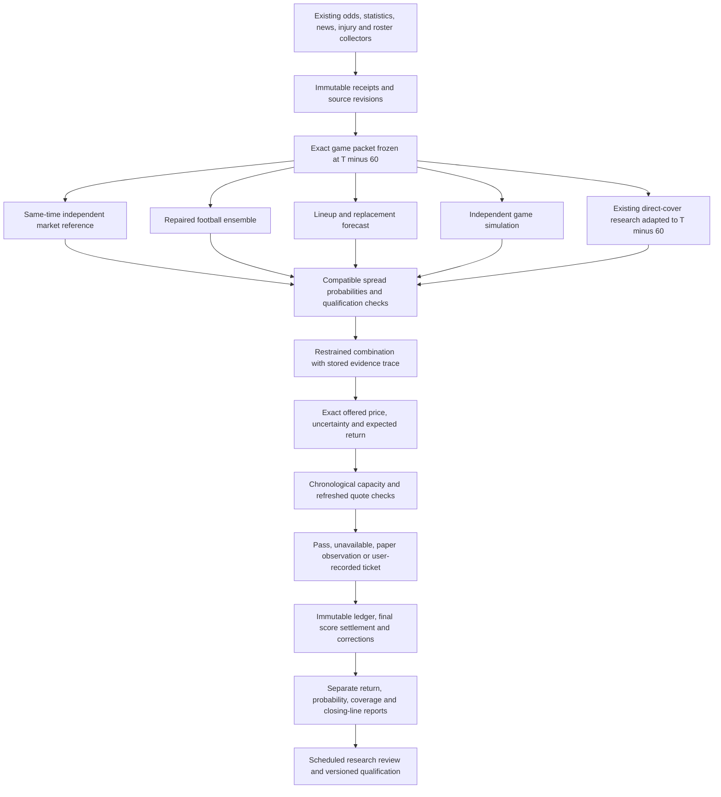

> **Organization-branch navigation:** the [latest consolidated plan](betting-model/plans/LATEST-PLAN.md) contains the current review-driven sequence. This ledger is preserved as implementation history; older “next actions” below are not a second current plan.

# Gridiron HQ — final NFL spreads implementation plan for Claude

**Reviewed September 10, 2026. Scope: ordinary full-game, pregame NFL spreads.**

**This file is that reconciliation.** The September 10 review was merged into this canonical plan on 2026-09-10; the superseded September 9 queue is preserved as dated evidence at [`evidence/2026-09-10/superseded-plan-2026-09-09.md`](evidence/2026-09-10/superseded-plan-2026-09-09.md). There is exactly one active plan: this one. Status for every correction and slice lives in [the status register](#0-status-register) below and is updated as work closes.

This is the consolidated implementation queue. It incorporates the prior model audit, the subsequent strategy review, the proposed multiple-model design, and the latest committed and uncommitted Claude work. When Nick hands this over, reconcile it into the project's existing `docs/CLAUDE-NEXT-STEPS.md`; do not create another competing roadmap. Preserve dated results and protocols as evidence, with no active task queues inside them.

## 0.0 September 14, 2026 reconciliation

A separate research pass (outside this repository — see below) produced its own condensed plan, reusing this document's findings and adding a recovered corpus of prior audits and statistics research. Reconciled here per this file's own instruction above, rather than kept as a competing roadmap:

- **Recovered evidence.** A large prior body of work — ~59 full-system audit notes (`SYSTEM_AUDIT_2026_09_11.md` and companions), ~41 audit-system notes, and a ~70-document statistics/code-catalog research collection (forecast combination, point-in-time data, multiple-testing correction, sequential inference, Bayesian ratings, conformal calibration, margin distributions, copulas, plus code catalogs for simulation/ratings/Bayesian/backtesting/Kelly/conformal/trial-registry) was found in a Claude scratchpad **outside this repository**, never committed. It has **not** been pushed to `gridiron-hq`. **Correction, later same night:** the "not readable from a fresh clone" / "confirmed permanently gone" claims below were wrong — a `~/Documents` permission that blocked this session's filesystem access was fixed and the session restarted, and the full corpus is readable at `/Users/nick_matta/Documents/Codex/2026-09-14/saved-2-memories-ran-a-command/outputs/` (`GRIDIRON-MASTER-PLAN.md`, `GRIDIRON-CLAUDE-HANDOFF.zip` and its unpacked `GRIDIRON-CLAUDE-HANDOFF/` directory, including `recovered-evidence/` with all 59+41+70 documents and a fresh `sept14/` folder of read-only live-DB verification notes). See the dated bullet below for what changed once this was actually readable.
- **Scope narrowed to betting only.** Fantasy/UI work is out of scope for this thread except where a shared dependency blocks the betting pipeline.
- **Stage framing.** The recovered plan restates this file's slices 0–10 as six stages (repair the foundation → shared training data → first serious model → connect the full path → validate the system → deeper football learning in increments). No new architecture — same target diagram in §4, same correction ledger in §0.1/§3. Use the stage names when discussing sequencing; use C01–C17 and slices 0–10 for the actual tracked work below.
- **Overfitting/safeguard correction, verified against code and now wired into a real gate:** `server/services/trial-statistics.js` already implemented the correct fix for the specific flaw the recovered research flagged (a naive Šidák/Holm correction overstating independent evidence across *correlated* retries) — Geyer (1992) effective-trial-count, Bailey & López de Prado's Deflated Sharpe Ratio, and CSCV probability-of-backtest-overfitting, all tested (`test/trial-statistics.test.js`, 15/15 passing). It was **not wired into anything that gates a real decision** — it only fed `scripts/run-purged-evaluation.mjs`, a report generator built from `scripts/backfill-historical-trial-registry.mjs`'s **hand-transcribed, one-time historical reconstruction** (real numbers, but documented in that script's own comments as "a demonstration on genuine data, not a high-power estimate," not a repeatable live feed). Turning *that* script into an automatically-recomputed live gate would have manufactured false rigor on top of a known-limited snapshot — exactly what this project's own rules warn against.
  - **What was actually built instead:** `nfl-research.js`'s `nflOperations()` — the real, live NFL-spread promotion gate list (`market_residual_margin`, `cover_calibration`, `exact_policy`, `forward_sample`, `quote_provenance`, `untouched_holdout`, `clv`, `pregame_coverage`) — now carries a ninth gate, `overfitting_correction`. On every `persist:true` run it registers the frozen exact-policy result as one more real, live, chronologically-timestamped trial in the SAME `research_trials` ledger (content-keyed, so a re-run against unchanged data does not inflate the count), separate from the hand-backfilled trial kinds. The gate reads that live-growing sequence, computes the effective trial count and deflated Sharpe ratio from it, and requires DSR ≥ 0.95 over at least 8 real live trials (Geyer's own minimum for a meaningful autocorrelation estimate) before it can pass. **It fails closed today** — zero live trials exist yet, so `overfitting_correction` is false and stays false until real evidence accumulates over real time. That is correct behavior, not a bug: a gate whose bar is only reachable once real history exists is the whole point.
  - Tests: `test/nfl-operations-overfitting-gate.test.js` (3/3 passing) — fails-closed with no history, computes a real bounded DSR once 8 synthetic live trials are seeded, and does not double-count a repeated call against unchanged evidence.
- **"Missing 2026 team features," verified and now triaged:** 34 call sites across ~25 services defaulted their `seasons` parameter to an array ending at 2025, silently excluding the live 2026 season for any caller that doesn't pass an explicit override. Triaged into two groups, on function *purpose* not just name:
  - **Live data/monitoring defaults — fixed, 15 call sites, all with green tests:** `nfl-data-consistency.js` (coverage/corruption audit) and `nfl-model-watch.js` (the daily drift loop `scheduler.js` actually runs via `refreshModelWatch` — both were structurally blind to the current season until today), plus 13 idempotent sync/backfill/materialize functions whose whole job is "pull or freeze data for these seasons": `ffopportunity.js:syncFfOpportunity`, `nfl-espn-pbp.js:backfillSeasons`, `nfl-event-archive.js` (`materializeInjuryEvents`, `syncWeeklyRosterEvents`, `syncVerifiedEventArchive`), `nfl-external-ratings.js:syncTeamRankings`, `nfl-postgame-truth.js:backfillGameVariance`, `nfl-team-card.js:backfillTeamCards`, `nfl-weather-history.js:syncForecastHistory`, `nfl-weather.js:syncGameWeather`, `nfl-weekly-feature-store.js` (`backfillTeamFeatureVectors`, `backfillPlayerFeatureVectors` — the literal "missing 2026 team features" function), `odds-archive.js:backfillOddsArchive`. Checked first whether any production caller actually relies on the default (scheduler.js, routes) — none currently do, every live caller already computes seasons dynamically — so this closes a latent gap (an ad hoc/manual no-args call) rather than a currently-firing one, unlike the two monitoring loops above which fire on defaults daily.
  - **Deliberately left alone, ~19 call sites:** audit/replay/study/report/diagnostic/comparison/measurement functions where the season list is the declared cohort of a specific historical result, not a "give me current data" default — `consensus-weights.js`, `draft-abstention-audit.js`, `line-move-study.js`, `nfl-abstention-audit.js`, `nfl-ai-replay.js`, `nfl-blind-audit.js`, `nfl-candidate-analysis.js`, `nfl-family-contribution.js` (ties to C16), `nfl-passing-diagnostic.js`, `nfl-passing-specialists.js`, `nfl-props-replay.js`, `nfl-replay.js:candidateInputComparison`, `nfl-research.js:runNflFeatureAblations`, `nfl-specialists.js:testSeasons` (a named backtest cohort, separate from the fitting-defect question below), `nfl-t60-packet.js:decisionTimeManifest`, `offseason-model.js:measureV2Effects`, `weekly-walkforward.js`. Also explicitly not touched: `nfl-evidence.js`'s `'nfl-dev-2021-2025'` string is a named/frozen evidence-set identity, not a default value — changing it would be changing history, not fixing a bug. None of these should be extended without checking, one at a time, whether extending its window would silently change a previously-reported result's scope (§1.2's rule).
- **Specialist-fitting defect and corrupt QBR rows: re-verified against the real database, 2026-09-15.** `nflDataConsistencyAudit()` and `runModelWatch()` were run against the real `server/data.sqlite` (not a fixture). Findings: verdict remains "at least one core year is not coverage-consistent"; 2026 has zero rows yet in `nfl_team_week_features`/`nfl_snaps`/`nfl_ngs` (season in progress); the 2026 `game_lines` market-pairing check's 257 "invalid" rows are simply unplayed 2026 games with no final score yet, not corruption (confirmed separately via `research/betting/nfl/dataset.py`'s `build_chronology` quarantine, which tags exactly those 257 rows `missing_final_score`). `runModelWatch()` found one real regression (`pass_yds` model MAE 64.945 vs. season-to-date baseline 63.406, `passes: false`) and one real negative-skill market (`interception`, skill -0.0065) — both alerted, neither promoted, `production_eligible: false`. **`nfl-specialists.js`'s `fitSpecialists`/`ridgeFit`: does NOT reproduce.** Run against the real `buildDataset({minSeason:2016,maxSeason:2025})` (2,440 real games), every family's ridge coefficients came back finite (max |coefficient| 0.897). Treat this specific defect as closed. **QBR corruption: CONFIRMED, and materially worse than first reported here.** The initial 2026-09-15 pass (previous paragraph) found one narrow duplicate-identity row and stopped there; a same-day cross-check against an independently produced review (see the Codex reconciliation bullet below) found the real scope. `nfl_qbr_weekly` has **550 rows for season 2026**, spanning weeks 1–18 — most of a full season, despite 2026 being in week 1 as of this writing. **520 of those 550 (94.5%) are exact copies of the matching 2025 row** on `(player_id, week, team, qbr_total, pts_added, qb_plays, epa_total)`, all `fetched_at` timestamped `2026-09-10`. This is not the narrow duplicate-team-tag bug alone — it looks like the entire 2026 season was bulk-seeded with 2025's numbers as placeholders (weeks 2–18, which have not been played, are **100%** 2025 copies: 31–32 rows each week, all matching). A second, real sync ran `2026-09-14` and correctly overwrote 30 of the 42 week-1 rows with distinct real data; the other 12 week-1 rows, and all of weeks 2–18, are still the 2025 copies presented as 2026 fact. Root cause of the narrow slice (why a stale row survives instead of being overwritten) remains as previously found: `nfl-qbr.js`'s `INSERT OR REPLACE` is keyed on the full primary key `(season,week,team,player_id)`, so a stale team tag creates a second row instead of correcting the first (e.g. `player_id` `15864`/Geno Smith, `team='LV'` fetched 09-10 vs `team='NYJ'` fetched 09-14). But the bulk-seed-with-last-year's-numbers issue is a separate, larger problem with its own root cause not yet identified — not fixed by changing the upsert key alone. **Any consumer reading `nfl_qbr_weekly` for 2026 weeks 2–18 today is reading fabricated data.** This re-verification worked from current code and real data only. (The "recovered evidence corpus is permanently gone" claim that used to sit here was wrong — see the correction two bullets up and the dated bullet below.)
- **Stage 2 (shared training data) started, 2026-09-15:** `research/betting/nfl/dataset.py` gained two new functions. `build_football_dataset(min_season=1999)` is a broad, price-agnostic dataset for team-strength learning — no archived quote required, so nothing is gated to 2022+; advanced play-by-play features (EPA etc.) are only available 2016+ and rows carry `pbp_available: False` rather than being dropped when absent. Against the real database: **7,291 rows spanning 1999-2026**, vs. roughly 150-285 rows per season/market the price-gated path was confined to. `build_betting_dataset`/`paired_quotes` extract the archive-join/timestamp-validation/quarantine block `market_lab.py` and `tree_lab.py` each used to duplicate (governance manual §4.4 items 2/3) into one shared, tested function; both labs' `build_dataset` now call it. Verified byte-identical dataset hashes against the real database before/after the migration for both labs — this is a pure extraction, not a behavior change. 10 new tests in `research/betting/nfl/test_dataset.py` (23 total in that file); full `research/` suite is 113/113 passing. Nothing yet consumes `build_football_dataset` for an actual fit — that is Stage 3 (first serious model), not done in this pass.
- **Second independent reconciliation, 2026-09-15 ("the Codex plan"):** A separate research/planning pass (Codex, outside this session, pasted in full rather than committed to the repo — the referenced `GRIDIRON-MASTER-PLAN.md`/`GRIDIRON-CLAUDE-HANDOFF.zip` live under this machine's `~/Documents`, which this session cannot read due to OS-level file permissions) produced its own large plan: 6 stages, 20 work packages, 28 research guardrails, and a code review against `21789a9` naming 12 findings (C01–C12). It explicitly distinguishes a **fresh** Sept 14 code-review snapshot from an **older** "historical inspection" snapshot at `43af933` and warns its own historical findings need rechecking, not blind trust — good practice, followed here.
  - **Fresh C01–C12 code findings — spot-checked against the actual current code tonight, all still real:**
    - **C06 (timezone):** `nfl-t60-packet.js` hardcodes `-04:00` for every reconstructed historical kickoff (lines 674, 730) — confirmed by the code's own comment at line 709 ("standard-time games are [wrong]"). Any T-60 cutoff computed for a game during EST (roughly Nov–Feb) is off by an hour. Not yet fixed.
    - **C07 (news overwrite):** `server/news/store.js`'s `upsertNormalizedNewsItem` update path (the `ON CONFLICT`/dedup branch) refreshes `updated_at` but its `SET` list never touches `ingested_at` — confirmed by reading the query. A revised Friday article body keeps its original (earlier) `ingested_at`, which is a real look-ahead risk for anything that treats `ingested_at` as the receipt clock. Not yet fixed.
    - **C05 (no frozen-packet retry):** `t60-runner.js`'s selection query (lines 145, 252) only ever reads `WHERE state='scheduled'` — confirmed by reading the code. A row stuck `frozen` after a downstream failure has no retry path back into processing. Not yet fixed.
    - **C09 (fake "robust" pass):** `nfl-replay.js:721`'s `robustAcrossSeasons` returns `{robust: true, note: 'fewer than 3 seasons... not meaningful'}` when there's insufficient data to actually check robustness — confirmed by reading the code at the exact claimed line. An uncomputable check reports as a pass. Not yet fixed.
    - **C01/C02 (packet validation gaps):** read `validateForecastPacket` in `server/betting/nfl/contracts/forecast-packet.js` directly — the required-field loop only catches `undefined`, not `null`; nothing checks embedded feature *values* for finiteness (only the container's type); nothing cross-checks `observation.cutoff_at` against kickoff; no price/odds-of-zero check exists. Structurally consistent with the claimed malformed-input probes; not independently re-run with their exact fixtures this pass.
    - **C03/C04 (`resolvePacketMarketQuote` mismatched-side quotes, preferred-book-before-completeness-check):** not independently re-verified this pass — read the code before trusting.
  - **QBR finding upgraded — see the corrected paragraph above.** This session's own first pass under-reported the QBR problem (found only the narrow duplicate-identity row); the Codex review's historical-snapshot claim of large-scale corruption turned out to be the real, current, and far more serious issue once re-checked against live data tonight — a useful example of exactly the cross-check both documents ask for.
  - **Historical (`43af933`-snapshot) findings — status as of this bullet, superseded below:** "Component gate never passed" (zero of 43,090 `nfl_ensemble_fit_artifacts` component rows with `residual_gate_passed=true`); "production forecast copies the market" (65/65 `nfl_decision_events` rows `is_market_identity=1`); a claimed NaN-coefficient defect in `nfl-orthogonal-specialists.js` (this session's spot-check of the file found ridge-penalty scaling by feature count at line 175, `Math.max(8, family.fields.length * 2)` — plausibly related but not a confirmed match to the claimed "allocates observation weights by feature count" bug; needs a real run against live data to confirm or refute, the same way this session settled the `nfl-specialists.js` question). Do not treat any of these as settled without rerunning them against the current database, the same discipline this file already applies to its own findings.
  - **Scope note:** the Codex plan's own effort estimate for its full 20-work-package scope is 41–78 engineer-days. Nothing beyond this reconciliation and the spot-checks above was implemented in this pass — no code changes, per the plan's own "targeted code review and planning expansion; application fixes haven't been made" framing of its findings.
- **Correction and continuation, later the same night (2026-09-14/15): the recovered corpus was NOT permanently gone.** The `~/Documents` read permission that blocked this session was fixed and the session restarted; the full Codex handoff is readable at `/Users/nick_matta/Documents/Codex/2026-09-14/saved-2-memories-ran-a-command/outputs/` — `GRIDIRON-MASTER-PLAN.md` (the complete document this file's Codex bullets above were reconciling from a pasted copy of, now confirmed byte-for-byte the same plan), `README-CLAUDE-HANDOFF.md`, `AGENT-PLAYBOOK.md`, 20 WP prompts under `agent-prompts/`, and `recovered-evidence/` containing the full 59-document `audit/`, 41-document `audit-system/`, 70-document `research2/` collections, `plans/` (Giant Plan, What Next), and a `sept14/` folder of fresh read-only live-DB verification notes that supersede the three historical-snapshot leads above:
  - **"Component gate never passed" — CONFIRMED with refreshed numbers.** `recovered-evidence/sept14/evidence-gates.md` (read-only `DatabaseSync` queries against the real `server/data.sqlite`, same night): the residual gate at `nfl-ensemble.js:1887` (n≥250, RMSE gain≥0.03, computable DM p≤0.05) has **0 passes in 37,510 component-cutoff rows across 1,210 artifacts** — the table grew since the 43,090/1,390 historical count, same zero result.
  - **"Production forecast copies the market" — CONFIRMED, and independently reproduced by this session tonight, not just cited.** Queried live `server/data.sqlite` directly: `nfl_decision_events` currently has **98/98 rows with `is_market_identity=1` and `edge_points=0`** (grown from the 65 and 33 counts in the two source documents — this is a standing condition of every recorded decision to date, not a one-time historical snapshot).
  - **`nfl-orthogonal-specialists.js` NaN bug — CONFIRMED by direct code read tonight, not the file's earlier "plausibly related" guess.** The actual defect is in `fitRidge` (~line 71): `let weights = Array(Z[0].length).fill(1)` sizes the IRLS weight array by **column count** (features+intercept, ~7-8), but the fitting loop indexes `weights[i]` by **row count** (`Z.length`, i.e. training examples — routinely dozens to hundreds). Every row index past the column count reads `weights[i] === undefined`, so `weights[i] * Z[i][j] * y[i]` is `NaN`, poisoning `xtx`/`xty` and making every returned `beta` coefficient `NaN`. (The line-175 ridge-penalty-scaling code this file previously flagged as a maybe-match is a different, unrelated piece of code — this is the real bug, at a different line.) Fix dispatched to a background agent tonight; see the status register once it lands.
  - **The `sept14/` folder also has independent verification reviews of the underlying research** (`recovered-evidence/sept14/wf_65f8c9e5-bf5/verify-*.json`) correcting some of the older recovered research's own overclaims before they get implemented — e.g. Holm's correction does *not* require independent p-values (only valid ones), a synthetic-finance walk-forward comparison doesn't dictate the one valid NFL chronology, and claims that no JS/Python bridging option exists were overstated. Read these before implementing the corresponding Stage/WP, not just the original research report.
  - **Five code fixes landed and pushed, 2026-09-15, `994d32e` + `eba6eca`.** Each was reviewed personally (diff read, tests rerun by hand, full suite rerun) before commit, not taken on the dispatching agent's word:
    - **C06 (timezone):** `nfl-t60-packet.js`'s `decisionTimeManifest`/`representativePackets` now call the existing `nflKickoffDate` (America/New_York, DST-aware) helper instead of hardcoding `-04:00`; the now-false `caveats` string about the offset was removed. New tests assert a January kickoff resolves to `18:00Z` (not the old buggy `17:00Z`) and a September kickoff to `17:00Z`.
    - **C07 (news receipt time):** `server/news/store.js`'s `upsertNormalizedNewsItem` now compares stored vs. incoming content columns and only advances `ingested_at` when the content genuinely changed, staying idempotent on plain resends. There was no existing content-hash column to reuse, so the fix compares the actual content columns directly rather than inventing one.
    - **C05 (frozen-packet retry):** `t60-runner.js` gained `relinkStalledObservations` — finds `frozen` rows with no `decision_run_id` past a grace period and retries only the decision-tape link, resuming from the already-stored `packet_json` (never re-freezing, never re-reading live tables), verifying the stored body still hashes to `packet_hash` first, and reusing `nfl-decision-tape.js`'s existing tested idempotency contract so a retry can't record a duplicate decision. Rows frozen before packet retention existed (no `packet_json`) are reported `unretryable` rather than reconstructed after the fact. This was the most structurally sensitive of the five; reviewed line-by-line before committing.
    - **C09 (fake robust pass):** `nfl-replay.js`'s `robustAcrossSeasons` now returns `{robust: false, status: 'insufficient_data', ...}` instead of `{robust: true, ...}` when fewer than 3 seasons make the check uncomputable, matching the `status: 'insufficient_data'`/`'insufficient'` convention already used in `decay-watch.js`/`mlb-calibration.js`. Confirmed its one caller (`analyzeErrors`'s `finalize()`) and the one downstream consumer (`nfl-candidate-findings.js`) never read `.robust` in a way this breaks.
    - **Orthogonal-specialists NaN bug:** `fitRidge`'s weight array is now sized `Array(Z.length)` (one weight per training row) instead of `Array(Z[0].length)` (one per feature column) — a one-line fix, verified by literally reverting it locally and watching the new regression test fail with `NaN` betas before reapplying it.
    - Full suite after all five: **1980 pass, 0 fail, 39 skip** — no regressions. New test file `test/nfl-orthogonal-specialists.test.js` (none existed before); extended `test/nfl-t60-packet.test.js`, `test/news-ingest.test.js`, `test/nfl-replay-error-analysis.test.js`, `test/t60-runner.test.js`.
  - **Nine more fixes landed and pushed the same night, `c63bc19` through `0c29c1b`**, each personally reviewed (diff read, targeted + full suite rerun) before commit:
    - **QBR corruption (both parts):** `nfl-qbr.js`'s `syncQbr` now deletes any other-team sibling row for `(season,week,player_id)` before insert (fixes the Geno-Smith-style duplicate-team-tag case, effective key now `(season,week,player_id)` with no schema migration) and quarantines any incoming row whose six stat columns exactly match the prior season's row for the same player/week/team. Root-cause investigation of the bulk-seed itself: strong circumstantial evidence it was an upstream nflverse/ESPN placeholder-with-2025-numbers at the moment of the 2026-09-10 sync (independently re-fetched the live release on 2026-09-14 and found only 30 real 2026 rows, all week 1) — not a bug in our own ingestion code, which has no season-defaulting/carry-forward logic of its own. Can't get the literal 2026-09-10 upstream bytes (GitHub overwrites release assets in place), so this is strong evidence, not certainty. Existing corrupt rows in the live DB were deliberately left alone — that's a data-remediation call for separate review, not a code fix. 6/6 new+existing tests pass.
    - **C01/C02 (packet validation gaps):** `validateForecastPacket` now rejects all seven previously-accepted malformed cases (unparseable `received_at`, `feature_lineage.values` as `{}`/`null`, a `NaN` feature value, `offered_price: 0`, a `totals`-shaped market on this spreads-only contract, `cutoff_at >= kickoff_at`) — confirmed by literally running the isolated repro script from `PLAN-CODE-CHECKS.json` before and after. `canonicalize` also now throws on a non-finite number instead of letting `JSON.stringify` silently coerce it to `null` — the actual mechanism behind the NaN/null hash collision that PLAN-CODE-CHECKS.json flagged, and still reachable via `nfl-t60-packet.js`'s `t60PacketHash` on a packet shape that never goes through this validator. `validateForecastPacket`/`sealForecastPacket` have no callers outside this module and its test today, so tightening was risk-free by construction. 22/22 tests pass (8 new).
    - **C03/C04 (mismatched-quote resolution):** `resolvePacketMarketQuote` now classifies every book's coverage (complete/single-sided/mismatched/no-home) *before* applying book preference — a book with a complete, exactly-mirrored pair (`|home+away| <= 1e-6`) always wins over a single-sided fallback regardless of alphabetical order, and a mismatched-line pair (e.g. home -3 / away +2.5, not a real mirror) is now rejected rather than silently presented as one coherent contract. A book whose away leg is present but mismatched is deliberately *not* eligible for single-sided fallback either (conservative by design, matching `nfl-execution-edge.js`'s existing refuse-rather-than-guess convention). A complete pair's timestamp-of-record is now the *later* of the two legs' receipt times, not always the home leg's. 39/39 tests pass (9 new); regression-checked against the two consumer test files, unaffected.
    - **Governance manual §4.4 item 2 (duplicated fold cutoffs):** 6 of 7 inline `min(decision_at) - 7 days` / eligibility-filter duplications in `market_lab.py`/`tree_lab.py` now call the shared, already-tested `dataset.py::eligible_training_rows`. The 7th (`market_lab.py`'s `time_folds()`) applies a genuinely different week-granularity condition and returns indices not rows — left as-is with an inline comment explaining why, rather than forced into a shape it doesn't fit. Verified as a pure extraction: byte-identical SHA-256 training-row-set hashes at all 6 sites against the real database, plus a full `git stash`-based before/after diff of each lab's actual `run()` output against the real database (report/dataset/all prediction files identical apart from volatile fields). `dataset.py` itself untouched. 42/42 research unit tests pass.
    - **Dead-code cleanup:** removed a stale `'elo'` entry from `nfl-expert-council.js`'s `simpleIds` set — `nfl-ensemble.js` registers the Elo-family rating as `'melo'` (already present), so `'elo'` never matched anything; a pure no-op on the computed value, just removing a misleading dead reference. A related item — `playerOpportunity` computed at the same file's line ~509 and never wired into its own expert's `output(...)` call — was flagged separately for human review (`task_4283df35`) rather than silently changed. **Resolved 2026-09-15**, investigated in a separate session: `git blame` shows both were added together in the same original commit (`129115e`), not a later-broken wire-up. `unitEdges` (from `gamePlayerAvailability` in `nfl-player-value.js`) already sums to exactly the `shadow_margin_adjustment` the `player_builder` expert's forecast is built from — `playerOpportunity`'s 0.55/0.35/0.1 reweighting is a collinear recombination of that same signal with unbacked weights (no citation, fit, or reference anywhere in the repo), and wiring it in would undercut the expert coordinator's own tested anti-collinearity design. Separately, `player_opportunity`'s real registered score is `volume_mae` (attempts/carries/targets), read from `settlement.player_volume_mae`, not `forecast_residual` — its `forecast:null` is a deliberate, tested reporting state (`different_score`, asserted in `test/model-integrity.test.js`), not an omission. Confirmed: dead leftover variable, not a defect. No code changed.
    - **Two investigations that found no defect, correctly, and made no changes:** (a) the online-neural net's empty `nfl_online_neural_artifacts` table — confirmed via read-only DB query this is because 2026 Week 1's Monday-night game genuinely hadn't finished at the moment of investigation, not a bug; every historical week across 27 seasons eventually reached 100% completion (worst case 6 days, 2020 COVID-disrupted schedule), so "wait for the whole week" is a bounded, real, working gate, not a near-permanent block. (b) the signal-reliability controller's hardcoded-off-in-production state and empty `nfl_signal_reliability_artifacts` table — confirmed via git history (`2f0df7ac` + its own operating-manual addition) this is an intentional, documented staged-rollout invariant, not leftover debug code; the artifact table is empty because `finalized_week` requires literally every 2026 Week-1 game final, and one (the Monday-night game) hadn't settled yet at query time. `shadow_decisions` is actively growing (40 → 60 rows across the session). Both are healthy fail-closed behavior, correctly waiting for real evidence that hasn't accumulated yet — not something to force open.
  - **Continuing the same night, `6248424` through `5b74a6a`:** synced `forecast-combination.js`'s research-only replayed incumbent gate off a stale fixed `-1.645` paired-t critical value onto the same Diebold-Mariano/HLN test production's `fitEnsemble` was already corrected to use on 2026-09-12 (Giant Plan 7.2 FIX #2) — reused the existing `forecast-comparison.js` helpers, no new statistics invented; resolved the flagged `player_opportunity` item as confirmed dead code (original-author leftover, not an abandoned wire-up — see the entry above); and, via a systematic grep for the same `published_at`-without-receipt-check pattern, closed two more news look-ahead gaps in `nfl-expert-council.js`'s `newsFor` (a `feedStories` count that could wrongly flip the news expert's `forecast` from an honest `null` to an observed `0`) and `nfl-player-state.js`'s `syncRosterEventsFromNews` (historical-replay-only exposure; its one live caller never passes a cutoff, so unaffected). Also investigated three more findings and correctly found no defect in any of them: the `nfl_weekly_learning` "capture blocked"/"need 250 settled snapshots" gate (legitimate, actively resolving as Week 2 approaches — confirmed live via read-only query), and the `pass_yds`/`interception` regression flagged by `runModelWatch()` (traced to a real, separately-landed data-integrity fix — the gsis_id crosswalk correction — removing a false earlier illusion of skill, and to interceptions' well-documented near-zero persistence; both are genuine Stage-6 backlog candidates, not code bugs). Separately confirmed the 13 historically stuck `frozen` T-60 observations (referenced in the master plan's historical register) all predate `packet_json` retention (migration 036) and are therefore correctly `unretryable` under tonight's C05 fix, not silently reconstructable — a genuine data-completeness limitation, not something the fix could or should paper over.
  - **Total for the night so far: 19 confirmed, independently-verified fixes landed and pushed** (`994d32e` through `5b74a6a`), plus 5 honest no-defect-found investigations and 1 resolved flagged-for-human-decision item. Every fix was reviewed personally against its actual diff and test output before committing — none taken on a dispatching agent's report alone. Full suite after that commit: **2014 pass, 0 fail, 39 skip.**
  - **Stage 3 landed, `c72206f`: the first predeclared model-vs-market comparison, and the market won.** `research/betting/nfl/stage3_team_strength.py` — a frozen-before-results spec (14 features, expanding whole-season outer folds with a strictly-inner chronological 80/20 hyperparameter split, 3 ridge alphas × 3 shallow LightGBM configs, both predeclared) run against the real `build_football_dataset` history, 7,276 games 1999–2025, 6,499 scored across 24 outer folds. Pooled MAE: zero-information baseline 11.309, **market baseline 10.249 (best)**, ridge 10.675, LightGBM 10.738. **Neither candidate beat the market**, and per the predeclared decision rule that is reported as the finding — no additional feature or model family was tried after seeing this result. Both candidates do beat the zero-information baseline by ~0.6 MAE (prior history and PBP features carry real signal over "assume average home-field advantage"), just not enough to close the gap to the market. Independently reproduced: reran the script myself against the real database and got byte-identical output to the dispatching agent's report (same run_id code hash, same metrics to full float precision) — this is a real, reproducible result, not a fabricated one. This is development data (previously-inspected 1999–2025 history), so a positive result here would still need confirmation on genuinely unseen future games; the negative result needs no such confirmation to stand. **This sets the honest baseline the rest of the plan measures against** — any later family (lineup, simulation, direct-cover classifier, combination) claiming value has to clear this same bar, on the same games, against the same market reference.
  - **Family D (direct spread-cover classifier), evaluated honestly, `research/betting/nfl/tree_lab_reports/` (gitignored — large, fully reproducible from `research/tree_lab.py` + the real database, see below).** Ran the existing `tree_lab.py` infrastructure (LightGBM/XGBoost/CatBoost/logistic + genuine market/coin-flip/no-move baselines, 7+ candidates × 3 seasons × 2 markets) against 1,795 real 2022–2025 rows. Only 1 of 6 season×market combinations beat market log-loss (totals 2023, extra_trees); the other 5 correctly selected the trivial market-only/coin-flip baseline via inner CV because nothing reliably beat it out-of-sample. The market-anchored logit's cross-validated shrinkage came out to **0.0 for both markets** — the CV procedure itself chose to discard the tree model's signal entirely. Movement and quantile targets showed the same pattern (5/6 combos selected the trivial baseline; the 1 exception in each scored *worse* held-out than the trivial baseline would have — inner-fold overfitting, not a real edge). **This independently confirms Stage 3's finding from completely different infrastructure** (classification against the actual offered price, not margin regression) — the market wins on this angle too. A genuinely valuable side-finding: the lab's own `model_discipline.py` observation-to-parameter check flagged **all 76 evaluated folds as underpowered** given only 2022–2025 history (~86 features against 200–700 games/fold) — this dataset, sized as it currently is, may not be able to reliably detect a small real edge even if one existed, which is a different and more actionable statement than "no edge exists." **T-60 label adaptation (the master plan's own explicit ask for this family) was scoped, not attempted:** `nfl_odds_archive` has only `open`/`close` quote phases for 2022-2025 (no intraday timeline to reconstruct a historical T-60 snapshot from), and the real T-60 capture mechanism (`nfl_t60_observations`) only started running 2026-09-10 with 15 rows total — a true T-60 version of this experiment is bottlenecked on real time/data accumulation or a separate multi-day historical-reconstruction project, not a same-night wiring task. Honest scoping over a rushed implementation, per this session's own established standard.
  - **The application's own live audit system (`audit_registry` table, `server/services/audit-registry.js`) was independently inspected and found healthy — a third, different confirmation of the same finding.** 15 preregistered trials, 14 sealed + 1 voided (crashed once, re-filed and ran clean as a new entry — a one-time operational hiccup, not a live defect: the registry's own error/void handling is well-designed, sealing on first run and voiding anything where code or data drifted between registration and running so nothing can be silently re-rolled for a better result). Honest split, no cherry-picking evidence: **7 passed, 7 failed.** Failed: "football-first beats the closing spread" (48.3% win rate on the larger sample, needs 52.4%; an earlier small-sample 57.9% "win" evaporated exactly as overfitting predicts), "lean predicts line movement"/CLV (47.7% and 51.1% across two trials, both statistically indistinguishable from a coin flip), "team trend predicts total" (43.8%, worse than a coin flip). Passed: simulator accuracy, live win-probability calibration, and line-shopping value — system-correctness checks, not "found an edge" checks. No new audit registered since 2026-08-30, consistent with the intervening weeks' focus being infrastructure repair rather than new hypothesis testing.
  - **Full gate audit complete: all five live promotion gates independently re-verified as correctly fail-closed. No code defects found; no code changed.** Directly answers the standing question "are my gates broken or just strict" (docs/CLAUDE-NEXT-STEPS.md's own C08/gate-ownership work, and tonight's earlier online-neural/signal-reliability/weekly-learning investigations, which found the same pattern each time) with a definitive, evidence-backed answer for the remaining five:
    - **Residual/market-residual gate** (`nfl-ensemble.js:1887`, n≥250/gain≥0.03/DM p≤0.05): 0/48,763 component-cutoff rows pass, but genuinely close — the best near-miss (`drive_eff`, n=357, gain=0.044) lands at DM p=0.071 against a p≤0.05 bar. Real near-misses on both sides of the bar, not a structurally unreachable one.
    - **Cover-calibration identity lock**: production requests `information_regime: 'live_weekly_unfrozen'`; every stored calibration was built under `'historical_weekly_closing'` — a real regime difference (archived closing lines with known outcomes vs. currently-moving lines), not a naming bug, and the project's own test suite already asserts this exact behavior as correct. Even the closest stored calibration independently fails its own forward gate on real data (z=0.80, needs >1.96) — no real signal to serve regardless.
    - **Staking gates**: independently recomputed the real empirical 80% margin-residual interval from 7,292 completed games — SD=13.20, width≈33.84, matching the model's reported 32-33 almost exactly. The 24-point ceiling would need sigma≈9.4 (near-perfect information); real NFL spread uncertainty is genuinely ~13-14 points. `NFL_MODEL_STAKE_UNITS` confirmed absent from `.env` — a deliberate, correct human/deployment decision, left untouched.
    - **Coordinator Stage-A shrink gate**: re-ran the actual shrinkage algorithm against the live DB (144,239 raw rows, 1,055 pivoted games) — all 21 experts land at k=0, with forecast-residual correlations ≤0.068 (noise level). Hand-verified the t-statistic formula algebraically against reported values; no sign error or off-by-one found.
    - **Promotion workflows**: hand-verified all 5 stored candidate-input audits — 4 of 5 have positive point-estimate ROI that beats the vig but a still-negative 95% bootstrap lower bound on ~209-213 bets (a real, close statistical near-miss, not an unreachable bar); the 5th has negative ROI and is correctly rejected outright. Verified the bootstrap implementation is a standard percentile block-bootstrap with no sign error.
    - **The honest overall picture**: gates 1 and 2 tell one coherent story, not two coincidental ones — production's default blend mode currently produces zero edges everywhere (gate 1 has never passed), so there is nothing meaningful to calibrate under that blend mode yet either (gate 2). None of this is a code problem; it is what "no demonstrated edge yet" looks like from five independent angles, consistent with tonight's Stage 3/Family D/audit-registry findings.
  - **Unified spread-family-adapter interface and a real weekly-training artifact pipeline are still in flight as background agents** — results and honest pass/fail status for each will be recorded here once they land and are independently reviewed the same way as everything above.

**Immediate next actions**, in order: (1) land and independently review the in-flight gate-audit, spread-family-adapter, and model-artifact-pipeline agents; (2) investigate the `pass_yds` regression / `interception` negative skill `runModelWatch()` flagged (a genuine model-weakness finding, not a code bug — belongs to Stage 6's measured-weakness process, not a quick fix) — **note:** independently investigated and found to be a genuine, non-actionable finding tonight (see the earlier dated bullet), so this line is effectively closed pending nothing further; (3) work through the master plan's WP03-WP05 (canonical identities, immutable record contracts, source coverage admission) — these are the plan's own stated dependencies before any new model training beyond tonight's Stage 3/Family D research reports; (4) decide the disposition of the other ~28 stale-season defaults one at a time; (5) the C08 finding (unresolved-team/unverified evidence admitted into `nfl-t60-packet.js`'s injury/news coverage counts) was reviewed tonight and found to already carry extensive deliberate design reasoning in its own comments (explicitly disclosed, not an oversight) — deprioritized rather than force-fixed; revisit only as part of the fuller WP03/WP09 identity-resolution work, not in isolation; (6) per tonight's three independent confirmations (Stage 3, Family D, the live audit registry) that no simple approach beats the market yet, the honest next research question per the master plan's own Stage 6 process is Family B (lineup/replacement) or Family C (independent simulation) — not a fourth retry of margin/cover regression with more features, which is exactly the anti-pattern the plan warns against.

## 1. Mandate, starting state, and honest conclusion

The objective is to determine whether Gridiron can select obtainable NFL spread bets with positive expected returns after the offered price, and to build the reliable operating system needed to test that proposition. Correct software and more models are necessary research tools; neither establishes profitability. Keep the option of a simpler market-based approach, or no bet, if the football ensemble fails to add useful information.

Nick wants the existing model combined with genuinely different approaches: game simulation, lineup-based forecasts, and direct spread-cover prediction. Build and evaluate those families using the substantial implementations already present. Give them common inputs, compatible probability outputs, and a restrained combination method. Do not count duplicated information as independent agreement or select a model because it recently won a few bets.

This review did not modify the active application, migrate its database, pull into its branch, install dependencies, enable collection, or send messages to Claude. Tests ran on isolated source copies and fixture databases. Only the audit's own deliverables were changed. Claude was working concurrently; the implementation instructions below require a fresh reconciliation before editing.

### 1.1 Source and evidence boundary

- Repository: [BouncySlime1215/gridiron-hq](https://github.com/BouncySlime1215/gridiron-hq).
- Local source: `/Users/nick_matta/Claude/Artifacts/fantasy-football-dashboard`.
- Tested committed snapshot: `401a5d01ea488ec1da96d4c9ac6db995e2ed38b2`.
- Comparison with the earlier reviewed `6d8245f`: 81 changed files, approximately 3,899 additions and 113 deletions, including documentation relocations.
- Latest captured uncommitted source, at **15:49 UTC / 11:49 Eastern**: `server/db/schema/nfl-n-to-z.js`, `server/services/nfl-t60-packet.js`, `test/nfl-t60-packet.test.js`, and new `server/migrations/029_quote_tape_commence_index.js`. Exact hashes are in the attached verification manifest. The backup journal also shown by Git is a runtime artifact, not source to commit or delete during an active backup.
- The dirty packet implementation was inspected and tested separately, including its final kickoff-range optimization. Its 14 tests passed; the cross-game and receipt-time counterexample still reproduced. The new index migration and schema addition received source review, not a full live upgrade certification.
- Conclusions concern these versions. Later work is not automatically covered. Read Claude's current implementation summary and subsequent diff first; use its chat for intent if needed, but reconcile any completion claim to code, callers, fixtures, and observed records.

The verification bundle contains the source manifest, test logs, isolated counterexamples, and timestamped read-only database observations. Counterexample tests that pass establish that the defect was reproduced; they are not evidence that it was fixed.

### 1.2 What the numbers actually say

| Evidence | Observed result | Interpretation |
|---|---|---|
| Historical audit 27 / 31, spreads | 153 bets; 72 wins, 78 losses, 3 pushes; about −11.8549 units; −7.7483% ROI | Negative historical development record. |
| Historical audit 32, spreads | 156 bets; 74 wins, 79 losses, 3 pushes; −11.0884001705 units; −7.1079488272% ROI | About 0.64 percentage points better descriptively, still negative. |
| Audit 32 coverage | 70 weeks, weeks 5–18 across its five-season cohort | Does not establish early-season performance or the proposed T−60 operating strategy. |
| New focused committed tests | 114 passed, zero failed | Useful local verification of the tested contracts. |
| Full isolated committed suite | 1,337 total; 1,307 passed, 24 failed, 6 skipped | Clean verification remains incomplete; several tests depend on development data. |
| Latest dirty packet tests | 14 passed, zero failed | Existing tests miss the reproduced identity/time errors. |
| Default local DB at 15:38 UTC | Migrations through 025; decision-run table absent | Earlier source deployment was incomplete at that moment. |
| Same DB at 15:49 UTC | Migrations through 028; zero decision runs; zero execution opportunities | Claude progressed during review. Upgraded schema does not establish a working collection-to-decision lifecycle. |

The local isolated test runtime was Node **24.19.0**. The CI configuration targets Node 22. This review did not run the hosted GitHub job; it cannot certify that job or attribute every failure to a recent change. Repair the development-data dependencies and validate the intended runtime explicitly.

The earlier read-only DB observation also contained 1,118 quote batches, 2,331 expert forward-prediction rows, 84 expert settlement rows, zero online neural artifacts, and one cover-calibration record. These are inventory counts, not independent bets or qualifications. Having news, injury, play-by-play, roster, odds, and research tables is real progress. The unanswered question is which exact, timely information actually reaches each numerical prediction and improves it.

Do not promise to improve the old historical record. Preserve it. A repaired strategy gets a new identity and a new evaluation. A corrected accounting report must retain the original and clearly explain its correction.

## 0. Status register

Per section 12, this plan carries its own status. One row per correction and per slice.
States are ordered: **open → implemented → tested → connected → installed → observed → qualified**.
A row advances only when the evidence column names something that actually demonstrates it.
Software test success alone never reaches `qualified`.

### 0.1 Corrections

| ID | State | Commit | Evidence | Remaining limitation |
|---|---|---|---|---|
| C01 decision identity | tested | 445c878 | [`slice1/`](evidence/2026-09-10/slice1/) · `test/nfl-decision-tape.test.js`, `test/nfl-decision-identity-pipeline.test.js` (32 pass) | Every run records `data_identity_status: unfrozen_live_tables` — no decision is yet reproducible from stored inputs. C11 closes that. |
| C02 partial writes / empty-run delete | tested | 445c878 | [`slice1/`](evidence/2026-09-10/slice1/) · same two test files | Legacy half-written runs are invalidated by append; none exist in the live DB to exercise that path against real data. |
| C03 populated 027 upgrade | **installed** | 445c878 · dd13278 · e02b362 | `test/migration-027-populated-upgrade.test.js` (14 pass) · the developer's own 9.0 GB database upgraded 029 → 035 on 2026-09-11 | **The fixture-only limitation is closed, and closing it cost two startup-fatal defects.** 031 and 032 each ran an UPDATE against a table carrying an append-only trigger; each aborted `runMigrations()`, which is awaited before any route imports, so the application could not start at all on a populated database. Neither was reachable from an empty fixture. Both are fixed, both now have fixtures holding real rows, and a generalised scan test refuses any migration that writes to a protected table without lifting and restoring its guard — that scan found a third latent instance in 008. |
| C04 opponent strength window | tested | fced8d9 | `test/ensemble-window-and-split.test.js` (8 pass) | The sparse-coverage floor is 3 eligible opponents — a stated judgement, not a measured one. |
| C05 shopping probabilities / ranking | tested | 8d950b0 · 61cde5a | `test/nfl-execution-edge.test.js` (30 pass) | Follow-through landed: both sides of every game are now indexed at their own posted number, the per-half-point value is conditioned on the line rather than flat, and an unpriceable market falls back to `ranked_by: 'price_only'` at the modal line. Still a no-forecast baseline implied by the market's own line; `qualified` is false everywhere. |
| C06 test suite hermeticity | tested | fced8d9 | [`evidence/2026-09-10/slice-final/`](evidence/2026-09-10/slice-final/) — 1,449 pass / 0 fail / 24 skip under CI conditions, from a 24-failure baseline. Current suite: **1,618 tests, 1,579 pass, 0 fail, 39 skip** | Fitted-model checks skip on a clean checkout with a named disposition each. Two tests were found transcribing the migration list by hand and breaking on every new migration for reasons unrelated to what they check; both now read it from the directory. **The hosted Node 22 job has still not been run**; local runtime is Node 25. |
| C07 residual split leakage | tested | fced8d9 | `test/ensemble-window-and-split.test.js` (8 pass) | The fit/score boundary is now week-complete, but it remains a single chronological split, not a rolling nested walk-forward. |
| C08 findings provenance | tested | fced8d9 | `test/nfl-candidate-findings.test.js` (20 pass) | Rule identity is git-free and cwd-free and fails closed. The T-60 approved set starting empty is enforced by there being no promoted findings, not by a check. |
| C09 audit overview counting | tested | fced8d9 | `test/audit-overview-counting.test.js` (10 pass, synthetic packets) | Run 27's spread record now reproduces independently from the picks: **153 bets, 72W/78L/3P, −11.855 units, −7.7% ROI**, matching §1.2 exactly. Found against real data: the first implementation compared results case-sensitively and classified every historical pick as unknown — it did not throw, it produced a confident report with a null win rate. |
| C10 preseason sparse fallback | tested | fced8d9 | `test/preseason-blend-cutoff.test.js` (5 pass) | The prespecified fallback is a declared prior, not an estimate. Any forecast resting on it is labelled insufficient evidence. |
| C11 frozen T-60 packet | tested | 1bbe43d | `test/nfl-t60-packet.test.js` (24 pass), `test/forecast-packet-contract.test.js` (14 pass) | Quote scoping, period and receipt clock are corrected; the packet carries actual rows; §4.1's contract now exists as one validated schema authority. **No forecast consumes it yet** — that is C11's remaining half and slice 7's prerequisite. |
| C12 sequential capacity path | **observed** | fced8d9 | `test/t60-runner.test.js` (11 pass), `test/nfl-t60-protocol.test.js` (14 pass) · **first real prospective capture, 2026-09-10** | The runner ran against a live slate for the first time and froze a packet at a real cutoff: `nfl\|2026-09-10\|SF@LAR`, kickoff 00:35Z, T−60 cutoff 23:35Z, captured 23:37:32–23:37:33, state `frozen`, packet hash `e2bcd98f…`. **This is the first prospective observation in the project's history**; every prior number was retrospective. Two honest limits remain. `decision_run_id` is empty — no forecast consumed the packet, so this is evidence that a packet CAN be frozen on time, not that anything used it (required return #4 is still undelivered). And it is one game: the fifteen Sunday games sit `beyond_scheduling_horizon` until T−24h, so coverage is 1 of 16 until Saturday. **The capture depends on the server staying up through the weekend; a restart across a cutoff loses that game permanently.** |
| C13 closing-line grading | tested | 1bbe43d | `test/nfl-execution-clv.test.js` (18 pass) | Declared bookmaker set defaults to every book in the tape; no independent reference set has been chosen. |
| C14 price CLV sign | tested | 1bbe43d | `test/nfl-execution-clv.test.js` (18 pass) | Done in slice 2 rather than slice 4: same function, same sign convention as C13. |
| C15 policy gate at refresh | tested | 8d950b0 | `test/nfl-execution-decision.test.js` (16 pass) | A changed handicap refuses outright, because no stored distribution can answer the new number. That is correct today and becomes a real re-evaluation once a per-game distribution is frozen. |
| C16 family report scope | tested | 8d950b0 | `test/family-contribution-scoring.test.js` (7 pass) | Conditional and three-state scoring corrected; runtime cost is still inferred rather than measured, and refit-vs-removal is not yet distinguished. |
| C17 sequential inference claims | tested | fced8d9 | `test/always-valid-significance.test.js`, `test/audit-registry-always-valid.test.js` (10 pass) | Callers that supply no sigma now get a fixed-sample p-value that says so. No confidence-sequence method was adopted. |

### 0.2 Slices

| Slice | State | Exit evidence | Remaining limitation |
|---|---|---|---|
| 0 Reconcile | implemented | [`evidence/2026-09-10/slice0/SOURCE-MANIFEST.md`](evidence/2026-09-10/slice0/SOURCE-MANIFEST.md) | Findings marked "not yet re-verified" in 0.1 are verified inside their own slice, not here. |
| 1 Protect evidence | tested | `test/nfl-decision-tape.test.js`, `test/nfl-decision-identity-pipeline.test.js`, `test/migration-027-populated-upgrade.test.js` (42 pass) | No real installation with execution rows has been upgraded; no decision is yet reproducible from stored inputs. |
| 2 Correct clocks and contracts | tested | `test/nfl-t60-packet.test.js`, `test/nfl-execution-clv.test.js`, `test/spread-probabilities.test.js` (57 pass) | Existing quote history can no longer support a prospective claim, by design. No forecast consumes the packet yet. |
| 3 Correct probabilities and authority | tested | `test/nfl-execution-edge.test.js`, `test/nfl-execution-decision.test.js` (36 pass) | Probabilities are a no-forecast baseline; nothing is qualified. |
| 4 Repair learning and reporting | tested | C04/C07/C08/C09/C10/C14/C16/C17 closed; C06 measured under CI conditions | Fitted-model checks that need real history skip with a named disposition rather than being deleted. |
| 5 Connect operation | **observed** | `test/t60-runner.test.js` (11 pass); registered as `nfl_t60_runner` on the live tier; one frozen prospective packet on a real cutoff (2026-09-10, SF@LAR) | A real slate has now started running. The controlled end-to-end lifecycle fixture in §7.4 is still not built, and no forecast consumes the frozen packet — so what exists is capture evidence, not decision evidence. Coverage is 1 of 16 games for week 1 until the Sunday cutoffs open at T−24h. |
| 6 Freeze simple comparison | implemented | `research/betting/nfl/dataset.py` + `test_dataset.py` (12 pass) | The shared cutoff-safe chronology is extracted and parity-tested. No comparison has been RUN: the frozen first experiment of §9.1 stage 2 is not started. |
| 7 Adapt requested families | open | — | Not started. Requires slice 6's comparison first, per §9.1's staging. |
| 8 Test the combination | open | — | Not started. Only families meeting the predeclared requirements may enter, and none has been qualified. |
| 9 Reorganize and consolidate | implemented | Root reduced to `README.md`; folder map recomputed to 820 dispositions, none undisposed; typecheck, lint, build and start-smoke all pass | Document consolidation is complete and zero open task lists remain outside the plan. The `server/` ownership MOVES in §10.2 are deliberately NOT executed — §10.4 requires packaging and path-resolution tests first, and `nfl-research-lab.js` still derives its root from `../..`. |
| 10 Prospective decision | implemented | [`evidence/2026-09-10/DECISION-RECORD.md`](evidence/2026-09-10/DECISION-RECORD.md) | A record of what the evidence supports, which is not a profitability verdict. No prospective observation has yet been made. |

### 0.3 What Claude returned, 2026-09-10

Section 12's nine required returns, and where each one is:

| # | Required return | Where |
|---|---|---|
| 1 | The exact fixes for C01–C17 | [`evidence/2026-09-10/CODEX-6-HANDOFF.md`](evidence/2026-09-10/CODEX-6-HANDOFF.md), one section per slice, each naming the defect it reproduced first. |
| 2 | Clean test results on the declared runtime, with explicit remaining skips | [`evidence/2026-09-10/slice-final/`](evidence/2026-09-10/slice-final/) — 1,449 pass / 0 fail / 24 skip under CI conditions, from a 24-failure baseline. **The hosted Node 22 job has still not been run**; local runtime is Node 25. |
| 3 | Safe migration/restore evidence and the installed schema version | `test/migration-027-populated-upgrade.test.js` (14 pass) — populated 026 fixtures, byte-identical preservation, `foreign_key_check`, and a `VACUUM INTO` snapshot proven to restore. **Now also delivered against the real thing:** the developer's 9.0 GB database was upgraded 029 → 035 on 2026-09-11, after the chain was rehearsed on an 8.7 GB `VACUUM INTO` copy (52.6s, 1,154 quote batches relabelled, 1,384,350 tape rows intact). Installed schema version: **035_alt_spread_capture**. |
| 4 | One packet-to-decision trace showing a news fact's real numerical influence | **Not delivered.** No forecast consumes the frozen packet yet; every run records `unfrozen_live_tables`. This is C11's remaining half and the honest blocker on this item. |
| 5 | Corrected family and audit reports preserving the old versions | C16 and C09. Old numbers preserved as `cover_brier_legacy_unconditional_vs_decided` and `clv_price_cents_v1_raw_american_difference`. No retroactive winning record: the 2021–2025 spread record is unchanged. |
| 6 | A registry showing implemented vs active vs qualified | This table plus §0.1. **Nothing is `qualified`.** The highest state reached is `connected` (C12). |
| 7 | The fixed experiment decision record | [`evidence/2026-09-10/DECISION-RECORD.md`](evidence/2026-09-10/DECISION-RECORD.md). It records that the question is now askable and has not been asked. |
| 8 | Updated folder dispositions, with the plan and routes still working | [`reference/architecture/folder-map.csv`](reference/architecture/folder-map.csv) recomputed to 820 dispositions, none undisposed. Typecheck, lint, build and the real-server startup smoke all pass. |
| 9 | A plain-language statement to Nick | The end of [`DECISION-RECORD.md`](evidence/2026-09-10/DECISION-RECORD.md) §1 and §4. |

### 0.4 Reconciliation notes, 2026-09-10

The review's "latest captured uncommitted source" — `nfl-t60-packet.js` v2, `server/db/schema/nfl-n-to-z.js`,
migration `029_quote_tape_commence_index.js` and the packet tests — is **committed** at `bbcdae2`. Nothing was
stashed, reset, pulled or overwritten. `bbcdae2` is the only commit after the reviewed `401a5d0`.

The full suite run on this machine reports **1,342 tests, 1,341 passed, 0 failed, 1 skipped**. That is *not* a
contradiction of the review's 24 failures and it is *not* evidence of C06 closure: this run resolved
`GRIDIRON_DB_PATH` to the developer's own populated `server/data.sqlite`, so the tests that require saved audit
runs and real history found them. The review ran against an isolated fixture database, which is the condition
C06 actually describes. The hermetic re-run is the measurement that counts, and it is recorded under C06.

## 2. What exists already, and what to keep

### 2.1 Main forecast inventory

`server/services/nfl-ensemble.js` registers **31 components**:

| Family | Registered | Role |
|---|---:|---|
| Roster availability | 2 | Ordinary availability; challenger roster strength. |
| Rating systems | 6 | Massey, Colley, Pythagorean, point differential, MELO, dynamic state. |
| Efficiency | 17 | Nine ordinary components and eight challengers, with substantial shared inputs. |
| Context | 4 | Recent form and rest/travel contribute to spreads; pace/total and weather/total are total-oriented components. |
| Market | 2 | Market anchor and market regression. |

There are **29 spread-capable registered components: 20 ordinary and 9 challenger-only**. The two total-oriented components are not two more independent spread voters. Actual participation and weights depend on the serving configuration. Preserve useful pace/total context if a spread distribution needs it, while keeping totals betting out of scope.

The default board is approximately:

`nfl-auto-picks.js` → `ensembleWeek` with `market_residual` → conditional online-neural substitution if eligible → cover calibration → `applyNflPolicy` → `nfl-execution-pipeline.js` → decision tape and execution ledger.

A component being registered does not establish that the board uses it. A Python model existing on disk does not establish that it is served. A table containing predictions does not establish their eligibility for recommendation.

### 2.2 Council, simulation, lineup, and Python research

The council has **19 roles**, including forecasting experts, market/news readers, a live updater, and a price shopper. These have different jobs and are not 19 independent pregame models. The default pick board does not automatically consume the council. Keep that boundary until qualification.

`nfl-expert-coordinator.js` already contains robust fitting, shrinkage and controls for correlated groups. `research/expert_selector_lab.py` already explores constrained mixtures, context selection, out-of-fold predictions, missingness, and family comparisons. Extend those deliberately; do not start another unrelated coordinator.

`nfl-drive-sim.js`, `nfl-sim-learn.js`, `nfl-sim-policy.js`, and `nfl-sim-calibration.js` already implement substantive game simulation: football states, possessions, clock and decision rules. The council calls the simulator with 160 trials and targets taken from the existing ensemble. `reconcileOutcomeWeights` then reweights outcomes toward those targets. That is a useful scenario view, but its agreement with its own target is not independent confirmation.

The player-builder pathway already uses roster/depth information, replacement effects, availability and injury carryover. The task is to estimate and validate those effects more rigorously, expose uncertainty, and connect the qualified output—not merely add an injuries feed.

`research/tree_lab.py` already contains **direct cover classification**, LightGBM, XGBoost, CatBoost, logistic baselines, quantile work and a market-offset logit. Its opening-line historical labels and push exclusions do not automatically match a T−60 three-state spread forecast. `research/market_lab.py` and `tree_lab.py` duplicate dataset chronology. Fix that shared foundation before adding another learner.

### 2.3 Repairs worth preserving

Keep the corrected Bayesian weight direction, server-side lookup of execution forecast inputs, separation of opener regrading from side reselection, repeated-finding holdout improvement, the residual fit/score split as an intermediate improvement, decision-tape integration, terminal non-execution outcomes, compensating settlement corrections, inferred-versus-confirmed finality, and explicit modeled-delay labels.

Also keep the new expected-return gate, CLV projection, family-report scaffold, T−60 packet taxonomy, and index optimization where useful. They require the corrections below. Passing their focused tests does not close their end-to-end obligations.

## 3. Required correction register

Priorities here order implementation. **P1** blocks trustworthy decisions, evidence, or qualification; **P2** blocks a specific report, staged family, or maintainability claim. A fix closes only when the listed production-path test passes and its status is recorded in this same plan.

### C01 — P1: Decision identity collapses different forecasts

**Files:** `server/services/nfl-decision-tape.js`, `nfl-auto-picks.js`, `nfl-execution-pipeline.js`.

The tape hashes/records `edge`, whereas the board emits `edge_points`. It omits material forecast, quote, feature, model, code and data identities. Changing the forecast from 5 to 12, edge from 2 to 9, model A to B, quote ID and code/data hashes reused the same run in the fixture; the persisted edge was NULL. Opportunity lookup also matches an insufficient subset of the contract and can select the first ambiguous event.

**Fix:** validate one explicit board schema, persist the actual edge, and hash canonical immutable content including the complete forecast/dependency identity, quote, policy, horizon, schedule version and reasons. The producer must supply checked payloads and real identities, not arbitrary trusted hash strings. Separate observation identity from content identity: a retry of one observation is idempotent, but a distinct declared observation must survive even if all numbers are equal. Exact-contract links must be unique or fail.

**Close with:** real board-to-pipeline tests changing each material field independently; repeated same-observation retry; identical forecasts at two horizons; ambiguous same-side different-line quotes; correct recovered feature packet and edge.

### C02 — P1: Partial decision writes and empty-run deletion

**Files:** `nfl-decision-tape.js`, decision schema/migration protections.

An invalid second child left a header claiming two decisions and only one event. Retry returned `created:false` without recovery. Empty run headers can be deleted despite the immutability claim.

**Fix:** validate before writing, atomically insert header and children, and verify completeness when resolving retries. Protect parent updates and deletes, including empty runs. Represent unavailable/missed computation explicitly; distinguish a healthy all-abstention observation from no computation. Append invalidation/replacement events for incomplete legacy records rather than quietly rewriting them.

**Close with:** failure injected on the second child rolls back all rows; successful retry/restart; duplicate race; empty and nonempty delete rejection; count reconciliation; missed game retained in the denominator.

### C03 — P1: Populated migration 027 fails and downgrade loses evidence

**Files:** `server/migrations/027_decision_tape.js`, `server/db/index.js`, `server/db/migrate.js` and the next compatible repair migration.

With foreign keys enabled, 027 rebuilds/drops the opportunity parent before removing/rebuilding its lifecycle children and append-only trigger. A populated 026 fixture fails with “lifecycle events are append-only — record a new state instead.” Transaction rollback preserved the fixture; the upgrade did not complete. Its downgrade cannot represent all newer terminal evidence.

The latest local DB got through 028 with zero opportunities. That does **not** disprove the populated upgrade defect.

**Fix:** support both installations that have not applied 027 and installations already past it. Review the full SQLite parent/child rebuild order, referencing tables, indexes and triggers. Do not rely on toggling foreign keys inside an existing transaction. A later migration alone cannot rescue an earlier migration that prevents startup: design a versioned bootstrap/preflight repair for the unapplied path, plus an additive integrity repair for the applied path. Preserve every ID, order, link, terminal result and correction. Refuse a destructive downgrade. Do not casually renumber Claude's new 029; allocate the next available number after reconciliation.

**Close with:** populated 026 → current migration fixtures spanning all lifecycle states; already-applied 027 fixtures; failure/rollback; restart; `foreign_key_check`; exact content preservation; no-loss downgrade refusal. Use a SQLite-consistent backup and prove restoration before any real upgrade. Never copy only a live WAL database file as its backup.

### C04 — P1: Opponent strength mixes obsolete schedules with recent statistics

**File:** `nfl-ensemble.js`, `scheduleFaced`, `sharedContext`, `featureAggregates`.

Opponent exposure uses all historical schedules while the EPA inputs use a recent seasonal window. Adding 2016 schedule rows changed the isolated 2024 component from −23.400 to +16.714 despite unchanged 2024 features.

**Fix:** align opponent exposures, opponent quality and underlying efficiency rows to the same eligible games and recency weights. Prefer game-level sufficient statistics. A current-season-only schedule also fails if the underlying feature still mixes prior-season statistics. Define the sparse-coverage fallback, report it, and version the corrected component.

**Close with:** obsolete/future schedules cannot change a forecast; eligible schedule changes can; week 1, previous-season blend, repeat opponents and incomplete coverage all have explicit expected behavior.

### C05 — P1: Shopping probabilities can be impossible; ranking contradicts EV

**Files:** `nfl-execution-edge.js`, `execution-slate-reasoning.js`, all sizing consumers.

`coverProbabilities(3, -10.5)` returned win −0.125, loss 1.125, push zero on the preserved empirical-margin fixture. It combines an assumed median anchor with an incompatible unconditional absolute-margin distribution. `bestExecution` still ranks an older points/price heuristic rather than its attached expected return: +2.5/+100 was ranked above +3/−150 even though its own EVs were −0.1500 and −0.1416667 respectively.

**Fix:** implement the coherent spread probability/economics contract in section 5. Remove the legacy `0.5 + line_edge` shortcut from any qualified sizing path. Invalid probabilities must fail validation; clipping them is not an adequate statistical repair. Until qualified, present price/line improvement as a diagnostic, not modeled profit. Rank by qualified expected net return under the same distribution and exact contract.

**Close with:** generated probability, sign, monotonicity, adjacent-line push, cutoff and ranking tests; independent direct-payout arithmetic; explicit refusal when no qualified distribution is available.

### C06 — P1: The full test suite still depends on private development history

**Files:** `.github/workflows/ci.yml`; data-dependent capability, simulator, preseason, touchdown/scoring tests; audit overview tests.

The isolated suite has 24 failures and six skips. Some tests import the application's default DB or expect saved audit runs. This is not a demonstrated credential-free, clean-checkout pass. Do not describe it as “hermetic and green.”

**Fix:** deterministic fixtures for logic tests, a temporary fallback DB, disabled scheduling and an enforced external-network guard with explicit localhost exceptions. Separate large historical validation from required logic tests. Preserve meaningful economic assertions; do not simply skip them or delete the tests. Validate the pinned CI Node version and record results. Non-spread failures can receive bounded fixture repairs without expanding the model project into props/fantasy redesign.

**Close with:** required clean-checkout tests pass without `.env`, real DB, provider tokens or historical audit IDs; economic overview checks execute on synthetic saved packets; failures/skips have explicit disposition.

### C07 — P1: The residual split does not isolate the entire fitted pipeline

**File:** `nfl-ensemble.js`, upstream `calibrate` and historical context construction around the residual fit.

The residual slope now uses disjoint rows, but one feature calibration fitted through a later cutoff is reused inside earlier historical forecasts. The 70/30 row split can also divide one NFL week across fit and score. A downstream split cannot undo upstream leakage.

**Fix:** generate every historical forecast from only its legal earlier fitted dependencies. Fit preprocessing, feature-to-points mappings, weights, residual coefficients, probability calibration and combination within earlier complete-week blocks. Store membership and cutoff manifests. Keep the current single-split output as a dated development result.

**Close with:** changing an unavailable future label cannot alter an earlier feature, forecast, fit or calibration; no week straddles fit/score; a synthetic spurious in-sample signal fails the later qualification gate.

### C08 — P2: Findings provenance can fail open and cannot renew normally

**Files:** `nfl-candidate-findings.js`, `nfl-replay.js` rule/hash helpers, cached board consumers.

Rule identity depends on Git and working directory, can return NULL, and missing provenance is accepted. Promotion does not enforce the same identity check. Dimension/segment-only uniqueness prevents a genuine new rule version under the same label.

**Fix:** an explicit rule/config/dependency manifest independent of `.git`; require provenance at evaluation, promotion and serving; version the rule key and preserve old evidence. Isolate one stale finding's failure rather than aborting unrelated evaluation. Include the approved-rule version in caches. Start T−60 with an empty approved set. Closing-horizon discoveries cannot inherit T−60 authority.

**Close with:** alternate working directory and packaged execution; missing/stale hash refusal; renewed same-label rule gets new evidence; unrelated docs edits do not change predicate identity; stale status is visible; refreshed boards cannot retain obsolete authority.

### C09 — P2: Audit overview miscounts pushes and coverage

**Files:** `nfl-audit-overview.js`, `nfl-replay.js` bootstrap/accounting helpers.

The market aggregate initializes but never adds pushes. Zero-spread weeks are omitted from the bootstrap. Min/max coverage hides missing weeks; invalid result JSON is silently skipped; missing units can become zero. Full-result hash changes are conflated with economic changes.

**Fix:** authoritative pick-level outcome aggregation with explicit unknown/void/correction states; full precision until display; exact expected/present/valid week sets; complete declared weekly clusters including zero-bet weeks. Report artifact, forecast, selection/price and cash-flow differences separately. Reconcile run summaries to their picks.

**Close with:** pushes, zero-bet weeks, gaps, corrupt JSON, missing units and metadata-only changes produce the appropriate distinct results; independently reproduce run 32's spread record; save bootstrap cohort, seed and draw count.

### C10 — P2: Sparse preseason uncertainty still uses future-fitted fallback

**File:** `nfl-preseason-blend.js`, module-level calibration and caches.

Earlier isolated testing showed a 2016 prediction's standard error changing from 5.756 to 12.286 after changing only 2024 scores when eligible variance history was sparse. This fallback remained in the reviewed source. An explicitly later `asOfSeason` is not rejected.

**Fix:** a genuinely prespecified versioned fallback, or insufficient-evidence status; no globally future-fitted substitute. Validate cutoff against target season and all cache identities. Keep this staged until a defined early-season trial needs it.

**Close with:** zero/sparse-history forecasts, uncertainty and missingness remain unchanged by future seasons; illegal later cutoff rejected; real-implementation fixture tests retain the corrected Bayesian direction.

### C11 — P1: The T−60 packet is not yet a frozen game evidence packet

**Files:** `nfl-t60-packet.js` including uncommitted v2, `nfl-quote-tape.js`, quote schema, canonical event/team mapping.

The current packet summarizes mutable tables with counts/latest timestamps. It does not persist the actual rows, values, identities and fitted artifacts consumed by a forecast. Its quote query identifies a game by kickoff alone. The fixture for CAR–CHI counted another game's quote received after cutoff as `received_by_cutoff`, because it uses `requested_at`, which is recorded before the provider request completes. Broad week/global injury, news and feature counts are availability diagnostics, not proof those facts belong to this game's forecast.

Dirty v2 usefully distinguishes late arrivals, oracle data and historical manifest modes and adds weather handling. It still reproduces the identity/receipt defect. The latest range query and commence-time index can improve speed; they make the same wrong-game predicate faster. Its migration comment says the change affects no behavior, but the packet predicate also changed: test timestamp normalization, supported spellings, offsets and malformed input explicitly.

**Fix:** canonical event and contract identity first; provider-event mappings and normalized team aliases at ingestion; true immutable first receipt/response completion separate from request time, provider publication and effective time; row-level revision histories; a persisted exact input payload or immutable row references with content hashes. Scope every input to the applicable event/team/player and cutoff. Use the existing diagnostic packet as the source-health projection of that artifact. Require the numerical forecast to consume that same artifact.

**Close with:** simultaneous kickoffs cannot cross-match; first-half quotes cannot qualify full-game spreads; request before/receipt after cutoff is excluded; earlier and later revisions preserve earlier values; reschedules retain event identity; no later fit, postgame weather, unrelated news or future weekly stat reaches the forecast; invalid mode/time fails explicitly. Index the corrected predicate and verify its query plan on a representative fixture.

### C12 — P1: Sequential capacity exists as a helper, not a durable decision path

**Files:** `nfl-t60-protocol.js`, `nfl-prospective-collection.js`, `scheduler.js`, `server/platform/jobs.js`, `nfl-execution-pipeline.js`.

The reviewed production callers do not invoke `cutoffBatches`/`sequentialCapacity` to drive a durable T−60 operation. A GET packet route is not a scheduled collector. The capacity API takes final release outcomes without release times: with one slot, A at 12:00 released at 12:10 wrongly allows B at 12:05 when replay is given A's final `released` state.

**Fix:** implement the durable runner in section 7 using event-time reservations/releases. Every batch sees only states known by that cutoff. Validate ordering, uniqueness, cap values and restart behavior. Never use the completed week's outcomes or rank all future games to decide an earlier batch.

**Close with:** the delayed release fixture refuses B; same-time tie rules are deterministic; restart neither loses nor duplicates a reservation; failed refresh releases at its actual time; later games are invisible; no-bet and missed observations persist; the scheduler-to-settlement integration test reaches all required records.

### C13 — P1: Closing-line grading can use the wrong game and period

**File:** `nfl-execution-clv.js`, `closingQuoteForContract` and its query/consumer.

The closing query filters market, side and kickoff, omitting the event and period. The fixture selected a later other-game first-half −2.5/−200 quote as the full-game close. Latest quote per book, freshness and reference definition also need to be explicit.

**Fix:** exact canonical event, full-game period, rules, handicap where required, side and declared bookmaker set. Deduplicate per book at the declared closing horizon. Grade same-handicap price movement separately from handicap movement; a method requiring the exact accepted line naturally returns zero point movement and cannot stand in for a moving main-line benchmark. Save closing quote IDs and a grading-version artifact. Missing close remains unknown while score-based P&L settles normally.

**Close with:** simultaneous games/periods, stale/absent closes, duplicate snapshots, reschedules, line moves and later corrections; independent reference excluding the target book where declared; every ticket retained even if CLV is missing.

### C14 — P2: Price CLV sign and American-odds arithmetic are misleading

**File:** `nfl-execution-clv.js` and its test.

Accepted −110 versus close −120 produces −10 cents although the comment says positive means better. An existing test encodes this inverted convention. Raw American-odds differences/medians are also unsafe across negative/positive prices.

**Fix:** define a positive-is-better metric in probability or decimal-return space; display American prices separately. Convert before aggregating, and remove vig only from compatible paired quotes. If preserving a legacy cents field, version it and document its restricted domain and sign. Never silently reinterpret past reports.

**Close with:** −110→−120 is favorable under the chosen sign; +100/−100 representation boundary; positive prices; mixed bookmaker quotes; same-line and changed-line metrics cannot be confused.

### C15 — P1: The new policy gate is incomplete at price refresh

**Files:** `nfl-policy.js`, `nfl-auto-picks.js`, `nfl-execution-decision.js`, pipeline and sizing consumers.

The new gate is useful, but the policy is still version 1.1.0 despite changed economics. The board does not supply the push probability expected by the EV calculation, which defaults to zero. A negative haircut increases probability and can change rejection to selection. Acceptance checks do not re-enforce the new expected-return threshold at the refreshed offered price. Nullable forecast evidence can bypass checks.

**Fix:** bump policy identity; validate finite thresholds/haircut and their domains; consume explicitly conditional or unconditional probabilities with known push treatment. An integer-line unknown push estimate cannot silently become zero. Recompute exact-price eligibility at refresh using a qualified immutable forecast/distribution, or abstain. Separate an authorized recommendation from recording a ticket the user actually placed: the latter must remain truthfully recordable as off-policy, even when it was a bad bet. Do not grant forecast authority merely through `source:'execution'`.

**Close with:** invalid/negative configuration rejection; integer push effect; fixed forecast with worsened price fails the refreshed gate; changed line invokes the exact new contract distribution; missing provenance refuses recommendation; off-policy manual tickets still settle and remain in the proper ledger.

### C16 — P2: The new family report overstates what it tested

**Files:** `nfl-family-contribution.js`, `nfl-ensemble.js:featureContracts`, family-contribution evidence JSON and summary.

`featureContracts` omits `challenger_only`, so the report says every family has zero challengers although nine exist. Both scoring paths drop actual pushes but score unconditional win probability against the decided binary label: a 0.45 win / 0.10 push / 0.45 loss forecast on a decided win gets about 0.303 rather than the proper conditional 0.25. Family count is not runtime cost. The report's default graph is raw historical/closing replay, not the intended T−60 residual graph. “Refit leave one family out” is inaccurate where fitting is cached independently of the removal and the forecast blend is simply filtered/renormalized.

**Fix:** propagate registry metadata; report actual active consumers and weights; correct conditional and three-state proper scoring in both functions; distinguish frozen-model removal sensitivity from complete earlier-fold refitting. Save graph/cutoff/universe/calibration identities. Show missing coverage before any common-support intersection. Measure runtime cost, do not infer it from model count. Preserve the old report and append a corrected version.

**Close with:** all nine challenger flags recovered; conditional Brier fixture equals 0.25; three-state Brier includes pushes; source family without a consumer is “not connected”; each refit actually rebuilds its dependent artifacts on prior data; common candidate-universe and coverage tables reconcile.

Do not promote the current headline “only market has signal.” The report's 1,424-game baseline had MAE about 10.095 versus market 9.762, 204 bets and roughly −5.10% ROI. Its family-removal results are diagnostic development evidence. They support a serious simplification experiment, not a proven verdict that existing injury/news/statistics are useless. Different policies may choose different bets on the same eligible universe; compare their full weekly economic results rather than demand identical selected-bet sets.

### C17 — P2: Sequential significance and completion claims need correction

**Files:** `backtest-significance.js:alwaysValidPValue`, implementation summary, `docs/README.md`, root README and old planning files.

A plug-in variance estimate from the same evaluated sequence is insufficient justification for an “always valid” label. Either implement a method with applicable assumptions or use fixed, declared evaluation endpoints. Do not repeatedly inspect conventional p-values and stop at a favorable one.

Replace “only calendar waiting remains” with separate states: implemented, tested, connected, installed, observed, and statistically qualified. Update stale inventory counts and incomplete-folder claims. An index, a helper, a table, or a passing mock is not an observed decision pipeline.

**Close with:** a declared inference protocol and appropriate fixture/reference checks; a clean inventory; each completion claim linked to its exact evidence; no profitability or runtime claim inferred from implementation alone.

## 4. Target system: one evidence path, several qualified forecasting families

The diagram describes the target, not the current installed path. An unqualified family can produce clearly labeled research forecasts without entering the recommendation combination. Preserve every family's result for comparison, including a model that abstains.

### 4.1 Exact frozen packet contract

Define and version the schema before adding more model integrations. The packet must include:

| Contract group | Required content |
|---|---|
| Event | Canonical event ID, league/season/week, canonical home/away team IDs, provider mappings, schedule version and kickoff in UTC. A reschedule updates schedule history, not event identity. |
| Market | Full-game spread, selected side, signed handicap, offered price, bookmaker, overtime/settlement rule version, quote ID, suspension/availability state. |
| Observation | Experiment ID, declared horizon, cutoff, job ID, observation/retry identity, collection and computation start/end, emission time and processing deadline. |
| Source lineage | Provider, source row/revision IDs, publication/effective time where known, true first receipt, request/response clocks, raw content hash, revision availability and historical/prospective mode. |
| Feature lineage | Actual values, units, canonical entity mappings, missing/stale flags, transformation version, included source IDs, fitted dependency IDs and their availability/training cutoffs. |
| Forecast | Graph/version, family outputs, distribution or explicit probability target, fit ID, calibration ID, training universe/folds, missing-family policy, uncertainty and runtime. |
| Decision | Policy/version, qualification state, reference construction, exact-price EV, conservative adjustment, exclusions, capacity state, rank/tie rule and final reason. |
| Integrity | Canonical payload hash, complete code/dependency manifest, schema version and validation result. Content integrity and repeated observation identity are separate fields. |

A hash without retained content cannot reconstruct a decision. Counts and a last-update time are a health summary, not the packet. An injury's `modified_at` is not proof its current value was available earlier. Cache keys must include graph, source packet, fit, calibration, rule/policy and quote identities; cached results cannot bypass provenance checks.

### 4.2 One source fact, traced all the way through

Use a real representative injury/news record already in the project, plus a deterministic test equivalent. Produce one trace showing source → receipt/revision → team/player match → availability scenario → numerical feature → family output → combined probability → decision at the offered line/price. Then remove that fact while holding the packet otherwise fixed and show what changes.

If the information only appears in a news card or explanation, label it “display only.” If it influences a roster feature, model coefficient, market reference and narrative, disclose those repeated routes. They are not four confirmations. A market price may already incorporate the injury. The valuable question is the incremental, timely effect beyond that market information.

## 5. Common probability and price engine

### 5.1 The invariant mathematics

Choose `M = home score − away score`. For a home bet with signed handicap `s`:

- Win: `M + s > 0`.
- Push: `M + s = 0`.
- Loss: `M + s < 0`.

Convert an away bet into the same convention explicitly. A distribution over integer margins supplies a coherent probability for every half/integer spread. Probability must remain in [0,1], sum to one, reconcile opposite sides, and behave monotonically when the same side receives more points. Half-point spreads have zero push probability under integer final scores. Integer spreads require an identified push estimate or an explicit unavailable status.

For net profit `b` per one unit risked, **expected net return = `p_win × b − p_loss`**. At −110, `b=100/110`; at +120, `b=1.2`. Push returns the stake with zero profit. If a classifier predicts `q = P(win | no push)`, then `p_win=(1−p_push)q` and `p_loss=(1−p_push)(1−q)`. Store those semantics, not just a field named `probability`.

At −110 with no push, break-even is approximately 52.38%, not 50%. Better average score prediction is insufficient if the cover probability or offered price is wrong. The probability-haircut setting is a conservative policy parameter, not a proven confidence interval; estimate its justification separately and do not permit negative or nonfinite settings.

### 5.2 How the families become comparable

Prefer a discrete signed-margin distribution where a family can support one. A family that only supplies a mean margin must receive an earlier-fitted, versioned residual distribution adapter and its uncertainty. A direct classifier may supply win/push/loss at a supported exact contract; do not imply this defines a coherent alternate-line surface unless cross-line consistency has been enforced and validated.

Do not average predicted margins and then silently reuse a calibrator fitted for a different final graph. Do not blend unconditional simulator probabilities with a push-excluding classifier's conditional output. If only a compatible binary target is available, compare it on decided outcomes and report push mass separately. A full three-state combination requires all participating outputs to have that common meaning.

Use bounded property tests with an independent arithmetic oracle for normalization, spread signs, 2.5/3/3.5 and 6.5/7/7.5 thresholds, extreme lines, missing tails, +100/−100 boundaries and opposite sides. Retain sufficient tail support or explicit tail buckets; silently truncating mass is not acceptable. Test cache invalidation after artifact and eligible-data changes.

### 5.3 A serious alternative: price the market before trying to outguess football

Build the simplest reference first: fresh, compatible, paired full-game quotes at the same handicap, with the evaluated book excluded where possible. Record which books contribute and how copying/shared origin affects independence. De-vig those pairs under a declared method and show sensitivity to alternatives. A two-sided quote pair generally identifies a conditional no-push probability; it does not independently identify integer-line push mass.

Only after same-line pricing works, consider a coherent alternate-spread surface using multiple compatible handicaps. Adjacent lines can inform key-margin mass, subject to price quality, consistency and uncertainty. Use constrained fitting if necessary; sparse quotes leave the surface underidentified. Do not manufacture confidence by filling every missing alternate with a normal curve or an assumed universal push rate.

Evaluate two different potential advantages: a better football probability than the market, and an obtainable offer that is better than a qualified independent reference. A better price can reduce expected loss without creating positive expectation. Compare both with no bet. The price-based approach is a genuine candidate to replace the complex football decision rule if it performs better under the same execution conditions.

## 6. Build the multiple-model design by adapting existing work

### 6.1 Family A: the repaired football ensemble

Retain a frozen repaired version as a benchmark. Repair chronology, opponent windows, graph authority and calibration before interpreting its family contributions. Expose active weights, actual numerical consumers, missingness and the list of shared data families. Rename proxy features accurately: a rest feature is not measured travel merely because its display name says rest/travel.

First compare the repaired ensemble against a small regularized residual baseline predicting the difference from the same-time market expectation. Keep features restrained: prior team efficiency, QB/availability state and a small number of justified context variables. Zero football correction is valid. Tune only a small prespecified set using earlier complete-week folds. Test whether additional efficiency components improve later scores and economics enough to justify their cost.

The raw historical ensemble remains useful as development evidence, but it is not the T−60 graph's qualification record. Online neural substitution must resolve the exact immutable eligible artifact and its own matching calibration; absence of such an artifact must be visible. Do not silently switch models while retaining the earlier graph's name.

### 6.2 Family B: lineup and replacement forecast

Reuse the existing player builder and shared roster/news/availability pathways. Separate expected availability, likely snaps, uncertain replacement quality and matchup effects. Begin with credible, supported effects such as quarterback changes and unit-level offensive-line/pass-rush scenarios; do not claim precise independently identified point values for every player.

Fit with hierarchical shrinkage or restrained regularization using dated lineup states. A player's estimated impact is confounded by teammates, opponent, coaching and playing time. Use team/unit effects, uncertainty intervals and replacement pools. Handle trades, new starters and sparse histories explicitly. A player's current name/role cannot be backfilled into a past roster snapshot.

Produce at least healthy, expected and adverse availability scenarios with probabilities that were estimable at cutoff. Track which injury news was already reflected in the reference line. Evaluate the incremental lineup correction conditional on the existing roster features and market. Do not apply the same quarterback adjustment once in the base forecast and again as an ostensibly independent expert vote.

Initially adapt the existing implementation and validate its fixed point adjustments; introduce a new Bayesian package only if a bounded hierarchical experiment cannot be reasonably expressed with existing tools. The nflWAR paper is a methodological reference for offensive player value, not an all-position spread-point lookup table.[^war]

### 6.3 Family C: an independent game simulation

Reuse the existing simulator, play-by-play training and late-game policy modules. Define an **unanchored** mode using only earlier-fitted football/team/lineup parameters, and retain the existing ensemble-reconciled mode as a separate diagnostic. Compare both against the same market benchmark. If the model is deliberately market-anchored, measure its incremental distributional contribution rather than calling it independent.

Validate possession starts, drive length, clock runoff, timeouts, penalties, turnovers, scoring transitions, special teams, kneels, fourth-down behavior, end-half decisions and era-appropriate overtime rules. Avoid impossible states and hidden use of actual game trajectories. Fit rule/transition changes using legal earlier data. Assess generated margins, key numbers, score totals as diagnostics, possessions, comeback frequency and conditional late-game behavior—not just mean points. This does not create a totals betting product.

The current 160 council trials are too noisy to distinguish small probability edges reliably: for an unweighted independent Bernoulli probability near 0.5, simulation standard error is roughly four percentage points. Reweighting reduces effective sample size further. Use adaptive trial counts or a stable cached distribution with declared Monte Carlo precision, effective sample size and reproducible seeds. More trials reduce simulation noise, not uncertainty in the football parameters. Show both. Do not run huge simulations simply to make a guessed parameter look precise.

Test whether simulation improves key-line cover/push calibration or useful scenario sensitivity beyond the simpler residual distribution. If not, retain it as an explanatory research tool with zero recommendation weight. Existing NFL simulation research informs validation design; there is no need to replace the engine wholesale.[^sim]

### 6.4 Family D: direct spread-cover prediction

Adapt `research/tree_lab.py` and its existing logistic/LightGBM paths. Extract a shared cutoff-safe dataset builder from the overlapping `market_lab.py` and `tree_lab.py` logic. Each sample must represent one game/contract/horizon with features genuinely available then. Multiple book quotes for a game share its outcome and cannot be independently shuffled across folds or counted as additional games.

Replace opening-line labels with exact T−60 offered-contract labels for this experiment. Preserve win/loss/push; alternatively use a declared conditional classifier plus a separately qualified push model. Restrict the branch to full-game spreads. Fit missing-value handling, transformations, feature selection and calibration within earlier folds. Begin with logistic and one shallow restrained LightGBM configuration family; do not run another open-ended TPOT/XGBoost/CatBoost search merely because those tools are present.

Required inputs include the actual handicap and price/reference context, as well as qualified team, roster and news features. When testing the same evidence at several handicaps, enforce or evaluate cross-line probability consistency. Export a versioned artifact with feature order, units, preprocessing, training cutoff, calibration and supported contract regime. Produce Python/Node parity fixtures before serving it. If serving requires an offline-produced prediction table initially, make the artifact/cutoff contract explicit; do not start an ungoverned synchronous Python subprocess for every live request.

### 6.5 Combining families without a “hot hand” vote

Reuse `nfl-expert-coordinator.js` and `research/expert_selector_lab.py` as the starting research/serving infrastructure. Assign the same-time market reference an explicit benchmark/prior role. Fit nonnegative restrained weights on **earlier out-of-fold family predictions**, not their training outputs. Begin with constant weights, shrink toward the market, and cap concentration in correlated information groups. Persist the exact weights and fitting evidence.

A weighted mixture of valid full distributions preserves probability validity; averaging incompatible probability targets does not. If one family is missing, use the prespecified missing-family treatment learned/evaluated under that regime. Do not silently rescale all remaining weights in a way never tested. If context-dependent weights are later tried, require earlier evidence that those contexts are supported and useful. They consume a new experiment slot.

Measure residual/error correlation and incremental value. The simulator targeted to the ensemble, the lineup model derived from the same availability score, and a classifier trained on ensemble outputs are dependent by construction. Diversity of algorithm names does not establish new information. Train and evaluate leave-one-family-out combinations on the same candidate universe, with uncertainty and costs recorded.

Refit only on a declared schedule using labels settled and available before the next fit cutoff. Monitoring a losing streak does not authorize ad hoc reweighting. Separate predictable refitting under a fixed algorithm from selecting a new algorithm after seeing outcomes.

### 6.6 “Real reasoning” must be reconstructable

Each decision should answer, using stored quantities:

1. What game, exact spread, price and cutoff are being considered?
2. What did the independent market reference imply, and how fresh was it?
3. What does each eligible family add, with its uncertainty and dependencies?
4. What material roster/news facts changed the numerical forecast, and what would the probability be without them?
5. Does the bet remain attractive under plausible lineup scenarios, estimation error and a worse refreshed price?
6. How did the combination and policy produce this expected return, stake ceiling or abstention?
7. Was the quote subsequently observed, merely modeled as available, or actually reported as bet by the user?

An LLM may turn this trace into readable language or extract structured claims with citations. It must not invent probabilities, resolve missing data by storytelling, or grant an unqualified model voting power. Explanations should change only when their supporting recorded facts/calculations change.

## 7. Complete the T−60 operation

### 7.1 Durable timeline and caller wiring

Use the existing scheduler and job infrastructure, not a second independent scheduling framework. Add a dedicated orchestration service only for the missing T−60 workflow. The intended call chain is:

`server/services/scheduler.js` / `server/platform/jobs.js`
→ T−60 runner
→ existing quote/source collectors ahead of cutoff
→ validated immutable game packet
→ qualified forecast adapters and combination
→ `nfl-auto-picks.js` / `nfl-policy.js`
→ capacity reservation
→ `nfl-execution-pipeline.js`
→ quote refresh and `nfl-execution-decision.js`
→ `nfl-execution-lifecycle.js`
→ final settlement and separate CLV grading.

`nfl-prospective-collection.js` should report the health and coverage of this real path. `nfl-t60-packet.js` should inspect its persisted packet. Route GETs must remain observations, not secretly initiate expensive collection or mint a historical-looking prospective decision.

Freeze 60 minutes before the then-known kickoff. Collect ahead of that time. Persist the schedule revision that established it. Record actual computation/emission times separately. A late forecast may use its frozen packet only within a declared processing/acceptance window. If capture was missed, record a missing prospective observation; never reconstruct it with later receipts and call it prospective.

### 7.2 Capacity and execution

Persist reservations and releases as timestamped events, with a transaction covering the batch decision and capacity change. Process games with the same cutoff together; use a fixed economic ranking and canonical game-ID tie-break. The default maximum of five is a ceiling, not a quota. No future game, price or eventual release may affect an earlier batch. Do not reset an existing ticket merely because its game was rescheduled.

Before acceptance/paper observation, refresh the exact contract. Recheck event, period, line, price, source, age, pregame deadline, probability/qualification identity, expected return and current exposure. If the line changes, re-evaluate that handicap under the same legally available distribution; do not apply a probability for −2.5 to −3.5. Release unusable reservations at the actual failed/expired time. Record quote unavailable, suspended, moved, rejected, late and no-edge separately.

External quote observation does not prove a fill. Keep paper outcomes, observed executable-looking offers and user-reported accepted tickets separate. Preserve off-policy user tickets in accounting. No autonomous wagering is part of this implementation plan. Fixed-stake paper work is the initial economic experiment; do not use unqualified probabilities for Kelly sizing.

### 7.3 Settlement, correction and CLV

Keep the new append-only corrections and finality distinctions. Settle using the saved exact contract and final game status/rules. Preserve voids, postponements, score corrections, pushes and incomplete outcomes. Ensure every UI/report uses net realized units after corrections rather than whichever event was easiest to query. A missing closing quote must not suppress a loss, delay score settlement indefinitely, or remove a ticket from ROI.

Produce independent CLV coverage and value reports with saved quote references. Corrected or newly arrived closing evidence creates a new grading version. Show missing/stale/mismatched reference rates. Remove hidden 5,000-row truncation from full-experiment reports through pagination or explicit coverage limits.

### 7.4 Observability and operational proof

For every scheduled game, expose: expected cutoff, collection health, packet state, fit availability, forecast completion, eligibility/abstention, capacity result, refresh outcome, ticket/paper classification, settlement/finality, CLV status and exact last error. A healthy empty slate is different from a failed collector.

Before claiming operational completion, run a small controlled end-to-end fixture with simultaneous games, delayed responses, a later lineup revision, a reschedule, one no-bet, one rejected price refresh, one accepted paper contract, a push, a score correction and a missing close. Then show actual newly recorded observations from the installed permitted paper workflow. Table existence and GET responses are insufficient.

## 8. Data and repository decisions, with destinations

Start by measuring coverage of the existing collectors. For each source: count applicable events, timely receipts, late receipts, revisions, entity-mapping failures, actual numerical consumers, incremental forecast value, operating cost and license/access limitations. Backfill can support a separately labeled historical experiment; it cannot recreate this system's first receipt months earlier.

### 8.1 Data priorities

| Source or acquisition | Decision and purpose | Destination and consumer |
|---|---|---|
| Existing odds feed and quote tape | **First priority:** canonical event/period identity, actual receipt clocks, paired prices, pre-cutoff cadence and measured refresh outcomes. Add alternate lines only after same-line controls work. | `nfl-quote-tape.js` and canonical contract module → packet, reference engine, refresh, CLV. |
| Existing news/injury/roster/depth sources | **Reuse first:** determine what is already collected, timely and numerically consumed. Preserve source revisions and player IDs. Buy redundancy only after a measured continuity/coverage gap. | Current ingestion/football evidence services → packet → lineup/scenario adapter and declared ensemble features. |
| nflverse play-by-play, schedules, stats, depth and participation | **Retain with vintage controls.** Latest historical files can incorporate later corrections. Availability differs by dataset and season; do not treat all downloads as contemporary evidence. | Shared football data adapters → chronological dataset builder, ensemble and simulator. |
| Historical odds snapshots | **Conditional:** useful for a fixed-cadence historical comparison and reference construction; insufficient to prove second-by-second execution. | Existing tape historical mode → research dataset; kept separate from prospective receipts. |
| Streaming odds, e.g. OpticOdds | **Defer purchase** until polling demonstrably misses relevant opportunities and a priced pilot can test whether improved capture is useful. Streaming access still does not prove fills. | Optional provider adapter feeding the same quote contract, not another decision engine. |
| Forecast weather history | Use only a forecast issued/received before cutoff, with the location and schedule known then. Observed game weather is an oracle for pregame use. | Existing weather ingestion → versioned forecast rows → simulator/context if validated. |
| Pinnacle direct API | Reference/access possibility, not an assumed free public dependency. General-public access is closed; verify actual permission before planning availability. | Optional reference quote provider through the same adapter, never a mandatory unverified credential. |

The nflverse availability page states that its injury source ended after the 2024 season, that participation data from 2023 onward arrives after the postseason, and that newer depth charts use timestamps. Those limitations do **not** mean Gridiron lacks other current injury sources. They mean each existing source needs its own timing contract.[^nflverse] Historical Odds API snapshots and supported alternate markets provide useful research inputs, subject to actual endpoint coverage and access.[^odds-history][^odds-markets] OpticOdds and Pinnacle should be evaluated under their documented access model, not assumed from a repository name.[^optic][^pinnacle]

### 8.2 GitHub adoption table

Paths below describe responsibilities. Existing source stays in its current path for correctness repairs; section 10 and the inventory specify staged ownership moves. Do not install or vendor everything in this table.

| Repository | Status / license consideration | Exact use and integration boundary | Required proof before adoption |
|---|---|---|---|
| [fast-check](https://github.com/dubzzz/fast-check) | **Already present**, declared 4.9.0; MIT. | Extend JS property tests for probability, contract identity, temporal selection, capacity and append-only ledger invariants. No new runtime dependency. | Generated cases exercise production functions against independent oracles and reproduce C01/C02/C05/C11/C12. |
| [LightGBM](https://github.com/lightgbm-org/LightGBM) | **Already declared** in research requirements; MIT. Current canonical repository uses `lightgbm-org`. | Reuse `research/tree_lab.py` → shared T−60 dataset → calibrated direct-cover artifact → spread family adapter. | Earlier-fold tests, exact-contract labels, calibration and Python/Node parity; no broad model search. |
| [scikit-learn](https://github.com/scikit-learn/scikit-learn) | **Already declared**; BSD-3-Clause. | Logistic baseline, restrained preprocessing/calibration and existing selector research. | Whole-week chronology; preprocessing/calibration never fitted on score rows. Default CV is not automatically NFL-safe.[^sklearn] |
| [nflreadpy](https://github.com/nflverse/nflreadpy) | Optional Python ingestion helper; MIT software, dataset rights separate. | Shared research input adapter, if it removes duplicated loading logic in `market_lab.py`/`tree_lab.py`; same retained source snapshots. | Row/identity parity and explicit availability metadata. It is not new football information. |
| [Pandera](https://github.com/unionai-oss/pandera) | Optional, MIT. | Validate the shared Python feature table at its boundary if existing validation is inadequate. | Demonstrate detection of duplicated contracts, illegal timestamps, missing required fields and type drift. Avoid adding a second schema authority. |
| [CVXPY](https://github.com/cvxpy/cvxpy) | Conditional offline tool; Apache-2.0. | `research/betting/nfl/market_surface.py`, only if a constrained alternate-spread distribution experiment needs it beyond existing SciPy. Export a small artifact to the Node probability adapter. | No-negative-mass/normalization tests, out-of-sample calibration, solver/status checks, sparse-data refusal. No live solver dependency initially. |
| [NumPyro](https://github.com/pyro-ppl/numpyro) | Later option; Apache-2.0. | A bounded hierarchical lineup/QB uncertainty experiment in `research/betting/nfl/lineup_lab.py`, if existing regularization is insufficient. | Identifiability, convergence/posterior checks, cutoff-safe fit, later predictive improvement worth new JAX/runtime cost. |
| [nfelo](https://github.com/greerreNFL/nfelo) | Existing nfelo-related integration should be audited first. No root license was visible in the inspected listing; verify reuse rights before copying. | Existing nfelo expert as a dated benchmark/reference; adapter metadata and source release times. | Exact historical availability and incremental value; no blind vendoring or duplicate market rating. |
| [WEPA](https://github.com/greerreNFL/wepa) | Research reference; verify license/data permission before code reuse. | At most one later weighted-efficiency challenger after the existing efficiency family is repaired/evaluated. | A prespecified gap and later paired improvement, rather than another correlated EPA column. |
| [NGBoost](https://github.com/stanfordmlgroup/ngboost) | **Defer.** Overlaps the existing probabilistic model experiment space. | Optional later distributional challenger, not part of the first implementation. | Clear failure of current residual/discrete models; continuous output cannot silently stand in for integer push mass. |
| [confseq](https://github.com/gostevehoward/confseq) | Method reference first; inspect exact package/license before reuse. | Evaluate a justified replacement for misleading sequential-inference claims in `backtest-significance.js`. | Applicable dependence/boundedness/variance assumptions, or retain fixed evaluation endpoints instead. |

Existing research requirements already name LightGBM, XGBoost, CatBoost, scikit-learn, SciPy and TPOT. A declared pin is not proof the package is installed, compatible or reproducibly locked. Record an environment lock and import/export smoke checks; do not opportunistically upgrade every package. Software license and sports-data redistribution rights are separate concerns. Cite origin, preserve notices, pin revisions when adopting code, and avoid root-level vendor clones.

## 9. Evaluation design and the decision about profit

### 9.1 Freeze a limited comparison

Do not immediately run every family and every combination through a wide search. Stage the work:

1. **Integrity stage:** close the evidence/probability/chronology defects with small fixtures and deterministic checks. Start permitted all-game observation once the capture boundary is valid; complex challengers need not delay recording useful new evidence.
2. **First fixed development comparison:** same-time market reference, one simple regularized football residual model, and the repaired existing market-residual ensemble. Use a bounded family-removal study, with at most four genuinely consumed groups, and distinguish sensitivity from refitting. Reuse shared baselines.
3. **Family adaptation:** lineup, independent simulator, and existing direct-cover classifier each get one prespecified question, limited configuration budget and earlier-fold evaluation. Record failed attempts. These are additions to a finite research register, not free uncounted diagnostics.
4. **Combination comparison:** only families that meet the predeclared predictive/data requirements enter a restrained combination. Compare with its best eligible single family and the market benchmark. Choose this configuration in development, then freeze it for a later paper cohort. If replacing a slot in an active experiment, declare a new version/cohort.
5. **Economic paper comparison:** hold execution/capacity constant and compare the frozen selected forecast policy, a simple qualified same-line price discrepancy policy, and no bet. Preserve every candidate and all reasons for exclusion. Do not compare different hidden game universes.

A complex combination does not receive an automatic promotion merely because Nick requested it. Build it as a testable candidate and retain it only if evidence supports its useful contribution.

### 9.2 Chronology and scoring contract

Use expanding or rolling earlier complete-week training blocks with a separate later calibration/selection block and an untouched later evaluation block where available. Every label and artifact must be available before its forecast. Keep all quotes/players/derived rows from a game in the same fold. Freeze preprocessing, candidate definitions and stopping rules. Store the exact universe before dropping unavailable family outputs; report both operational coverage and paired common-support performance.

The 2021–2025 outcomes already inspected across these audits are development data. Rearranging them does not make them newly unseen. Historical as-of reconstruction can test algorithmic chronology, but a newly fitted artifact is not a forecast that was actually emitted in the past. Label historical reconstruction and real prospective observation separately.

Report five distinct scorecards:

| Question | Measurements |
|---|---|
| Did the football prediction improve? | Paired margin error; distribution/log score where defined; same-time market comparison; uncertainty by complete week blocks. |
| Are exact spread probabilities reliable? | Conditional binary Brier/log loss on decided bets with that denominator stated; three-state proper scores when available; push calibration; key-line calibration/interval coverage. |
| Was a useful offer available? | Freshness, source/contract matching, suspension, refresh survival, observed delay and availability at the declared cadence. No assumed fill labels. |
| Did the policy improve economics? | Net units and ROI on units risked, P&L per eligible week including zero-bet weeks, turnover, drawdown, concentration/exposure and operating costs. Include pushes/voids/unknowns explicitly. |
| Did the reference price support the thesis? | Correctly defined same-line price CLV and point movement, with exact coverage, quote IDs, reference composition and missing-close rates. CLV is supporting evidence, not profit proof. |

Use paired weekly resampling or an otherwise justified clustered method for policy differences, with complete zero-bet weeks retained. Disclose repeated-team/season dependence and limitations. Keep precision through calculations. A favorable ROI after selecting among many variants is exploratory until later confirmation; count every attempted model, threshold, family connection and segment definition in the trial register.

### 9.3 Operational minimums, capacity and realistic economics

The existing 75/200 observation thresholds may serve as operational minimums, not universal evidence of an edge. With a maximum five selections per week, 200 selections require at least 40 fully used weeks, and fewer eligible bets lengthen that period. Many quote rows do not shorten it. Estimate feasible usable observations from actual access, freshness and coverage, not the model's optimistic edge estimate.

Prepare a sensitivity calculation before committing to a long test: achievable turnover × plausible net return on stakes − data/compute/operating cost. Show zero advantage and downside cases, as well as a modest positive effect. State assumptions about limits, stake units, price deterioration and dependence; do not turn it into an earnings forecast. A statistically interesting probability improvement can still be economically too small for the available turnover.

Use fixed review endpoints initially. If continuous monitoring is required, qualify an appropriate method rather than peeking repeatedly at ordinary intervals. Record a collection/compute budget, finite research budget, next decision date and maximum additional observation period. New paid access should come with a concrete gap, priced pilot and acceptance test, not a shopping list.

### 9.4 Decision rules

| Condition | Action |
|---|---|
| Ambiguous identity, future input, invalid probability, incompatible calibration or broken accounting | Pause the affected recommendation path, preserve the error/denominator, repair and rerun its integrity tests. |
| Missing timely source or obtainable contract | Abstain for that scope; retain the unavailable observation. |
| Valid implementation but inadequate evidence | State “inconclusive”; continue only within the declared budget if more evidence can resolve the question. |
| No useful incremental effect at the declared endpoint | Simplify or reject that family/policy. Do not keep adding features until the same sample looks profitable. |
| Good probability scores but bad economics | Investigate price, selection, delay and costs; do not assume another football feature is the fix. |
| Apparent positive return with poor calibration/coverage or uncertain execution | Keep research/paper status; resolve the specific gap. |
| Integrity, predictive/reference qualification and attainable economics supported by later evidence | Review that exact version for the next permitted stage. Software test success alone never qualifies betting authority. |

The answer to “can we do it?” is that this system is feasible to build with much of the current code and data. Whether its attainable betting advantage exists remains unproven. The plan is designed to find that out, preserve negative evidence, and stop expensive complexity when a simpler strategy wins.

## 10. Exact file work and organization

The accompanying **[`reference/architecture/folder-map.csv`](reference/architecture/folder-map.csv) is a disposition inventory, not a second plan**. It covers every tracked file at the reviewed HEAD plus the captured new source migration. It preserves verified earlier ownership proposals where appropriate, identifies already completed document relocations, and gives unclassified paths an explicit retain/review disposition. A path entry is an ownership recommendation, not certification that moving it is safe. Recompute it against any later changes before execution.

### 10.1 Ownership boundaries

| Boundary | Responsibility and dependency direction |
|---|---|
| `server/platform/` | Configuration, jobs, shared path resolution and infrastructure. Cannot depend on NFL decision policies. Keep current DB bootstrap/migration locations stable initially. |
| `server/football/evidence/` | Canonical teams/players, schedules, source receipts, news/injury/roster/statistics. Shared football facts, not bet authorization. |
| `server/football/forecast/` | Truly shared football estimates used by fantasy and betting, with explicit artifact/cutoff contracts. |
| `server/betting/nfl/` | Spread forecast adapters, qualified probabilities, policy, execution, ledger and evaluation. Owns the complete spread decision path. |
| `server/fantasy/` | Draft/roster/league user flows. Retain functioning features; do not let them create betting authority. |
| `server/betting/mlb/` and separate non-spread modules | Preserve out-of-scope functionality behind its existing boundaries. Remove it from NFL-spread navigation/qualification, not by deleting valuable unrelated work. |

Mirror clear ownership in `research/betting/nfl/`, domain tests and client features when path contracts are ready. Keep root package/build/launch files, migrations and executable scripts where tooling requires them until explicitly updated and tested. No mass folder movement before C01–C15 and the live path have stable verification.

### 10.2 Fix and wire existing files first

| Current file(s), relative to repository root | Required work | Intended owner after isolated move |
|---|---|---|
| `server/services/nfl-contract-key.js` | Canonical event/team/provider mappings, exact period/side/line/rules identity, reschedule handling; reuse this authority everywhere. | `server/betting/nfl/contracts/nfl-contract-key.js` |
| `server/services/nfl-quote-tape.js` | Immutable true receipt and quote revisions, entity/contract normalization, source state and compatible pairing. | `server/betting/nfl/market/nfl-quote-tape.js` |
| `server/services/nfl-t60-packet.js` | Freeze actual usable input payload; retain source health view; correct cross-game/receipt errors and scope counts. | `server/betting/nfl/evidence/nfl-t60-packet.js` |
| `server/services/nfl-t60-protocol.js` | Validated cutoff rules and event-time capacity semantics; pure helpers consumed by runner. | `server/betting/nfl/strategy/nfl-t60-protocol.js` |
| `server/services/nfl-auto-picks.js`, `nfl-policy.js` | Common packet/forecast contract, explicit push semantics, versioned exact-price gate and exclusions. | `server/betting/nfl/strategy/` preserving basenames |
| `server/services/nfl-ensemble.js` | Opponent/chronology repairs, registry metadata, matching calibration and explicit active graph. | `server/betting/nfl/forecast/nfl-ensemble.js` |
| `server/services/nfl-cover-calibration.js`, `nfl-preseason-blend.js` | Earlier-only fit resolver, graph/target identity, validated sparse-history fallback. | `server/betting/nfl/forecast/` preserving basenames |
| `server/services/nfl-drive-sim.js`, `nfl-sim-learn.js`, `nfl-sim-policy.js`, `nfl-sim-calibration.js` | Independent mode, probability/precision checks, football validation and artifact lineage. | `server/betting/nfl/forecast/` preserving basenames |
| `server/services/nfl-expert-council.js`, `nfl-expert-coordinator.js` | Registry roles and dependency disclosure; adapt qualified combination, leave unsupported roles research-only. | `server/betting/nfl/forecast/` preserving basenames |
| `server/services/nfl-decision-tape.js` | Atomic immutable observations and exact content/retry identity; repair links/completeness. | `server/betting/nfl/evidence/nfl-decision-tape.js` |
| `server/services/nfl-execution-edge.js` | Coherent validated probability adapter, diagnostic versus qualified state, EV ranking. | `server/betting/nfl/execution/nfl-execution-edge.js` |
| `server/services/nfl-execution-pipeline.js`, `nfl-execution-decision.js`, `nfl-execution-lifecycle.js` | Frozen decision binding, refresh economics, timestamped capacity, truthful paper/manual states, net corrections. | `server/betting/nfl/execution/` preserving basenames |
| `server/services/nfl-execution-clv.js`, `nfl-execution-replay.js` | Correct closing contract/sign, saved grading provenance, explicit modeled-delay limits. | `server/betting/nfl/execution/` preserving basenames |
| `server/services/nfl-family-contribution.js`, `nfl-audit-overview.js`, `nfl-replay.js` | Correct scoring, true refit labels, coverage, full weekly economic accounting and graph identity. | `server/betting/nfl/evaluation/` preserving basenames |
| `server/services/nfl-candidate-findings.js` | Versioned executable predicate lifecycle and fail-closed promotion/serving. | `server/betting/nfl/evaluation/nfl-candidate-findings.js` |
| `server/services/nfl-prospective-collection.js` | Source/runner health based on actual retained observations and expected games. | `server/betting/nfl/evidence/nfl-prospective-collection.js` |
| `server/services/nfl-research-lab.js` | Preserve canonical plan reader, artifact discovery and schema validation; replace location-derived root assumptions before moving. | `server/betting/nfl/research/nfl-research-lab.js` |
| `server/routes/nfl-betting.js`, `nfl-market.js`, `execution-slate.js`, `nfldata.js` | Thin validated routes into the corresponding owners; no parallel probability or settlement logic. Preserve API compatibility during moves. | Retain route mounts first; split mixed responsibilities only with caller tests. |
| `research/tree_lab.py`, `market_lab.py`, `expert_selector_lab.py`, `book_lag_lab.py`, `model_discipline.py`, `leakage.py`, `drift.py` | Shared dataset chronology, qualified artifacts, bounded family/combination experiments; retain prior outputs. | `research/betting/nfl/` preserving basenames |

### 10.3 Add only the missing boundaries

Search for equivalent existing modules before creating a new file. These names are proposed interfaces, not permission to duplicate current services:

| Proposed addition | Consumer and acceptance |
|---|---|
| `server/platform/paths.js` | Explicit project/data/artifact roots consumed by DB configuration, research-lab reader and relocated services. Test launch from another working directory and installed/packaged mode. |
| `server/betting/nfl/contracts/forecast-packet.js` | Shared versioned packet schema/canonicalization used by source freeze, family adapters, decision tape and execution. One schema authority. |
| `server/betting/nfl/contracts/spread-probabilities.js` | Probability target/invariant validation and pure payout conversion shared by model adapters, policy, shopping and reports. Extract/reuse current economics, do not maintain two formulas. |
| `server/betting/nfl/strategy/t60-runner.js` | Missing durable orchestration registered with existing jobs; all-game coverage, cutoff and restart integration tests. |
| `server/betting/nfl/strategy/capacity-ledger.js` | Needed only if existing lifecycle cannot own reservation events cleanly. One transaction/state authority, not a second position ledger. |
| `server/betting/nfl/forecast/spread-family-adapters.js` | Existing ensemble, simulator, lineup and Python artifact → common packet/probability/qualification interface. |
| `research/betting/nfl/dataset.py` | Shared earlier-only feature/label construction extracted from existing labs, with consumer parity tests. |
| `research/betting/nfl/market_surface.py`, `lineup_lab.py` | Conditional experiments only under the adoption gates in section 8. Do not create empty scaffolds and call the family delivered. |
| Next available versioned migration(s) | Add event/receipt/packet/reservation/identity constraints as genuinely required. Reconcile in-flight 029 and both pre/post-027 installation states first. |
| Domain fixture/property/integration tests | One fixture per confirmed failure plus meaningful end-to-end cases; keep related tests together and avoid tests that merely restate implementation. |

A separate `probability-combiner.js` is unnecessary if the existing coordinator can expose the required validated entry point cleanly. Likewise use the current engine/capability registry for status rather than introducing another registry.

### 10.4 Moves, removals and path-sensitive traps

First fix location assumptions. `nfl-research-lab.js` computes its root from `../..` and reads `server/data/*/latest.json` plus `docs/CLAUDE-NEXT-STEPS.md`. A direct move breaks these even if imports compile. The DB default path similarly depends on its module location. Keep existing data locations stable through the first reorganization. Use explicit roots, fixtures and packaging tests before changing storage layout.

Move pure ownership groups in separate commits from statistical changes. Update imports, route mounts, scripts, test discovery, package commands, dynamic imports, browser assets, documentation readers and persisted artifact-path resolution. Use temporary compatibility exports only with a named removal checklist and zero-caller proof. A successful build alone does not test runtime file loading.

Keep **one** active plan at `docs/CLAUDE-NEXT-STEPS.md`. `docs/README.md` is an index only. Extract unique still-valid requirements from old planning files into this plan, preserve dated outcomes/decisions in evidence, then remove obsolete queues. Specifically reconcile root `CLAUDE_FEEDBACK.md`, `CODEX_SUGGESTIONS.md` and `MODEL_OPERATIONS.md`; retain operational instructions in the reference manual rather than leaving duplicate work orders. Existing archived plans with open task lists still need this extraction; merely moving them under history is not complete consolidation.

Preserve frozen experiment protocols, negative results, migrations, source licenses, settlement history and unique scientific notes. They are evidence, not redundant planning. Do not delete props/fantasy/MLB code just because this project is spreads-only. Stop routing unsupported domains into spread authority and defer their model improvements unless a demonstrated dependency blocks a spread milestone.

Generated SQLite DBs, WAL/SHM files, backup journals, private provider payloads, credentials and large runtime artifacts stay out of Git. Never delete a live backup journal to clean status. Review narrow ignore patterns when the job is finished. Do not remove historical model artifacts merely because the current registry does not use them; retain their identity/reference or perform a separately verified retention migration.

**Move acceptance:** exhaustive current-path inventory, no unintended target collisions, references resolve, launch from another directory works, default data path is unchanged, production route/worker smoke tests pass, saved artifacts still load, and the canonical plan remains readable. The inventory's domain proposals still require file-level import/path verification before execution.

## 11. Implementation order and Git workflow

Nick previously requested work on main. Preserve that preference when implementation is authorized, coordinate with the active writer, and do not create competing worktrees or overwrite uncommitted changes. This delivered audit does not itself execute implementation. Before edits, inspect branch/HEAD, tracked and untracked source, migration state and current Claude progress. A remote comparison can use fetch/read-only diff after preserving local work; do not blindly pull/reset/stash an active working tree.

| Slice | Work | Exit evidence |
|---|---|---|
| 0 — Reconcile | Match latest files to C01–C17; preserve dirty edits and old evidence; update this plan's status table. | Exact source/diff manifest; no claim that later changes were reviewed automatically. |
| 1 — Protect evidence | C01–C03, temporary DB test discipline, legacy evidence classification. | Atomicity/identity/empty-run/populated-upgrade fixtures; no data loss; correct restart. |
| 2 — Correct clocks and contracts | C11/C13 plus canonical quote/event identity and receipt storage; keep useful dirty optimizations. | Simultaneous-game and late-receipt repros now fail closed; saved packet has actual values. |
| 3 — Correct probabilities and authority | C05/C15, shared probability target, exact refresh EV, policy/calibration identity. | All generated invariants; real board → quote refresh → decision tests; manual ticket accounting intact. |
| 4 — Repair learning and reporting | C04/C07/C08/C09/C10/C14/C16/C17 as applicable; complete C06. | Earlier-only perturbation checks, corrected report versions, clean pinned-runtime required suite. |
| 5 — Connect operation | C12 and section 7, existing scheduler/jobs/ledger, observed source health. | Controlled full lifecycle then real permitted paper observations; coverage counts reconcile. |
| 6 — Freeze simple comparison | Common dataset and baseline/repaired model experiments, finite budget. | Complete candidate universe, folds, all attempted results, exact protocol/version. |
| 7 — Adapt requested families | Lineup, independent simulation, existing direct classifier; common outputs and parity. | Each family's bounded qualification report, costs, missingness and dependency map. |
| 8 — Test the combination | Reuse coordinator/selector; constant restrained weights first; sensitivity trace. | Later-fold incremental comparison against singles/market, full probability and execution consistency. |
| 9 — Reorganize and consolidate | Central paths, inventory-driven pure moves, remove duplicate queues after extraction. | Path/packaging/route/worker checks; no unresolved aliases or competing plans. |
| 10 — Prospective decision | Fixed version and paper protocol, later evidence review. | Explicit continue/reject/advance record; no automatic profitability claim. |

Slices can share fixture infrastructure, and valid data capture should begin before expensive family research finishes. Do not let cosmetic movement or another large historical closing-line rerun delay the trustworthy observation path. Conversely, do not launch an apparently prospective policy before clock/identity/economic integrity is fixed.

Each slice should be a reviewable commit with the concrete behavior change, relevant tests and remaining limits. Pure moves get their own commits. Update source/graph/policy/fit/calibration identities when their behavior changes; documentation edits alone should not invalidate a mathematical predicate. Commit generated evidence only when small, nonprivate, reproducible and useful. Do not commit an arbitrary machine database.

## 12. What Claude must return and maintain

Use this same plan for status, with one row per correction/work slice:

`ID | open / implemented / tested / connected / installed / observed / qualified | commit + dirty hash if any | evidence path | remaining limitation`.

Return:

1. The exact fixes made for C01–C17, including any finding disproved by a newer counterexample with its evidence. “Already done” without a caller and test is not closure.
2. Clean test results on the declared runtime, plus real path integration results and explicit remaining dataset-dependent tests/skips.
3. Safe migration/restore evidence and the actual installed schema version; never infer deployment from source files.
4. One packet-to-decision trace showing an existing injury/news fact's real numerical influence, all family outputs, probability semantics, combination and refreshed-price decision.
5. Corrected family and audit reports preserving the old versions; no retroactive winning record.
6. A model/source registry showing implemented versus active versus qualified, true family dependencies, and which news/statistics are display-only or unconsumed.
7. The fixed experiment decision record: question, version, unique games/weeks, probability/economic/reference results, uncertainty, coverage, turnover, costs, remaining budget and next endpoint.
8. Updated complete folder dispositions and evidence that the canonical plan, routes, jobs and artifact readers still work after moves.
9. A short plain-language statement to Nick: what now works, what still prevents a profit claim, and what the next limited test will resolve.

Do not make “more data,” “more models,” “all tests pass,” or “waiting for football” substitutes for the specific missing evidence. The completion standard is a reconstructable, correctly priced, correctly timed spread decision and an honest later test of whether it is worth taking.

## References and evidence notes

Local findings above are tied to the reviewed source, read-only observations and isolated repro files in [`evidence/2026-09-10/AUDIT-VERIFICATION.zip`](evidence/2026-09-10/AUDIT-VERIFICATION.zip). They do not rely on Claude's chat as proof of correctness. The folder inventory is the complete path-disposition attachment; the plan is the sole queue. External references below support capabilities and methodological choices, not claims that any imported tool beats NFL spreads. Links were checked during the September 10 review.

[^nflverse]: nflverse, [Data availability and update schedule](https://nflreadr.nflverse.com/articles/nflverse_data_schedule.html). Source timing and coverage differ across play-by-play, injuries, depth and participation.
[^odds-history]: The Odds API, [Historical odds documentation](https://the-odds-api.com/historical-odds-data/). Historical snapshots have provider-defined cadence and coverage; they do not certify fills.
[^odds-markets]: The Odds API, [Betting markets](https://the-odds-api.com/sports-odds-data/betting-markets.html). Verify full-game spread/alternate availability for the selected sport, book and access tier.
[^optic]: OpticOdds, [Streaming odds endpoint](https://developer.opticodds.com/reference/get_stream-odds-sport). A conditional provider option for a demonstrated cadence gap.
[^pinnacle]: Pinnacle, [API documentation and access notice](https://github.com/pinnacleapi/pinnacleapi-documentation/blob/master/README.md). General-public access closed in July 2025; bespoke access must be established.
[^sklearn]: scikit-learn, [Probability calibration](https://scikit-learn.org/stable/modules/calibration.html) and [stacked generalization](https://scikit-learn.org/stable/modules/ensemble.html#stacked-generalization). NFL-specific chronological grouping and legal fitted cutoffs remain the implementer's responsibility.
[^sim]: [NFL game simulation research, arXiv:2102.01846](https://arxiv.org/abs/2102.01846). A methodological reference for simulation, not profitability evidence for Gridiron.
[^war]: [nflWAR research, arXiv:1802.00998](https://arxiv.org/abs/1802.00998). Player-value methodology requires careful scope, uncertainty and validation before use in spread adjustments.
