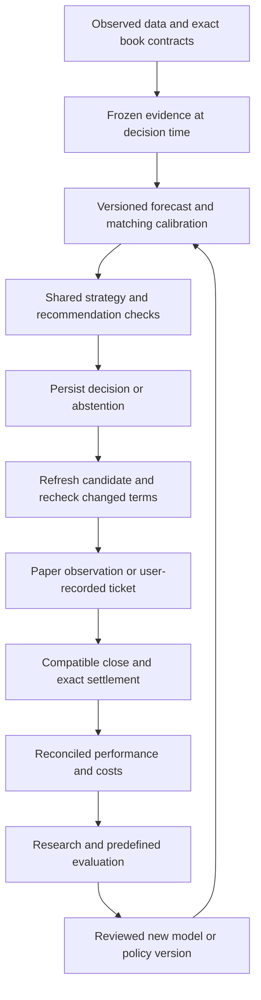

# Superseded plan — the September 9, 2026 Codex queue

**Status: evidence, not instructions.** This was the active plan until 2026-09-10, when the
September 10 review replaced it. It is preserved verbatim below for its dated implementation-state
records, its acceptance fixtures and its measured numbers. Its task lists are closed history.

The single active plan is [`docs/CLAUDE-NEXT-STEPS.md`](../../CLAUDE-NEXT-STEPS.md). Do not execute
anything from this file.

---

# Gridiron HQ: build and evaluate one NFL spread strategy

## Instructions to Claude

Implementation brief with supporting appendices: [audit evidence](evidence/2026-09-09/AUDIT-EVIDENCE.md), [folder and document disposition](reference/architecture/FOLDER-REORGANIZATION.md), [file migration inventory](reference/architecture/folder-map.csv), and [reproduction evidence](evidence/2026-09-09/AUDIT-VERIFICATION.zip).

**Current scope: ordinary NFL full-game pregame point spreads only.** This instruction supersedes the earlier multi-market work packages. The initial operating assumption is one forecast/decision cutoff **60 minutes before each game's scheduled kickoff**, using information actually received by that cutoff. Treat this as a new prospective protocol to qualify, not a label for historical closing-line results. Teasers, alternate-spread ladders, live/half/quarter markets, totals, moneyline bets and player props are outside the active strategy work. Totals, moneyline prices and player information may remain qualified contemporaneous inputs where an existing spread model uses them; they are not additional betting targets.

Preserve existing fantasy and other-market functionality, data and research. The requested folder organization and removal of competing planning documents still cover the full repository, but non-spread changes are limited to behavior-neutral organization and compatibility required by shared dependencies. Do not repair or expand a separate prop/teaser/totals/MLB product as a prerequisite for this spread milestone. The evidence appendix retains the original all-market audit with clear scope labels; negative results are not erased because the active mandate narrowed.

Use this as the next implementation brief for the **NFL betting model in the local Claude project**, not as permission to promote a model, place bets, purchase feeds, or rerun every historical experiment. The primary audited version is local commit `969d501e5d318f8ff650d7e239d8647f8b75eb84` in `/Users/nick_matta/Claude/Artifacts/fantasy-football-dashboard`. GitHub was pulled to `7dfd3f2392510effc6f5d51e9708d502ff80bdbf`; the local project has seven additional commits. Reconcile any newer changes before implementation. Run 31 completed before implementation began. Preserve its original evidence and database; follow Nick’s explicit direction to edit local main, with tests on isolated database fixtures/snapshots.

Read the companion **AUDIT-EVIDENCE.md** for the actual run results, verified defects, source locations, and limitations, and **FOLDER-REORGANIZATION.md** for the complete folder migration and document disposition. These are appendices to this single implementation brief, not competing plans. Read the existing conversation **“Gridiron HQ research platform strategy”** as historical context, but correct its unsupported conclusions rather than carrying them forward. Keep the useful code and negative research already accumulated. The task is to finish a defensible forecasting-and-execution experiment, with a clear stop decision if it fails.

Nick explicitly wants **only this plan retained as the active plan**. Consolidate any still-valid obligations from the old planning documents into this brief, then remove the superseded planning files from the current checkout using the companion's disposition inventory. Preserve actual audit results, experiment declarations, source provenance, and maintained technical references in their proper folders; they are evidence or documentation, not alternative work queues. Do not create another roadmap, next-session plan, or planning archive in the working tree. Git history preserves tracked historical plans. The audit itself made no source-folder moves or document deletions: these are implementation instructions for Claude, as Nick requested.

The desired outcome is one NFL spread strategy with reproducible T−60 evidence, win/loss/push probabilities for the exact handicap, an obtainable price, recorded decisions and abstentions, valid settlement, and an honest economic evaluation. A functioning research platform is an intermediate result. Profit is something the evidence must establish.

Use **AUDIT-VERIFICATION.zip** to reproduce the independent defects and inspect frozen numerical evidence before writing regression tests. It contains isolated audit probes and their outputs, not production changes or another plan.

## 1. Diagnosis that should govern the work

### 1.1 The spread model has not established an advantage over the market

The spread portion of completed run 27 has **153 selections: 72 wins, 78 losses, 3 pushes; −11.854884 units and −7.7483% return on all stakes**. The win rate excluding pushes is **48.0%**. The earlier 545-selection/−10.17%/37.5% headlines combine spreads, totals and moneylines and are not the baseline for this mandate. Removing the other markets is a prospective scope decision; do not present it as a newly discovered profitable selector. These are historical diagnostic selections, not verified personal wagers.

At a constant −110 price, a binary decided bet needs about **52.38%** wins to break even before other costs. Actual spread prices vary, so use each recorded price and treat returned-stake pushes explicitly. The approximately 4.38-point gap from this sample's 48% to that illustrative benchmark is not an estimate of how much any proposed repair will improve accuracy.

Run 27's historical selector deliberately bypassed calibration restrictions required by the current live policy. Its prediction/calibration paths also differ from today's serving graph. Report both facts. The correct verdict is no demonstrated spread advantage; it is not a precise probability of eventual success. Spread-only evidence is smaller than the former combined sample. The independent 50,000-replicate week-cluster calculation gives a descriptive 95% spread-ROI interval of approximately **−23.22% to +7.51%**. It includes zero and does not undo historical selection, timing or execution limitations. Do not borrow the all-market interval or sample size.

The stored 855-game residual audit shows market margin MAE **9.786**, residual-model MAE **9.801**, and raw-model MAE **10.256**. That is evidence against assuming the richer football model already improves the market. Margin accuracy is only one diagnostic: profitable spreads require credible probabilities at the actual handicap and an adequate offered price.

### 1.2 Recent development has not changed what the main replay bets

The initial 51-week inspection found all 395 stored selections identical, including 113 spreads. Run 31 subsequently completed all 70 weeks before source editing began. The full read-only comparison confirmed **all 545 stored selections identical to run 27, including all 153 spreads**, with unchanged side, line, projected number, edge, result and units. Preserve the original prefix inspection as dated evidence; use the completed comparison for current status. The newer offseason collection, diagnostics, and promotion machinery should not be described as a proven predictive improvement.

There are separate learning paths. The main pick board uses the ensemble; the expert council/coordinator is another path. A diagnostic can identify a pattern without changing a forecast. A promoted finding can veto a pick without retraining the ensemble's parameters. The new preseason blend is explicitly staged outside the main production prediction. Make these distinctions visible in code contracts and in explanations to Nick.

### 1.3 The opener thesis remains untested

The existing `vs_open_line` helper does not replay decisions made when the opener was offered. It generates a forecast using the existing historical model path and then compares it with the opening line, sometimes choosing a different side. The stored “opener” spread result is 71–79–3, while the closing spread result is 72–78–3. The broad approximately 50% opener headline excludes moneylines, while the 37.5% closing headline includes them.

Independently keeping the actual closing-selected sides fixed gives 58–92–3 at opening spread numbers. That also is **not** an opener strategy: the selections were chosen with later information. None of these comparisons proves an early betting edge. Build a real decision-time replay and forward experiment before recommending the opener as the solution.

### 1.4 There are material correctness defects

The spread code can confuse repeated matchups from different seasons, choose an earlier quote instead of the decision-time quote, accept invalid prices, preserve a contract identity while changing its line, and settle from incomplete scores. The default residual blend can also admit a challenger despite the caller excluding challengers. These are concrete defects, not speculative reasons for every historical loss.

The new early-season Bayesian mean has its prior weight reversed, and its calibration does not estimate the uncertainty that the comments claim. Because this candidate is not serving the main predictions, it cannot explain run 27's losses. Keep it staged; fix and qualify it only if chosen for a later spread experiment.

### 1.5 The economic operating loop has almost no real evidence

At the database inspection, execution opportunities and lifecycle events were both zero; the conventional bet log, execution log, teaser executions, and general forward-picks table were also empty. There was one user-bet row and 2,331 expert forward predictions, with zero expert settlements. These tables do not establish verified personal profit or loss. They establish that the platform's historical research is much further developed than its measured execution loop.

The quote tape is substantial, but heterogeneous: about 1.17 million rows at inspection included roughly 1.01 million current-capture rows from one early-September window and 159,748 backfilled historical rows in 168 snapshots. The six-season backfill is useful, but it does not turn a one-week book-response experiment into a validated six-season experiment, or establish second-by-second price availability.

## 2. Delivery order and completion contract

Follow the dependency order below; capture can start as soon as its isolated integrity checks pass, while model repair and organization continue. A later statistical qualification is not a prerequisite for collecting the evidence it requires. Keep changes small enough to review independently. Each change must name the behavior it changes, the evidence supporting it, its consumer, and an acceptance test. A module without a consumer is “implemented, not integrated.” A passing test suite is “software verified,” not “profitable.”

| Order | Work package | Completion evidence and dependency |
|---|---|---|
| 0 | Snapshot and evidence correction | Versioned source/data and utilization inventory; corrected scoreboard and opener labels |
| 1 | Contract, quote, and settlement integrity | Independent adversarial fixtures reject the confirmed bad cases; qualified capture can begin |
| 2 | Forecast identity and calibration parity | One reproducible forecast interface; compatible calibrators where available, explicit unqualified outputs otherwise |
| 3 | Genuine decision-time dataset | Inspected cutoff packets exclude later information; collect all games and missingness without requiring betting approval |
| 4 | Complete paper operating software | Candidate fixture reaches settlement through actual routes; an abstention ends at its persisted decision; both survive restart, while real records accumulate |
| 5 | Bounded development and calibration | Market baseline, simple residual and repaired ensemble; earlier-data fits/calibration and declared later comparisons |
| 6 | Frozen prospective evaluation | New timestamped forecasts and fixed-stake diagnostic paper observations; complete denominators and a predeclared endpoint |
| 7 | Review and economics | Advance, continue collecting, simplify or reject using observed evidence; no automatic promotion |

Keep **research capture**, **diagnostic paper evaluation**, **qualified recommendation**, and **user-recorded ticket** as distinct classifications in the existing registry/records. Integrity-qualified experimental forecasts may be stored and scored before their probabilities qualify for money recommendations. Missing calibration is an explicit status, not a reason to discard the raw forecast or pretend it is calibrated. A frozen fixed-unit diagnostic paper policy may select hypothetical observations without granting money authority; label that policy and its limitations. It must still enforce valid identity, information time, prices and accounting.

Break the current cold-start dependency deliberately: `calibratedCoverProbability` returns null until its forward gate passes, and the live selector rejects calibration-ineligible picks. Do not weaken those recommendation gates to manufacture a calibration dataset. Use the research forecast interface to collect earlier predictions, fit calibration on permitted earlier labels, then assess that calibrated graph on later observations. Existing qualified historical-as-of data can support development; otherwise collect prospective calibration data first. A fixture proves software completion; actual capture, settlement and statistical qualification remain separately pending until observable. Neither a real qualifying bet nor a profitable result is a prerequisite for shipping the evidence collector.

Suggested effort allocation for this milestone: 50% correctness, data timing, and integration; 30% model/evaluation repair; 20% focused research. This is a prioritization recommendation, not a promise of time to profit. Consolidate the planning documents first, establish the complete ownership/migration inventory, then reorganize code in verified slices alongside the work packages. Finish the full folder disposition without letting cosmetic moves delay the first complete workflow.

### Implementation state — first repairs on local main, September 9 Eastern

Nick explicitly directed implementation on the Claude-local **main branch**. Work began from clean `969d501e5d318f8ff650d7e239d8647f8b75eb84`; fetching origin confirmed seven local-only commits and no remote-only commits. This current instruction supersedes isolated source-branch/worktree recommendations elsewhere in the original brief. Tests and diagnostics must still use temporary databases and disabled/mocked collection. No live schema change, model fit, provider purchase, wager or promotion was performed in this slice.

The active plan and appendices are installed in this repository; README and the existing `/api/nfl-market/research-lab/plan` endpoint now point here. **Document extraction/deletion and physical folder moves are not complete.** The folder map now accounts for all 761 baseline paths, nine first-slice additions, and three model-repair additions (773 total); continue reconciling additions before executing moves. This is still the only governing work queue.

Completed and verified in the first integrity slice:

- Quote resolution requires a matching kickoff and canonical teams, rejects ambiguous provider identities, and uses the latest usable observation at the frozen connector decision instant. It preserves quote IDs/receipt/source clocks, excludes backfilled history from the normal live path, and refuses stale, future, removed, conflicting and wrong-period quote evidence. This is not yet the complete T−60 forecasting interface or a durable reschedule crosswalk.
- Execution routes and ledger primitives validate whole-number American odds (absolute value at least 100), finite positive stakes, finite potential payouts, explicit accepted spread lines, books and lifecycle chronology. Changed handicaps are **rejected on the old contract**, rather than corrupting its identity. A child-contract repricing workflow and comprehensive off-policy ticket adapter remain pending; existing separate user-bet bookkeeping remains available.
- Settlement refuses incomplete/negative/noninteger scores, conflicting mirrored team results, wrong opponents/periods, ambiguous games and games not yet started. It grades the recorded accepted line/price, independently of closing-quote availability. **Explicit provider-finality observations and append-only settlement corrections still need implementation**; mirrored complete scores are not a substitute for that future evidence contract.
- Live pipeline delay previews beyond the observation horizon remain pending with zero obtained stake. Retrospective carry-forward results now identify their modeled assumption. Observed quotes never become confirmed sportsbook fills.
- Added pinned `fast-check` 4.9.0 for bounded generated contract/price/stake/accounting cases with seed 9021026, plus actual authenticated API fixtures for invalid inputs and pipeline quote lineage. A seeded version of the old finite-only price validator fails the corresponding generated property.
- Fixed a discovered fresh-install startup failure: database migrations now finish after the port guard and before importing routes whose dependencies prepare statements against migrated tables.

Verification: **147/147 execution tests passed**, including the 12 new integrity tests; typecheck, syntax lint, build, fresh-database startup and the port-guard check passed. The full offline suite ran 1,207 tests: 1,185 passed, 21 failed, one skipped. **All 21 failure names reproduce on the untouched audited commit** in the same empty-data setup; they are older real-data-dependent model tests, not newly introduced execution failures. Do not call the entire suite green or silently skip them. The CI/test-fixture package must separate explicit dataset-dependent experiments from meaningful hermetic tests. See [verification record](evidence/2026-09-09/implementation-checks.json).

Run 31 finished all 70 weeks before source editing began. A subsequent read-only full comparison confirmed all **545 selections, including 153 spreads, identical to run 27 across all 70 stored pick arrays**. The historical spread result remains −7.7483% ROI. See [completed-run comparison](evidence/2026-09-09/run31-completed-comparison.json); preserve the earlier 51-week inspection as its original dated observation.

Resume from the incomplete work packages above: finish the required data/finality and exact-contract operating interfaces, then forecast/calibrator identity and the honest research-capture loop. Do not re-run unchanged historical seasons or mark calibration, positive EV enforcement, abstention persistence, findings controls, source contributions, folder cleanup or prospective profitability complete because this first software slice passed.

### Implementation state — model authority and calibration isolation, September 10

Repair commit `3f19e25` is on local main. This advances work package 2; it does **not** complete the frozen forecasting interface or statistical qualification.

- **M04 exclusion repaired:** challenger-only components now receive zero champion residual weight before normalization, and serving independently refuses their residual contributions even if an artifact contains a bad nonzero weight. Champion raw forecasts, disagreement, confidence and empirical distributions remain unchanged under 40 seeded challenger perturbations. Challenger diagnostics remain visible. Cache version v8 prevents v7 fitted weights from being silently reused.
- **Family-comparison defect repaired:** the former family shortcut always performed a raw blend and retained the full model's distribution, even when the caller requested market-residual forecasts. Family selections now use the same fitting/blending/distribution path, and their cache keys include the selected families. Equivalent family inclusion and model exclusion produce identical forecast packets in tested raw/residual and champion/candidate cases. Historical family-ablation outputs from the old shortcut must retain their old source version; they are not evidence from this repaired implementation.
- **M06 compatibility boundary installed:** a shared identity records algorithm version, blend, weighting, family/model exclusions, challenger mode, controller/neural version and information regime. Calibration fitting defaults to the requested residual graph and uses the same Shin no-vig method as serving. Fits are versioned by graph and retain their identity. Stored generic `cover-logit-v2` fits cannot authorize the current board. Historical weekly closing calibration is explicitly research and cannot authorize `live_weekly_unfrozen`; neither is described as T−60. Candidate calibration requiring dynamic controller provenance is rejected by the old replay builder rather than mislabeled.
- The real decision board and coordination audit use the compatibility check. Missing calibration produces an explicit reason while retaining the raw margin/edge evidence. Decision snapshots identify actual base-model contributors using residual weights in residual mode; they retain residual slopes/weights and identify the existing empirical distribution as base-ensemble research. A neural output is recorded as used only when it actually supplies a finite margin. Full per-decision contribution amounts, neural distribution parity and counterfactual source ablations remain pending.

Verification: **251/251 targeted model, policy and execution regressions passed**, including 14 new tests; the final trace adjustment passed its seven board/calibration tests and syntax check. Typecheck, build and syntax lint (536 JavaScript files) passed. Isolated mutation copies restored each of the old fit-exclusion, serving-exclusion and family-shortcut defects; the tests rejected all three, while the unchanged control passed. The original full-suite result remains a separate historical record: the 21 dataset-dependent failures have not been repaired or silently waived. [Verification and source hashes](evidence/2026-09-09/implementation-checks.json).

**Still required:** this is algorithm/configuration identity, not a complete frozen input/learned-artifact manifest. The residual slope/gain test remains in-sample and is now labeled accordingly; chronological out-of-fold selection is not implemented. The old calibration builder still draws selected nonpush outcomes from closing-known replay; replacing that dataset with every eligible decision-time observation is essential. Its historical `forward_gate_passed` field is not prospective approval. Complete cache invalidation, real T−60 capture, calibrated push-aware positive EV, explicit provider finality, append-only decision/settlement history, controlled review, and physical document/folder consolidation remain open. No live fitting, new economic replay, wager or promotion was run. These software fixes do not change the historical loss record or demonstrate profit.

Next implementation priority: persist the complete frozen T−60 research packet for every scheduled game, with strict as-of inputs, artifact/configuration identities, raw predictions and explicit missingness/abstentions; keep it separate from qualified recommendations. Finish finality and exact-contract paper operation alongside that collector, then build the chronological residual/calibration experiment from admissible observations. Continue the single plan and reconciled migration inventory rather than adding another roadmap.

### Claude-work audit and required corrections — September 10, 14:12 UTC

**This is an update to this same governing plan, not another roadmap.** Nick requested an audit of Claude's implementation and instructions for anything still wrong; this review changes documentation only. Review baseline: Codex commit `4a9a9c1`. Reviewed Claude's committed changes through `6d8245f` (including the decision-tape work first observed before it was committed), its dated implementation summary, migrations, callers and tests. Source was copied into an isolated review snapshot before testing. Claude continued editing delay-preview code during this review; those later uncommitted edits are identified separately below and are **not** certified by the snapshot test result.

**Keep the useful repairs:** the Bayesian weight formula now has the right direction; the opener diagnostics distinguish fixed-side regrading from side reselection; repeatedly flagged findings are no longer automatically excluded from holdout testing; strong findings are refused by the shrink-veto promotion entry point; acceptance checks read persisted forecast inputs; the residual slope uses disjoint fit/score rows instead of grading exactly the rows that fitted that slope; and the new decision tape is connected to the execution pipeline. These are real advances. Several are only partial fixes, and passing their current tests does not close the findings below.

**Evidence checked:** the isolated Node 25.9.0 suite ran **1,270 tests: 1,240 passed, 24 failed, six skipped**. The failures include the 21 previously identified development-data-dependent failures and three newly added preseason tests with the same dependency. Five of the six skips are new audit-overview tests that require local audit-run data; the other skip predates this work. The test environment used an empty fallback database, temporary fixture databases, disabled scheduling and an external-fetch guard. This was not a run against Nick's live database. Separate adversarial fixtures reproduced the migration, decision-tape, shopping-probability, schedule-window and preseason-fallback defects below. Do not replace this with the summary's claim that clean CI is proven green.

A read-only check of the actual stored picks confirmed run 32 completed 70 weeks: **156 spreads, 74 wins / 79 losses / 3 pushes, −11.08840017048844 units, −7.10794882723618% ROI**. Run 27 remains 153 spreads, 72/78/3, −7.748290384027985%. That is an approximately **0.64 percentage-point** descriptive improvement, not demonstrated profitability. Run 32 still tests the raw, closing-known historical graph and does not qualify the intended T−60 residual strategy. Keep both records; do not overwrite either. Its totals remain 23/24/1 over 48 bets and −6.134629893% ROI, despite the summary's abbreviated/misrounded table.

#### R01 — P1: Decision identity still collapses materially different forecasts (E6 / WP2–4)

**Where:** `server/services/nfl-decision-tape.js:40–100`, `nfl-auto-picks.js`, and `nfl-execution-pipeline.js:107–166`.

`decisionFingerprint` and the event insert read `d.edge`, while the real decision board supplies `edge_points`. They omit the feature snapshot, forecast/calibrator identity, model probability, quote ID, code/data identity and engine mode from the hash. `recordDecisionRun` accepts code/data hashes but does not include them in identity, and the pipeline currently supplies neither. Consequently, a revised model can return `created:false` and link a new opportunity to an old forecast event. In the isolated reproduction, changing the raw forecast from **5 to 12**, `edge_points` from **2 to 9**, model A to model B, the quote ID, and both code/data hashes reused the **same run ID**; the stored edge was **NULL** and the old feature packet survived.

**Required correction:** define and use the actual decision-board schema at this boundary. Hash a canonical frozen payload including graph/fit/calibration/policy identities, input and quote lineage, forecast values, missingness and reasons, the decision horizon and its scheduled event/contract identity. Populate authoritative hashes from the producer; do not accept a supplied hash as a substitute for checking its payload. Separate a retry token for the *same scheduled observation* from content equality: identical values at a later required horizon still need their own observation identity. Require a complete event/contract match when linking an opportunity; `findDecisionEvent` currently matches only matchup/market/selection and takes the first row, omitting handicap, quote and kickoff. Preserve existing old records as incomplete legacy evidence; do not relabel them as complete frozen packets.

**Acceptance:** invoke the real board-to-pipeline path, independently change each omitted field while holding the betting selection fixed, and verify a new immutable record with the correct edge and lineage. A retry of the same scheduled observation must remain idempotent. Two observations at different declared horizons must both survive. Duplicate selections at different lines/quotes must resolve uniquely or fail, never choose the first row.

#### R02 — P1: Decision runs can be partially written and then permanently treated as complete (E6)

**Where:** `nfl-decision-tape.js:74–104`; migration `027_decision_tape.js` decision-run/event triggers.

The run header and child events are written outside a transaction. A two-decision fixture with an invalid second matchup left a header declaring two decisions and only one child. Retrying returned `created:false` and never repaired the missing child. The supposedly immutable schema also permits deleting an **empty decision run**, because there is no run-level delete trigger; a child delete trigger does not protect a parent with no children.

**Required correction:** validate the complete packet before writing and atomically insert the header plus all events, with safe idempotency handling inside the transaction. Check that an existing run is complete before treating a retry as successful. Protect run deletion as well as update, including empty/all-abstention observations. Define append-only invalidation/replacement for any already-partial legacy record rather than silently rewriting it. If zero decisions means collection/forecast failure, record that status and the expected scheduled-game denominator rather than presenting it as an exhaustive healthy pass.

**Acceptance:** inject failure at the second event, verify no partial header/children remain, then retry successfully; test process restart and duplicate retry. Verify both nonempty and empty run headers resist deletion, and each run's stored counts reconcile to its child events.

#### R03 — P1: Migration 027 fails on populated execution history; rollback discards new evidence

**Where:** `server/migrations/027_decision_tape.js` opportunity rebuild before lifecycle rebuild; its `down`; `server/db/index.js:36–46`.

The normal migration runner keeps foreign keys enabled. `up` drops the existing opportunity parent while its lifecycle children and no-delete trigger still exist. An isolated upgrade through migration 026 with **one opportunity and one offered event** failed with **“lifecycle events are append-only — record a new state instead”**. Transaction rollback preserved both rows, but an ordinary populated installation cannot complete startup. Fresh-database migration tests do not exercise this. The downgrade additionally filters out the newly introduced terminal outcomes and drops the decision tape, which is destructive to evidence if allowed to proceed.

**Required correction:** implement SQLite's supported parent/child rebuild sequence within a reviewed migration procedure, accounting for every referencing table, index and trigger. Foreign-key configuration cannot be casually changed inside an already-open transaction. Preserve all IDs, event order, forecast fields and decision links; finish with `foreign_key_check` and content/count reconciliation. Refuse a downgrade when newer evidence cannot be represented, or implement an explicitly non-destructive compatibility strategy. Do not silently delete terminal decisions to make rollback succeed.

**Acceptance:** migrate a populated 026 fixture containing offered, observed, decision, refreshed, accepted and settled histories and then exercise the new terminal states. Verify exact preservation, foreign keys, idempotent restart and append-only protections. Inject a rebuild failure and verify rollback. Test a populated downgrade refusal without losing one row.

#### R04 — P1: Opponent adjustment uses obsolete schedules against current statistics (M13)

**Where:** `nfl-ensemble.js:491–526`, `scheduleFaced` and `sharedContext` around lines 697–718; compare `featureAggregates` around line 261.

The new adjustment is no longer algebraically empty, but `scheduleFaced(hist)` includes **all game history from 2015 onward**. The EPA feature aggregation uses the target season's earlier weeks and the previous season, with recency weighting. Thus old opponents are evaluated using their current/recent quality and can dominate the schedule adjustment. This contradicts the new description of “opponents actually faced this season.” In Claude's own synthetic opponent fixture, keeping every feature row in 2024 and neutralizing home-field effects, adding only 2016 schedule rows moved the 2024 component margin from **−23.400 to +16.714**.

**Required correction:** align opponent exposure to the precise games/seasons and weights used by the underlying efficiency statistic. Prefer game-level sufficient statistics so offense/defense exposure and opponent quality can be joined under the same as-of cutoff; otherwise document and test the exact supported seasonal fallback. Do not simply apply a current-season schedule to features that still mix the previous season. Use explicit missing-coverage treatment. Bump affected model/fit/forecast identities after the fix, preserving run 32 as a record of the earlier implementation.

**Acceptance:** old schedule rows outside the feature window cannot alter this component; changes within the eligible schedule do. Include week 1, a new season, partial opponent coverage, repeated opponents, and future-row exclusion. Repeat the component-level comparison before attributing an economic improvement to this signal. This does not authorize another broad parameter search on run 32's already-seen outcomes.

#### R05 — P1: New three-state shopping values are still an unqualified probability model (E5)

**Where:** `nfl-execution-edge.js:referenceCoverBaseline`, `coverProbabilities`, `bestExecution`; `execution-slate-reasoning.js:171–205` and its staking consumer.

Separating win/loss/push is useful, but the values are not “exact” or directly measured conditional cover probabilities. They splice a 50/50 median-line assumption into an unconditional absolute-margin distribution built from all stored seasons, split signs symmetrically. Those two distributions need not be compatible. Using the new tests' own exact population (absolute margins 0:10%, 3:30%, 7:20%, 10:40%), `coverProbabilities(3, -10.5)` returns **win −0.125, loss 1.125, push 0**. There is no fitted decision-time distribution, cutoff or cache refresh contract here. The existing legacy fallback still feeds `0.5 + line_edge` toward sizing when the new fields are absent.

`bestExecution` also continues sorting the old `2*lineEdge + priceEdge` approximation instead of the three-state expected return it now exposes. With that same fixture, it ranks **+2.5 at +100** ahead of **+3 at −150**, although its own attached probabilities imply EV **−0.1500** versus **−0.1416667** respectively. The “best” label is inconsistent even with its own new model.

**Required correction:** distinguish observed price improvement from modeled absolute profitability. Keep this probability path research-only until a coherent, cutoff-safe signed-margin/conditional-push model is fitted and evaluated for the exact spread regime. Reject invalid probability triples; clamping negatives is not a model fix. Remove the legacy shortcut as a route to qualified staking. Rank economically using `p_win * net_win_payout − p_loss` under a common qualified distribution, with exact contract/quote matching; otherwise label a price/line comparison as diagnostic. Do not let `source:'execution'` grant money authority to these probability assumptions. Keep other-market/teaser feature development deferred.

**Acceptance:** bounded generated tests verify each probability lies in [0,1], sums within declared numerical tolerance, correct signed line ordering and push transitions, consistent probabilities across adjacent lines, strict historical cutoff and cache invalidation. Ranking must agree with direct expected-return calculations across both prices and lines. Unqualified modeled advantages may support clearly labeled fixed-stake diagnostic paper work, not qualified Kelly recommendations.

#### R06 — P1: The new CI workflow is not yet hermetic or demonstrated green (WP16)

**Where:** `.github/workflows/ci.yml`, the dated implementation summary, `test/nfl-preseason-blend.test.js`, and the five previously identified dataset-dependent test files.

The workflow says every test builds its own temporary database, but several test files still import app services against the default database and require Nick's populated development history. Clean-checkout execution reproduced **24 failures**: the known 21 plus the new preseason prior-variance monotonicity, observation-noise monotonicity and future-cutoff tests. There are also five new skipped audit-overview checks when run 27/31 is absent. A local full-data pass does not establish a credential-free clean CI pass. The workflow sets only `SCHEDULER_DISABLED`, not a fallback database or network prohibition.

**Required correction:** replace logic tests' accidental dependency on the development database with deterministic fixtures that exercise their actual production functions. Keep large historical experiments separately and explicitly dataset-dependent. Set a temporary fallback DB for the test job and enforce an external-network guard while permitting intentional localhost fixtures. Validate under the workflow's pinned Node 22 environment, not only the local Node 25 environment. Do not solve this by dropping the failing tests or saying the database is expected to be populated in CI.

**Acceptance:** a clean checkout with no `.env`, live DB, provider credentials or cached audit runs passes the required suite; tests of economic headlines run on small saved synthetic audit packets and do not silently skip. Record the exact runtime and final pass/fail/skip counts. Correct the summary's “hermetic/all five steps verified” claim until that evidence exists.

#### R07 — P1 before qualification: Residual OOF repair does not yet isolate the entire fitted pipeline (M05)

**Where:** `nfl-ensemble.js:936–939`, the per-week context construction and the 70/30 residual split around lines 1014–1098.

The direct same-row residual-slope grading defect was improved. However, a single feature calibration `calibrate(all, ..., calibrationCutoff)` is computed before the historical week loop and reused in every context. For a normal later prediction it can include all labels through 2021 while generating/scoring component forecasts for earlier years in that same period. Separating the residual multiplier's fit and score arrays does not undo leakage through the upstream feature-to-points calibration. The split also slices individual game rows rather than complete week clusters; it can fit and score games from the same week. Claude correctly describes this as a single split, but “genuine held-out” must not be taken to cover the entire graph.

**Required correction:** generate historical component forecasts with *every* fitted upstream transformation restricted to the forecast's permitted earlier information, then fit the residual multiplier on prior folds and score later complete weeks. Persist fold/cutoff membership and fit identities; use the declared clustered assessment and later evaluation set to assess selection. Keep the v9 single-split results as dated development diagnostics, not a promotion certificate. Do not quietly weaken the sample or significance bar to force this gate open.

**Acceptance:** perturb labels unavailable at a historical prediction and verify neither its base component forecast nor its calibration parameters change. No week straddles fit and score. Include a synthetic apparent in-sample signal with no later skill that fails the final gate; an authority-only fixture with more history is not sufficient validation of OOF correctness.

#### R08 — P2: Findings versioning still has fail-open and renewal gaps (M12/E12)

**Where:** `nfl-candidate-findings.js:assertRuleUnchanged`, `recordDiscoveryFlag`, `promoteFindingToShrink`; `nfl-replay.js:segmentRuleHash` / `trainingAuditCodeHash`.

Hashing code is better than hashing labels. But the implementation depends on `git` and the process working directory; its fallback is `null`, so a packaged or non-repository execution no longer binds a real predicate implementation. `assertRuleUnchanged` accepts a missing stored hash, and promotion does not call it. Stale rules are told to reappear under a new `segment_key`, yet discovery still looks up the same dimension/segment-only unique key; the normal discovery path cannot create that replacement version. Broad replay/policy edits can therefore strand old findings or stop the season-end job even without a predicate change. Silently ignoring a stale live veto avoids applying it, but its invalid status must be exposed rather than presented as an unchanged, successfully validated policy.

**Required correction:** use an explicit versioned rule/configuration/dependency manifest resolvable without repository metadata, fail closed for missing provenance, validate the version at promotion as well as holdout/serving, and provide a real new-version lifecycle preserving old evidence. Keep the default approved rule set empty until horizon-specific approval. A stale finding should not abort unrelated findings' evaluation without a recorded, isolated reason.

**Acceptance:** run rule hashing from another working directory and without `.git`; missing/stale hashes cannot qualify; a changed rule can be rediscovered as a separate version under the same human label; unrelated documentation changes do not redefine the predicate; stale-rule status is visible and the policy/board cache cannot retain its old authority.

#### R09 — P2: The new audit overview has accounting and coverage defects (WP0)

**Where:** `nfl-audit-overview.js:52–106` and `compareAuditRuns`; `nfl-replay.js:42` bootstrap helper.

`by_market` initializes pushes to zero and never adds any: run 32 actually has **three spread pushes and one total push**. The separate spread-only calculation uses picks and can consequently disagree with `by_market.spread`. The bootstrap receives only weeks with spread picks, excluding sealed zero-spread weeks instead of the full declared 70-week cohort. Coverage uses min/max week strings, hiding holes, while `weeks_sealed` counts rows whose result JSON may be invalid or absent and is silently skipped. Missing units are silently treated as zero. These are inappropriate defaults for an evidence-of-completion report.

Full-result hash comparison is a useful integrity comparison, but includes player/council/context/metadata, so a changed hash alone does not prove a changed betting decision. In the actual 27/32 records, all **70 full results** and **70 full pick arrays** differ, but only **21 weeks' all-market economic pick tuples** differ; for spreads, **13 economic weeks** and **65 forecast-value weeks** differ. Economic tuples here mean matchup, market, selection, line, result and units; forecast tuples additionally include model number, market number and edge. These comparisons answer different questions and should be reported separately.

**Required correction:** aggregate authoritative pick-level outcomes with explicit unsupported/missing states, reconcile the stored summaries, retain full precision until presentation, report exact expected/present/valid week sets, and bootstrap the declared cluster universe including zero-bet weeks. Separate artifact identity, forecast changes, selection/price changes and realized-P&L changes. Do not silently infer “complete and no change” from missing or null hashes.

**Acceptance:** synthetic runs with pushes, void/missing outcomes, zero-bet weeks, a gap, corrupt JSON and metadata-only changes produce the correct explicit statuses. Market and spread totals reconcile. The ordinary valid run reproduces the independently checked record above, with seed/draw count/cohort recorded for its interval.

#### R10 — P2, keep staged: Preseason cutoff fallback still borrows future data (M01)

**Where:** `nfl-preseason-blend.js:224–227`, module-level `CALIBRATED`/exported variances and the calibration cache.

The default as-of query is an improvement, but when that earlier history cannot estimate a variance the code falls back to `PER_GAME_VARIANCE`/`PRIOR_VARIANCE`, which were fitted using **all recorded seasons**. An isolated 2016 prediction with an explicit prior and no eligible variance history changed its posterior standard error from **5.756 to 12.286** after changing only 2024 scores and reloading the module. The new cutoff test does not cover this sparse-history fallback. An explicit later `asOfSeason` is documented as illegitimate but not rejected.

**Required correction:** use a genuinely prespecified, versioned fallback or report insufficient prior uncertainty; never substitute a future-fitted global estimate for an as-of fit. Validate the cutoff against the target season, make cache invalidation explicit, and distinguish observed year-to-year prediction error from a validated latent-team-quality variance model. Keep this module staged; do not let its remaining research refinement displace the active spread collector.

**Acceptance:** with no and sparse earlier history, adding/deleting/changing future seasons cannot change any historical output, including uncertainty and missingness. A prohibited later cutoff is rejected. Existing formula-direction checks remain and should exercise the real implementation using fixtures.

#### R11 — P2: Reconcile completion claims and the folder inventory; preserve the original delivery order

The dated summary credits prior Codex **M06/E1/E3 as completed**, whereas this plan explicitly kept the frozen T−60 interface, full artifact/input identity, provider finality and other operating requirements open. E4's persisted inputs fix the request-body trust problem, but nullable evidence still skips those checks, accepted forecast columns are not an immutable decision packet, and positive-EV/qualified-recommendation versus manual-ticket classification remains unfinished. Do not upgrade these to complete based on the new summary.

At reviewed commit `6d8245f`, there are **780 tracked files versus 773 migration-map rows**: **12 new paths have no disposition and five deleted documents are still listed as current paths**. Add dispositions for the CI workflow, both new evidence/contract documents, migrations 026/027, the audit overview and decision tape, and their five new test files. Record the five superseded document removals as completed historical dispositions rather than pretending they remain live paths. Correct the claim in `nfl-policy.js` that `PROFITABILITY_PLAN.md` was removed: it still exists. Preserve unique old evidence before further deletion and keep this as the only work queue.

**Required state update:** M01 formula fixed / sparse-history qualification pending; M05 direct split fixed / full pipeline OOF pending; M13 adjustment implemented / schedule defect open; E4 server-side input lookup fixed / full execution authority pending; E6 connected / R01–R03 blocking trustworthy evidence; M06 identity boundary installed / true timing and artifact parity pending; E5 improved outcome accounting / probability qualification and ranking defects open; CI created / clean execution failing; document consolidation partial / physical moves pending.

**Order from here:** fix the evidence-loss/upgrade hazards (R01–R03), make clean fixture verification reliable (R06), and correct forecast/shopping defects before relying on those outputs (R04/R05/R07). Then resume the already prioritized all-game T−60 research capture and exact-contract fixed-stake paper lifecycle. R08/R09 support trustworthy evaluation; R10 remains a staged dependency. Do not turn this review into another broad raw closing-line rerun or make additional historical tuning the substitute for the collector.

**In-flight edits observed, not certified:** after the review snapshot, Claude modified `nfl-execution-replay.js`, its pipeline caller and replay/integrity tests to add kickoff refusal and distinguish interpolated/extrapolated carry-forward. Preserve the existing future-horizon refusal. A later tape row does **not** by itself confirm the same quote remained obtainable throughout a gap: validate book, contract, quote state, price, observation/receipt cutoff and suspension/removal boundaries. Keep both carry-forward variants explicitly modeled, and ensure no observation beyond `observedThrough` is used to assert confirmation. These delay-preview edits were subsequently committed as `6fc652a` while this document was being written. Inspect and test that final version before marking E7 complete; it was not included in the 1,270-test snapshot above. At the final status check, Claude had also started uncommitted `028_settlement_corrections.js` and lifecycle edits. Those new settlement changes are outside this completed snapshot audit; do not treat them as reviewed or as resolving R03.

**Review boundary:** no application source, migration, existing audit result or live database was modified by this audit. The tests and counterexamples above ran on scratch copies/temporary databases; the 27/31/32 verification was read-only. Correct these items in small reviewed slices and add results back to this plan's implementation state with source identifiers. Never retroactively change the negative records to make the repair appear successful.

## 3. Work package 0 — establish one truthful evidence record

### Tasks

1. Create a source manifest with the local commit, dirty-tree state, configuration hash, dependency lock, model versions, and selected data hashes. Keep credentials out of all manifests. Record the read-consistent snapshot time. Use SQLite's supported backup/snapshot mechanism for a working copy; do not copy only the main database file during active WAL writes and assume it is complete.
2. Preserve run 27, ongoing run 31, previous completed runs, failed runs, and their manifests. A failed or cancelled run is not a negative statistical trial or a new independent replication. Preserve why it failed. Repeated historical seasons remain explored history after a new code hash.
3. Generate the audit overview from saved records. Show market-specific selections, wins/losses/pushes, amount staked, profit, return, unique games, weeks, years, uncertainty, data provenance, and exact policy. Label synthetic, retrospective, prospective paper, and user-recorded tickets separately.
4. Fix the opener disclosure. Provide two distinctly named diagnostics if both are useful: **same-side endpoint regrade** and **side-reselected counterfactual**. Neither gets a forward or executable label. Neither reuses closing prices as opening payouts. The current note claiming “same picks” must not accompany changed sides.
5. Add a run comparison using saved predictions, not a fresh expensive replay: compare selected rows and forecast hashes on overlapping weeks. Report changed forecasts, changed selection policies, unchanged outputs, and new data separately. Explain why running the same frozen computation again does not teach it anything new.
6. Make error attribution name the marginal reason for a bet. If market-anchor components dominate the weights but contribute almost zero deviation from the market, show the components responsible for the actual deviation. Keep numerical reconstruction separate from evidence that those components are predictive.
7. Mark run 27's completed coverage and run 31's scheduled coverage as weeks 5–18 of 2021–2025; show run 31's actually completed prefix separately. Neither protocol directly tests weeks 1–4, where the new early-season module is supposed to help.
8. Make spreads the active scoreboard filter, retain the historical all-market report as evidence, and recompute spread-only uncertainty. Do not run new moneyline/total/prop audits for this milestone. Main desk recommendations must enforce the spread-only market/period policy server-side; preserved other-market pages do not inherit this strategy's authority.

### Acceptance

The generated overview reproduces the spread-only table and interval in the companion, with explicit handling of approximately 0.001-unit differences caused by summing rounded weekly figures. A reader cannot mistake the combined 37.5% rate for spread accuracy, compare a moneyline-heavy sample with a spread/total-only sample, or interpret a repeated historical run as new evidence. A run-comparison fixture recognizes identical predictions under changed diagnostic code.

## 4. Work package 1 — fix prices, contracts, and settlement first

### 4.1 Canonical events and decision-time quotes

Repair `nfl-execution-pipeline.js` to resolve an event using a durable provider/canonical mapping with season, kickoff, home, away, and reconciliation status. Team names alone are not an event ID. Resolve postponed games, neutral sites, rematches, abbreviations, and provider-ID changes explicitly. If two events match, abstain with an ambiguity reason.

For an opportunity at time `t`, choose only quotes whose usable receipt time is at or before `t`; among eligible records, select the latest compatible quote for the exact book, market, period, participant, side, line, and rules. Refresh after the decision is a separate event. A historical quote can support a retrospective experiment but must never masquerade as a current live quote.

Preserve source snapshot time, bookmaker update time, local receipt time, decision time, refresh time, market status, and sequence. Reject future-dated, stale, malformed, suspended, or unresolvable records. Store the reason rather than silently dropping them. Treat sparse quote coverage as unknown between observations unless an explicitly labeled model is being evaluated.

### 4.2 Pair only compatible spread quotes

For ordinary full-game spreads, resolve canonical event, bookmaker, home/away identity, period, handicap, overtime rule and settlement version before pairing sides. A home −3 quote pairs with away +3 at the same book and compatible observation; home −3 and away +3.5 are different thresholds. Preserve each actual quote ID and timestamps, and prevent cross-book price/label mixing in any shared adapter the spread path uses.

A better displayed handicap can come with a worse price. Home −3 at −120 and home −3.5 at −110 must be compared through their respective threshold probabilities and payoffs, not sorted by handicap or American price alone. Use standard main-line offers in the initial strategy; alternate-line quotes can inform a separately qualified reference but do not become a new traded market. Missing compatible quotes produce a no-bet, not an invented opposite-side price.

### 4.3 Enforce line identity through the lifecycle

An accepted −7.5 spread is a different threshold from the −3.5 spread used to calculate the original probability. A changed handicap creates or references a new exact contract and child decision, preserving the parent opportunity. Recompute its threshold probability from the **same frozen T−60 forecast/distribution, inputs and compatible calibrator**, then recompute expected payoff at the refreshed price and rerun applicable gates. A price-only change changes payoff, not the frozen football forecast. Do not re-anchor a market-residual forecast to the new market price, fetch later football inputs, or switch selected sides while calling it the original decision. If the chosen architecture cannot validly price the new threshold from that frozen artifact, abstain. Never settle the new line under the old immutable contract key.

Material news received after cutoff can cancel a pending recommendation under a predeclared veto rule; it cannot improve the frozen forecast retroactively. Preserve the original forecast for evaluation and the separate veto/refresh outcome. A later forecast belongs to a separately defined horizon/cohort. A report of an already-placed wager still belongs in bookkeeping.

Validate odds as finite legal values under the provider's documented format; reject zero, NaN, infinity, malformed strings, and economically invalid representations. Validate stake units, timestamps, source, and market compatibility. A bad price must fail before expected value, exposure, acceptance, or settlement is recorded.

### 4.4 Spread sign, push and payoff semantics

Use one canonical orientation. Let `M = home score − away score` and `s` be the **home handicap**; home −3.5 means `s = −3.5`. Home wins the spread when `M + s > 0`, pushes when `M + s = 0`, and loses when `M + s < 0`. Reverse win/loss for the compatible away side. Provider home/away/selection sign conversions belong in a tested adapter.

For a one-unit cash-risk spread with net win payout `b`, expected profit is `p_win × b − p_loss`; returned-stake pushes contribute zero. Keep `p_win + p_loss + p_push = 1` for the modeled ordinary settlement states and extend explicitly for any relevant void outcome. Never equate a conditional-on-no-push win probability with unconditional `p_win`. Save the full-game/overtime, postponement/cancellation, tie/push and correction rules with the contract. Grade under the applicable book rules, not a generic label or current rules retroactively.

At integer handicaps, opposite sides' unconditional win probabilities sum to `1 − p_push`. On a half-point line with no void state they sum to one. Two-way normalization of quoted prices supplies a conditional reference; it does not by itself identify push mass. A price-shopping benefit and positive absolute expected return remain separate quantities.

### 4.5 Settlement and corrections

Require final game status, complete scores for both teams, a resolved event, and a compatible contract before settling. Missing opposing scores are not zero. Grade game finality, score corrections, overtime, ties, pushes, cancellations and voids according to the saved rule version. Corrections append a reversal/replacement event; do not silently rewrite the original result. Settlement must be idempotent and reconcile cumulative stakes and net profit.

### Adversarial acceptance fixtures

- Same two teams in different seasons and twice in one season: select the correct event or abstain.
- Two compatible quotes, −140 then −155: use the correct quote at the declared cutoff; no future quote leaks backward.
- Only sibling/removed quote samples remain: return a per-candidate abstention for the missing exact quote; never dereference a null quote or abort the whole slate.
- Home −3 from book A and away +3 from book B: reject them as a same-book probability pair; preserve each real offer for separately qualified price comparison.
- Compatible home/away spread sides and sign changes reconcile; different handicaps never pair as one threshold.
- Price zero and other malformed prices: rejected before lifecycle acceptance.
- Refreshed handicap changes from −3.5 to −7.5: a new probability/contract decision is required.
- One score missing or game not final: no settlement.
- Integer push, overtime, tie, postponement/cancellation, incomplete result and corrected score: each reconciles to its saved full-game spread rule.
- Process restart after refresh/acceptance/settlement: no duplicate cash flow or double exposure.

## 5. Work package 2 — give every forecast one identity

### 5.1 Separate a forecast from the policy that trades it

Define an immutable forecast artifact containing engine/version, component versions and eligibility, input cutoff, feature-data hash, training cutoff, hyperparameters, calibrator/version, target distribution, and output probabilities. Define a separate policy artifact containing eligible markets/books, horizon, expected-return requirement, freshness rule, uncertainty treatment, exposure limits, and ranking. Every decision binds both IDs.

Make the raw football ensemble, market-residual ensemble, optional neural adjustment, and expert coordinator explicit distinct candidates. Do not display coordinator learning next to bets generated by a different engine without saying so. Shared player or roster features used by the spread forecast retain their own dated provenance; their fantasy or prop consumers are preserved and do not become active strategy targets.

### 5.2 Enforce challenger exclusion and model governance

Fix the residual path in `nfl-ensemble.js` so `includeChallengers=false` excludes challenger-only models from both fitting/influence assignment and final blending. The present raw blend and residual blend do not enforce the same exclusion. Governance must govern the actual numerical path, not only the UI badge.

Add an invariant: replacing an excluded challenger's predictions with extreme values cannot change a champion forecast, its uncertainty, its calibration, or the final decision. When a challenger is deliberately evaluated, record that explicitly. A successful experiment cannot silently alter historical champion outputs.

### 5.3 Calibration must match the served forecast

The current spread calibration builder replays the default raw ensemble while the live board uses the market-residual path and possibly a neural correction. Repair this mismatch. Calibrate predictions produced by the exact frozen serving graph on chronologically held-out data, then evaluate the calibrated graph on later blocks.

Key calibrators by compatible forecast algorithm/refit protocol, exact fit dependencies, feature schema, target/contract, horizon, and calibration-label cutoff. Each forecast links its actual fitted artifacts; calibration evidence from earlier scheduled fits must come from the same declared graph and refit rule, not falsely claim all weeks used one numeric fit. If the neural adjustment changes the final forecast, calibrate that combined output or keep it as a separate challenger. If the requisite calibrator is missing, expired, or incompatible, recommendations stay blocked; retain explicitly unqualified raw research predictions for later calibration and proper evaluation. Do not silently reuse a calibrator because both outputs are called “edge.”

The cover calibrator currently discards pushes while building its binary labels (`nfl-cover-calibration.js:284`), so define its probability as conditional on a decided spread unless rebuilt otherwise. Convert that output with a separately qualified push estimate when reporting unconditional win/loss/push and expected cash return. A full margin distribution already exists in the ensemble, but the main board does not directly use its cover probabilities; choose and validate one probability path rather than silently mixing the two.

### 5.4 Gate on executable expected return

A forecast can disagree with the no-vig market yet still lose at the actual offered odds. The isolated selector test marked a 51% outcome eligible at −110 when other eligibility flags passed; that is about **−2.64%** expected cash return before other costs. Require positive, conservatively estimated contract-level return at the refreshed price, after declared costs and uncertainty treatment.

Calibrated status and a three-point forecast gap are not substitutes for this calculation. Keep spread disagreement in points, cover-probability difference, expected return and uncertainty in explicitly separate units. Three game points and three probability percentage points are not an interchangeable economic policy. Compare policies using expected profit, uncertainty, opportunity capacity, and risk, not a shared number named `minEdge`.

### Acceptance

For a fixed saved evidence packet, the serving path, offline replay, calibration input, and decision report agree exactly or within declared numerical tolerances. The artifact IDs appear in all four. An excluded challenger cannot alter the champion. A forecast with negative expected cash return at the offered price cannot become an eligible money opportunity even if it differs from the no-vig market.

## 6. Work package 3 — reconstruct what was knowable at each decision

### 6.0 Start with the news, injuries, and statistics already present

Gridiron already collects and models substantial football information. Do not translate this brief into a generic task to add news, injuries, depth charts, or football statistics. At the audited snapshot, the project held roughly 28,000 injury records, 177,000 depth records, extensive PBP/player statistics, news signals/events, roster records, and 1.17 million quote rows. Counts alone do not establish quality or signal, but they establish that the foundation exists. Reuse and qualify it before requesting another feed.

Several existing inputs already affect spread components. Injury availability uses roster/injury state (`nfl-ensemble.js:320–333`; `nfl-availability.js:62–95`), while net/neutral EPA uses earlier PBP (`nfl-ensemble.js:277–297,398–405`). Additional pass/rush/pressure components are challenger-only. An eligible online neural spread path consumes verified-news features (`nfl-online-neural.js:145–156` → `nfl-auto-picks.js:102–106`). Preserve these consumers while repairing timing, missingness, calibration and authority.

The council/coordinator is a separate research forecaster, not the main selector's numerical source. The new preseason blend is staged. Player role/availability information can inform team strength, but fantasy-point improvements and player-prop research do not prove better spread probabilities. Do not rebuild those products or turn on previously harmful multipliers for this mandate. An active call path does not establish a nonzero or beneficial final contribution; save component values and weights for each spread forecast.

Create one **data-utilization inventory**, generated or checked against actual calls. For each source and derived feature family, record:

- Dataset/table, source owner, canonical keys, observed coverage, newest successful receipt, and source-specific missingness.
- Publication, provider observation, local receipt, effective event, and decision clocks, preserving unknown clocks rather than fabricating them.
- Transformation and fitted artifact; output units; player/team/event scope; train-time and serve-time implementations.
- Every spread numerical consumer and context-only consumer, with source locations and the field changed: team availability, margin component, final margin distribution, cover/push probability, eligibility or stake. Classify unrelated consumers for preservation without expanding their behavior.
- Current authority, historical cutoff qualification, a representative evidence packet, and a concrete next action.

Classify each item using the following decision, instead of a binary present/missing badge:

| Observed situation | Required action |
|---|---|
| Present, time-qualified, already affects the intended forecast | Measure incremental value; keep or simplify on evidence |
| Present and time-qualified, but only displayed or used by another model | Preserve context; test a connection only if selected within the bounded spread experiment budget |
| Present, but its historical availability is unknown | Quarantine that historical use; preserve live first receipt going forward |
| Present but stale, conflicting, sparse, or mismatched to the target | Repair collection/identity/coverage using the existing adapter first |
| A precisely defined required field genuinely cannot be recovered | Specify the smallest additional acquisition with sample coverage and cost |

Completion is a queryable answer to “what does our injury/news/stat data actually change?” A file count, API connection badge, or engine diagram without a numerical consumer is insufficient. Conversely, an active source that fails an incremental-value test should not be granted more influence merely because it is expensive or detailed.

### 6.0A Follow one existing injury/news fact all the way to a spread price

Use a fixed earlier fit/calibrator, exact quote, random seed and evidence cutoff to trace a saved or synthetic starter-availability change. This proves software behavior; predictive value requires the later-data comparisons below.

1. **Observed claim:** preserve the source, canonical team/player/game, original report, first receipt, assertion and uncertainty. Deduplicate repeated articles; preserve contradictions and distinguish a new fact from a recap.
2. **Team state:** map the fact to expected participation, replacement quality and team availability using a named dated feature. A QB absence and a low-snap reserve absence must not receive the same point value by default. Missing snap history or one team's missing injury report must not be treated as verified health.
3. **Component and forecast:** reconstruct the current availability component and its final residual contribution. Show a zero/excluded weight honestly. If evaluating a new typed-news addition, place it in one explicit shadow residual candidate rather than average an unsuccessful council into the champion.
4. **Spread probability:** calculate the selected side's win/loss/push probabilities at the fixed actual handicap from the qualified forecast/calibration path. A changed score estimate or explanation is not by itself completion.
5. **Quote and decision:** retain the actual offered price and cutoff, recompute expected payoff, and store old/new evidence/forecast/policy identities. A useful availability signal can already be reflected in the market, leaving no bet.
6. **Later evaluation:** use settled game margin and exact spread settlement under their respective labels. Inspect whether the availability claim was correct separately from whether its assigned team impact was predictive or the bet won.

Test removing the report, moving its first receipt after T−60, duplicating it across outlets, contradicting it, changing only the bookmaker price, and changing only a context field. With an ineligible neural/council candidate, changing that candidate cannot affect the champion; with a deliberately enabled test candidate and known nonzero sensitivity, the effect must be reconstructible. An already-priced injury and its derivative articles are not several independent confirmations. Never force every article to move a forecast: a zero learned effect or market-only fallback can be correct.

### 6.1 One temporal data interface

Unify the decision-time extraction contract used by the spread game model, relevant tree/market labs, news and spread execution. Reuse the existing evidence, quote-clock, bitemporal, and manifest components. Duplicated extractors must use the same clock definitions and explicitly named eligibility profile. Prospective capture requires actual local receipt by cutoff; hypothetical historical replay may use independently evidenced provider availability by the simulated cutoff. The latter is a different claim, not permission to backdate local receipt.

Each value needs the event/effective time, source publication time where known, first receipt time, revision time, source ID, raw record hash, and missingness reason. Preserve what was actually received, not just the latest stored value. Distinguish historical provider snapshots, retrospectively reconstructed records, assumed availability, and real prospective observations.

Keep three fitting clocks distinct: the simulated/actual training-label eligibility cutoff, when a fit artifact was materialized, and when a real prospective forecast was emitted. A historical model fitted today can support a hypothetical earlier-data-only replay if all features, settled labels and model-selection rules obey that simulated chronology. It is not an actual forecast made years ago, and previously explored seasons remain development history. For prospective decisions, the actual fit/calibrator must exist by the declared cutoff; later artifacts never overwrite that forecast.

Join on stable team/player/game IDs and preserve unresolved joins. Treat missing NGS, snaps, injury status, or news as missing. Some feeds report only players passing activity thresholds; a missing row is not proof of zero skill or zero opportunity. Report coverage by season, player role, market, and horizon.

### 6.2 Historical weather, injuries, depth, and news

Remove realized kickoff weather from all pregame actionable experiments, including T−60 and any later Friday/opening study. Keep it only in a labeled oracle diagnostic if useful. A forecast's initialization time is not always its distribution/receipt time. Select the latest forecast actually available by the decision cutoff and save roof status known then.

Audit the 2025 injury rows separately from nflverse's discontinued injury feed. The database has 2025 rows, so do not say injury data is entirely absent. Identify their actual source, reconstruction method, time precision, and whether they represent a final weekly designation rather than a midweek history. Backfilling old facts today is not discovering when they first became known.

The saved historical manifest has essentially no contemporaneous pre-2026 news-signal or roster-event trail of the sort now collected live. A source called “verified news” in a historical expert does not by itself establish a true contemporaneous news feed. Trace its underlying evidence and label archival proxies.

Use official team reports and verified reporting going forward, with append-only revisions. Record inactive, active-limited, active-normal, return-to-practice, and return-to-role separately. A starter returning must update the team availability/replacement state using newly observed evidence; it must not leave a stale absence penalty or count both the absence and return as independent adverse signals.

### 6.3 Freeze one implementable T−60 spread protocol

The initial prospective decision time is 60 minutes before each game's scheduled kickoff. Save the schedule version that established the cutoff. Retain one canonical event across reschedules with explicit schedule revisions; a postponement invalidates a pending acceptance under its rules rather than creating an unrelated duplicate game or resetting a recorded ticket.

Collect ahead of T−60 and freeze records actually received by cutoff. Record computation start/end and forecast emission separately; never backdate a late capture or fill its missing cutoff packet from later arrivals. Emission after cutoff may use the frozen packet only within the predeclared processing/acceptance window. Record a missed capture as a missing prospective observation. Only source records and model/calibrator artifacts actually available by that cutoff may enter a real prospective decision; historical simulation follows the separately labeled rules in section 6.1. A later refresh is a separately timestamped execution observation, not permission to rewrite the original forecast. Freeze a maximum decision-to-acceptance delay before collecting the evaluation cohort, matched to the available quote cadence. Strategy acceptance must remain before kickoff and inside that declared window; a stale forecast cannot be carried indefinitely into a different market state. Honest records of already-placed tickets remain separate bookkeeping even when outside this policy.

Capture every scheduled eligible game and its standard full-game spread universe, including absent quotes, stale data, abstentions and failed refreshes. Define accessible books and at most one selected side/contract per game for the first paper policy; choose among eligible compatible offers using expected payoff, uncertainty and the frozen tie rule. Alternate spreads, teaser legs and both sides of the same game are not independent additional strategy selections.

The existing policy ranks the entire week's candidates and keeps five (`nfl-policy.js:99–106`; `nfl-replay.js:171–176`). This cannot be reused as a retrospective ranking of all games' eventual T−60 outputs. At Thursday's cutoff, Sunday/Monday T−60 inputs do not exist. Record all eligible forecasts for the predictive comparison; for a capped paper policy, process cutoff batches chronologically, rank only candidates available in the same batch, consume the remaining predeclared weekly slots, and preserve exclusions after capacity is reached. Start with the existing five-slot cap as a declared sequential policy choice unless the protocol changes it before observations; it is not an optimality claim. Never reassign earlier slots using later results or later forecasts. Specify deterministic batch ordering and tie-breaking. Reserve a slot on selection, commit it on a qualifying paper observation/acceptance, and release it on failed refresh or expiry; released capacity becomes available only to later cutoff batches, without retrospectively replacing earlier exclusions. Pending reservations count against the cap. Preserve these transitions so the replay can reproduce the sequential policy.

Use the latest compatible quote actually known at T−60. Historical closing rows, eventual injury status, realized weather and final-season statistics cannot substitute. Qualify any historical T−60 dataset before using it; where snapshots are missing, retain the original closing-time diagnostic label and collect prospective evidence instead. Existing run 27 and the raw historical backfill are not automatically a replay of this new policy.

Save local receipt, provider/source snapshot, book update, cutoff, refresh and kickoff clocks separately. For sparse historical quote sequences, retain the native cadence and censored intervals. If an early-week/opener experiment is later chosen, give it a separate clock, forecast/calibrator version and cohort. Do not combine horizons or optimize the decision hour after inspecting their results.

### Acceptance

Manually inspect evidence packets for a normal week, a quarterback scratch, a postponed/oddly timed game, a bye return, and an early-season game. Attempt to inject tomorrow's injury status, postgame weather, next-week ranks, and a revised record. Each attempt must be rejected or quarantined with an explicit reason. A historical provider archive ingested today can remain eligible for a clearly labeled hypothetical historical replay, but cannot acquire the status of real prospective capture.

## 7. Work package 4 — complete the paper operation

### 7.1 One durable loop

Connect existing components into: capture → validate → produce forecast → evaluate policy → persist every decision/abstention → refresh → reevaluate changed price/line → record paper availability or user-recorded acceptance → capture compatible close → settle → evaluate.

Repair the actual route/UI/pipeline path, not just reusable library functions. The inspected pipeline loops selected picks and does not persist all decision-board abstentions. The inspected accept path skips built corridor and suspect-value checks when the necessary fields are absent; it also needs the new explicit minimum-return requirement. Server-side enforcement is required; browser state is not an authority boundary.

Replace the mutable `persistPickDecisions` upsert history with append-only decision-run and decision IDs. Its present conflict key omits policy version and can overwrite earlier prices, features, reasons, and times. Identical retries may be idempotent; changed quotes, model/policy versions, or evidence create new immutable records. Keep a latest-view projection for convenience, without using it as historical evidence.

Keep a common decision/contract identity across existing ledgers. Adapt and link the existing stores instead of creating another competing ledger. Preserve the difference between simulated availability, prospective paper decisions, and a user-recorded accepted wager. `fill_confirmed` must not become true merely because a quote was observed or a button was clicked.

### 7.2 Availability is a measured outcome

Record candidates, rejected candidates, refresh attempts, missing/suspended responses, changed prices, unchanged prices, misses, and outages. Report available stake/limit only when observed. A public quote is not evidence of Nick's book access or allowed stake. Configure accessible books and limits as explicit operational inputs.

The combined prospective news/quote collection function is manual and explicitly not a background collector. Other jobs are adding quotes, but that does not prove continuous complete news/quote coverage. The active-queue document says `SCHEDULER_DISABLED=1` is still in `.env`, while the inspected current `.env` has no such entry; an inherited process variable remains possible. Read actual runtime state and current settings before deciding what is enabled. Establish one documented collection owner with restart behavior, heartbeat, gaps, quotas, and freshness objectives for the chosen strategy. Do not change operating preferences or purchase capacity implicitly. Prepare any required deployment/spend proposal after the collector is concrete and testable.

The capture window must match the opportunity's lifetime. Existing coarse snapshots can support slow price-development research. They cannot verify a five-second advantage. If finer timing is unavailable, change the research question to one the available observations can answer.

### 7.3 Exposure, cash flows, and expected value

Use conservative fixed paper stakes for the initial comparison. Show any alternative stake policy separately and freeze it before evaluation. Kelly or any uncertainty-based size must operate on calibrated payoff probabilities and finite limits; sizing cannot cure a negative edge.

Use the existing staking-policy fixed-paper mode for the initial diagnostic cohort, with declared unit size and exposure limits. Verify the trusted server-side adapter and complete recommendation gate set, correct model/policy versions and current exposure. Missing gates grant no money authority; an external caller's `calibrated` flag is not evidence. Preserve a zero-downsize/zero-recommended-stake invariant where a qualified sizing policy uses that control.

Keep Kelly and the CLV-downsize controller shadow-only outside the initial fixed-stake comparison. The downsize module itself says its control law was validated on synthetic paths and requires real-CLV qualification. Empty CLV history must not prevent fixed-unit research capture or create fabricated safe sizing. Activating a variable-stake controller later requires qualified spread probabilities, real compatible CLV evidence, and a separately frozen policy comparison.

Aggregate spread exposure by canonical game, selected team and week. Multiple quotes or tickets on the same game do not create independent evidence. The initial policy selects at most one side/contract per game; separately imported real tickets remain accurately recorded and deduplicated only on verified ticket identity. Shared bankroll accounting may preserve existing other-market positions, but the spread strategy scoreboard must not mix their returns into its evidence.

Reconcile initial bankroll, stakes reserved, settled returns, voids, credits, data cost, inference/compute cost, and operator time. Separate return on stakes from net operating contribution. At a hypothetical true 2% return, $1,000 of profit plus $100 of cost requires $55,000 turnover; this is illustrative arithmetic, not a proposed stake level or an estimate of Gridiron's edge.

### Acceptance

Candidate and abstention fixtures must survive the full route/restart journey before launch. Real captured forecasts and genuine abstentions must remain inspectable as they arrive; a real diagnostic paper candidate need not qualify as a money recommendation. If none is selected or a game has not finished, report that evidence as pending without fabricating a candidate or settlement. Every eventual settlement traces to the evidence and price actually used. Ledger totals reconcile, stale/invalid opportunities fail through the actual route, and missing closes stay in coverage denominators. The scorecard does not treat observed quotes as confirmed fills.

### 7.4 Close the remaining alternate-path loopholes

Apply spread recommendation authority consistently to the main spread board, spread execution desk, any spread suggestions from the execution slate, and manual acceptance adapter. An “execution” or “shopping” source label cannot bypass evidence checks for a spread recommendation. Enforce ordinary full-game pregame spread scope on the server and prevent an aggregate slate from adding a teaser, total, moneyline, prop or alternate-spread selection to this strategy. Preserve other products with their existing authority rather than turning their unresolved work into this milestone. Relative price savings may be shown without claiming that the wager itself is profitable.

Keep honest ticket entry possible: if Nick reports a wager already placed, record it as user-reported and outside policy when appropriate. Do not refuse to record losses or policy breaches because a recommendation gate would have rejected the original decision. Recommendation eligibility and historical bookkeeping are different operations.

When a live timeline ends now, its +30-second or +10-minute survival is pending, not filled. The current preview can carry its last quote into an unobserved future bucket. Add direct-observation, modeled, censored, and pending classifications; a finite freshness allowance is not evidence that the future price was offered.

Fix collector health reporting: returned `{error: ...}` values must be treated as failures even without an exception. Both halves skipped must not report successful collection. Preserve article first receipt separately from extraction completion. Show last successful data, not merely last attempted job. Add expired/pass/declined outcomes, keep refreshed opportunities visible while awaiting acceptance, and display accepted prices in Positions rather than the original decision price.

## 8. Work package 5A — repair how the model learns

### 8.1 Keep the early-season prior staged; repair it before any later trial

The normal-normal prior weight for prior variance `tau²`, per-game observation variance `sigma²`, and `n` observations is `sigma² / (sigma² + n × tau²)`. The inspected mean instead uses `tau² / (tau² + n × sigma²)`. With the stored approximate values, the sensible prior weight after one game is about 83%, while the current mean gives about 17%. Its posterior-variance calculation follows a different, correct precision formula, making the mean and variance internally inconsistent.

If this candidate is selected for a later trial, fix the formula and its comments first. Estimate prior-error variance from actual prior forecasts versus subsequent team strength using only earlier seasons, not cross-sectional variance of current-season averages. Estimate observation noise consistently with the estimator, opponent strength, schedule, roster uncertainty, and recency assumptions. Give high roster churn less confidence in the prior when that is empirically warranted; do not encode the opposite response by accident.

Test zero games, one game, equal variances, very many games, high/low prior uncertainty, high/low observation noise, and missing preseason evidence. Increasing observations should reduce prior weight; increasing uncertainty in the prior should also reduce it. Verify against an independent closed-form calculation. Then evaluate weeks 1–4 specifically, and later weeks separately. Do not connect it merely because unit tests pass.

### 8.2 Use compact, interpretable baselines

Retain market-only as a legitimate zero-residual forecast. Compare a simple regularized model of the market residual with the present ensemble on identical decision-time data. Use a small number of meaningful spread feature groups: quarterback availability/quality, verified opponent-adjusted efficiency, pace, line/receiver continuity, actual rest/travel, forecast weather and same-time market information. Classify a proxy as a proxy until an actual measured replacement is qualified.

Do not count multiple market-anchored models as independent football evidence. Audit correlations and marginal out-of-sample contributions. A negative standalone expert may contain conditional signal, but the test must be regularized, chronological, and compared with abstention. An ensemble that shrinks most inputs to zero may be behaving correctly when the inputs add no signal.

Make the “qualitative versus quantitative” distinction a provenance and modeling question, not an arbitrary two-dial interface. Injury reports, coach statements, snaps, and efficiency can overlap in what they reveal. Convert textual information into typed, timestamped evidence and scenario probabilities; let a restrained model test whether it adds information beyond prices and football variables. Use the single bounded family-ablation set in section 8.6 to test overlap; do not add a second mandatory grid of news-only/football-only/combined models.

### 8.3 Learn spread probabilities at the actual handicap

A point estimate of the winning margin is insufficient. Choose a coherent spread-probability architecture: either a qualified discrete margin distribution from which exact threshold probabilities are derived, or a market-anchored cover model with explicit conditional probability and separately qualified push mass. Choose the initial architecture during bounded development; an alternative consumes a registered trial and must be chosen before freezing the three-entry prospective comparison; do not combine an unqualified distribution, a calibrator trained on different raw edges and a neural adjustment under one version label.

The existing ensemble distribution shifts and rounds historical market residuals around the forecast and heuristically inflates dispersion with disagreement (`nfl-ensemble.js:206–241`). That can produce integer outcomes without establishing calibrated key-number mass. The live board instead passes absolute point disagreement to cover calibration (`nfl-auto-picks.js:100–119`). Repair and document the chosen path, including the push-excluding training labels, before treating its output as unconditional cover probability.

Test representative thresholds around 3 and 7 using −2.5/−3/−3.5 and −6.5/−7/−7.5, both selection orientations, several positive/negative offered prices, price-only changes and handicap changes. Derive sensible monotonicity from a fixed evidence/distribution: giving the same selected side more points cannot reduce its cover probability. That does not imply that expected return improves when the price worsens. Verify opposite-side reconciliation, probability normalization, push settlement and conditional/unconditional conversion.

Evaluate later-block log/Brier scores under the declared target, exact-line calibration with uncertainty, discrete margin/interval coverage where modeled, same-time-market comparison and price-based economics. If the market baseline only identifies a conditional-on-no-push probability, compare that binary target on decided outcomes with its count stated, then evaluate push mass separately; do not pretend it supplies a full three-state distribution. Preserve pushes in the experiment/ROI denominator, and compare unconditional distribution scores only when both models actually produce compatible probabilities. Retain useful total/pace/weather context if the spread distribution needs it; no totals betting strategy is introduced. Keep the earliest-season and ordinary-season populations separate in reporting, because the principal historical run excludes weeks 1–4.

### 8.4 Stop treating every weekly loss as a training instruction

Train only on labels settled before the next forecast cutoff. Refit on a declared schedule; save inputs and outputs. Monitor rolling performance, but do not change the strategy every time a short streak loses. A bad prediction can be a plausible tail event, poor calibration, missing input, stale price, or a software defect. Those require different interventions.

Separate predictable refitting within a frozen algorithm from choosing a new algorithm after seeing the results. A new feature, threshold, shrinkage rule, or model family consumes research budget and starts a new evaluation cohort. Retain an unchanged benchmark so improvement is measurable rather than asserted.

### 8.5 Date every fitted spread dependency and describe features accurately

Resolve ensemble weights, component coefficients, distributions/dispersion, cover calibration, neural candidates, availability mappings and any shared fitted player/roster features by immutable artifact and legal cutoff. A newly published fit cannot change an earlier T−60 forecast. If a shared player/shrinkage module is actually consumed by a spread feature, inspect that dependency's historical resolver; do not repair the entire prop simulator merely because it shares a repository.

The audited player-sampler, touchdown pairing/calibration, fantasy weights and role-scenario defects remain preserved in the evidence appendix and are deferred unless a demonstrated spread dependency requires a bounded repair. Fixing receiving-touchdown simulation is not part of the spread milestone.

Rename spread pseudo-measurements accurately. The current “opponent-adjusted EPA” component does not perform its claimed adjustment, and “rest/travel” does not measure travel. Publish measured/proxy/missing/staged status and require a small fair test before replacing a feature. Evaluate actual opponent adjustment, QB replacement/availability and travel only with dated inputs and against the same-time market; extra columns alone do not earn influence.

### 8.6 Prove the existing information earns its influence

Run a bounded feature-family comparison for ordinary pregame spreads using the common as-of forecast interface. Begin with the existing market-only baseline and repaired current model. Then test the current model with one of these groups removed at a time: football efficiency/usage, availability/roster, typed news/role changes, and additional market history. Where a family is not actually consumed, report “no numerical consumer” instead of manufacturing a zero-effect scientific result. A declared new connection is its own challenger.

Use identical candidate universes, quote cutoffs, folds, score definitions, and missing-data rules. Refit preprocessing, coefficients and calibration inside each earlier training block for a true out-of-sample ablation. Simply zeroing an input in a trained model is a sensitivity test and can push it out of its training distribution; label that separately. Run this prespecified offline development set once, preserve every outcome, and confirm any selected change on later observations. The initial set is the three models in section 10 plus at most four leave-one-family-out variants of the repaired ensemble for families actually consumed. Reuse shared baseline runs; count each additional architecture, consumer connection, tuning or outcome-guided selection in the finite trial budget rather than hiding it as a diagnostic. Only the frozen three forecast entries advance into the first prospective comparison; a newly selected challenger replaces a slot through a new declared experiment, not an ever-growing parallel search.

Report three separate answers for each group: did it improve the game-margin forecast; did it improve cover/push probabilities around offered spread thresholds; and did it improve the economic policy after prices and costs? Better margin error does not automatically improve cover calibration, and a better probability does not automatically make a bad offered price profitable.

Control overlap explicitly. An injury report, lower expected snaps, a market move, and an expert's injury adjustment can all express the same underlying event. Document where that information enters and assess marginal value conditional on the other groups. Do not count four representations as four independent confirmations. Raw football forecasts may be evaluated separately, but the betting challenger must demonstrate useful information beyond its same-time market baseline.

Claude must return a compact table naming each existing source family, actual consumer, paired later-block change, uncertainty, cost, and keep/simplify/test-connection decision. This is the evidence needed to decide whether we need new information, better use of existing information, or should reject the proposed spread strategy. Changing betting markets is outside this mandate.

## 9. Work package 5B — repair the findings-and-promotion loop

Start the first T−60 experiment with no newly promoted finding. Fix chronology, executable-predicate identity and decision-cache controls using fixtures; collecting a new season of findings evidence is not a prerequisite for the initial spread experiment. Historical raw-model/closing-horizon findings do not automatically apply to the new T−60 graph. Bind a permitted finding to its forecast/refit protocol, horizon, population and policy version, and preserve the empty approved set until matching later evidence qualifies it.

1. Freeze discovery seasons, the actual executable predicate definition, its version/hash, target, minimum coverage, comparison baseline, evaluation calendar, and primary statistic before holdout evaluation.
2. Evaluate an existing finding on each declared later holdout period **before** running new discovery on that period. The present orchestration can skip holdout whenever the same pattern is flagged again; that makes which years count depend on their results.
3. Enforce time order, not merely non-overlap. A holdout must be later than discovery and all fitting. The one current manually discovered late-season/big-spread finding already uses 2021–2025 as discovery; those years cannot confirm it again.
4. Hash the predicate implementation and parameters, not only its text labels. Check that hash at validation and at the live consumer. A rule change creates a new finding/version and cannot inherit old confirmation.
5. Compare the proposed policy against the original on the same later opportunities, with paired week-clustered uncertainty and opportunity/turnover loss. Fewer bets can improve a point estimate by accident. Three favorable season votes are not a substitute for effect size, uncertainty, or accounting for search.
6. Preserve rejected findings and all attempted segment definitions. If a diagnosis was selected after inspecting many slices, label it exploratory and confirm on genuinely later observations.
7. Invalidate affected cached boards when an approved policy/finding changes. Include model, calibration, findings, quote, rules, and data versions in the decision cache key. A promotion that never reaches a cached live board is not an integrated control.
8. Keep proposal, validation, human review, and production eligibility distinct. The present consumer is a veto, not a learned change to ensemble weights. If future evidence justifies residual reweighting, implement and evaluate that as a separate forecast/policy candidate.

Acceptance: a six-year fixture that repeatedly exhibits the same discovered weakness still executes every eligible later holdout evaluation; a renamed or recoded predicate cannot inherit confirmation; reversed chronology fails; an approved change updates the next eligible cached decision; and an unapproved discovery never alters production.

## 10. Work package 6 — one spread experiment with controlled comparisons

### 10.1 Freeze the first experiment before looking at its returns

Use standard full-game pregame spreads, the T−60 rule in section 6.3, named accessible books, and a declared chronological selection/weekly-cap policy. Freeze the repair-complete code/data/calibrator versions and the following three initial forecast entries: **same-time market baseline**, **one simple regularized football residual model**, and **the repaired existing market-residual ensemble**. The raw model can remain a diagnostic. Neural/council/new preseason variants stay staged until one specific result justifies replacing an initial challenger; they do not all become simultaneous searches.

Use the existing injury, efficiency, roster/news and market evidence. Complete the bounded development family comparisons in section 8.6 with all transformations fitted earlier; do not tune those variants on the new prospective cohort. A market-only residual of zero and a no-bet are legitimate outputs. Describe the expected source of advantage before running: a demonstrably better spread probability from available information, a fresh obtainable price discrepancy relative to a qualified reference, or both as a separately declared combined policy.

### 10.2 Separate forecasting value from price-selection value

On the same eligible games/cutoff evidence, compare the market baseline and football challengers using proper probability scores and exact-line calibration. Separately compare a simple fresh same-line price-discrepancy policy with the selected forecast-based policy and no-bet, preserving all evaluated opportunities. Hold the execution/capacity rules fixed. This establishes whether an apparent improvement came from forecasting, selecting a better available price, or changing the cohort.

Reference quality must be explicit: compatible handicap/rules, freshness, bookmaker identity and a documented independent or leave-target-book-out construction. Many books copying one source do not supply independent confirmation. A quoted difference can reflect stale evidence or a different contract; a better price alone does not prove positive expectation. Initially prefer direct same-line comparisons. Transforming different handicaps requires an independently qualified spread distribution and disclosed uncertainty.

The existing book-response pilot remains exploratory and cannot prove subminute availability. Native-cadence qualification of the historical backfill is still required. Add its response model only if a separately declared later comparison shows value beyond the simple discrepancy baseline; do not make a fresh book-lag model a prerequisite for the first spread evaluation.

### 10.3 Forward evidence, next decision and the optional early-week question

Capture every eligible T−60 game, freeze all three forecast outputs and the actual policy decision, refresh the selected contract through the measured execution window, retain failures, record a paper observation or user-reported ticket accurately, then settle the recorded paper/accepted contract against final scores and its saved book rules, and independently grade closing-line value against a compatible closing quote. A missing close leaves CLV unknown; it does not prevent score-based settlement or remove the bet from return accounting. Use the common league-week accounting and experiment decision record. Same-game multiple prices are repeated observations, not extra independent wins.

Advance only on the protocol's qualified later evidence and economics. If the forecast adds no value, allow market-only/no-bet or the separately tested price-selection policy to win. If price discrepancies are unavailable or nonprofitable, reject that hypothesis. Do not search post hoc for one winning cutoff, price bucket, team or spread band and call it confirmation.

An opener/early-week spread experiment is a later alternative only if its information vintages and quotes can be established. Give it an independent preregistration, timeline, horizon-specific calibration and new selection policy. The corrected run-27 opening-line regrades do not establish that hypothesis. The existing nfelo integration is a research input whose forecast vintage must be verified; downloading it again adds no new knowledge.

## 11. Validation protocol for every experiment

### Before running

Register the hypothesis, strategy/version, book/market/contract universe, decision horizon, source vintages, selection policy, training/validation/test blocks, model families and maximum trials, primary metric, minimum economically meaningful effect, cost assumptions, uncertainty method, and decision endpoint. Save failed and cancelled attempts. Define what result would make the experiment stop.

### During development

Use expanding or rolling chronological blocks with explicit label-settlement cutoffs. Keep all quotes and sides from an event together; cluster uncertainty by week, with year/regime sensitivity checks. Purge labels not yet known at the next decision. Fit preprocessing, feature selection, model tuning, calibration, devig choice, shrinkage, threshold selection, and staking only within earlier training/calibration blocks. A chronological outer test does not rescue a leaky inner selector.

Replace the current in-sample residual significance gate with earlier-block fitted contributions evaluated on later blocks. Record the full search family and its multiplicity. Retain the repository's OOF-1 requirements, but make the executable split metadata prove them. Where data cannot meet a requirement, label the output a diagnostic and block promotion.

### Metrics

Report probability scores versus the same-time market, calibration intercept/slope and reliability with uncertainty, distribution/tail coverage, and point error where relevant. Score all eligible forecasts and the bet-selected subset separately. Report dollars/units only at verified or explicitly hypothetical prices. Include flat-stake return, stake-policy return, drawdown, largest game/week loss, misses, limits, quote age, missing-close rate, and net after costs.

Do not use mixed-moneyline win rate as a profitability measure. Do not infer bankroll safety from a high win percentage. For paired policy changes, show return and opportunity count for both policies on the same periods. If all prior periods were explored, call them development; a newly named model does not restore their untouched status.

### Prospective phase

Freeze the algorithm and policy for the declared observation block. Routine refits are permitted only if their schedule and rules were frozen in advance. Save forecasts before outcomes. Keep an append-only record of opportunities, including no-bets and failed refreshes. Every routine fit receives a new immutable artifact ID within the same cohort when generated by the frozen refit rule. A change to the algorithm, feature schema, calibration-selection/refit rule, horizon or economic policy creates a new experiment version/cohort; it does not backfill “forward” decisions. Routine scheduled fitting alone must not reset the evidence count.

Use a fixed endpoint initially. The repository already has `alwaysValidPValue` and its tests in `backtest-significance.js`; inspect that implementation and its assumptions before adding another monitor. If continuous inferential monitoring is required, qualify an appropriate time-uniform method with justified return bounds and dependence assumptions. Do not repeatedly peek at ordinary 95% intervals until one is favorable. Existing 200/75 count thresholds can be operational minimums, not universal proof of profitability. A few hundred bets can still be insufficient for a small advantage.

### Evidence feasibility and the experiment budget

Before launching the first prospective experiment, estimate whether it can answer its question within a realistic calendar and operating budget. Use observed eligible opportunities after book access, timing, freshness, exact-contract matching, and policy filters. Report unique games, independent week blocks, repeated-team/season concentration, executable turnover at observed or explicitly assumed limits, and usable closing/settlement coverage. Thousands of quote rows for the same game are not thousands of independent bets.

Show a conservative range for eligible spread games per week and the number of weeks/seasons needed for informative evidence. Only 153 spread selections belong to the principal historical policy sample; neither the other markets nor extra books increase its independent spread sample size. Evaluate uncertainty or detection probability across a declared grid of economically meaningful effects, including zero; do not use the model's own optimistic edge as the only planning assumption. Preserve real clustering, return asymmetry, missingness and selection where the design simulation supports them. If only a rough independent-observation calculation is feasible, label it as an illustration and explain why it may understate the required evidence. A target count such as 75 or 200 is not a universal proof threshold.

Specify a finite development/search budget, collection/inference budget, review date, and maximum additional observation period before deciding whether continuation is justified. Use existing authorized settings and actual provider/compute use to prepare the estimate; unresolved spending requirements become a concrete cost proposal, not an open-ended acquisition task. At each declared review, report actual cost per usable observation and remaining coverage. A model can have positive return on stakes yet produce too little accessible turnover to cover operating costs.

Compare the desired operating contribution with achievable turnover and the range of plausible returns after price deterioration and costs. Keep this a sensitivity analysis, not a forecast of earnings. If the experiment cannot distinguish an economically useful effect within the available horizon, change the research question or its evidence design before committing to years of inconclusive monitoring. Proper forecast scores and closing-price comparisons can inform an earlier research decision, but they do not become verified realized profit.

### Explicit pause, continue, reject, and advance rules

Use the existing strategy/capability status machinery for these states; do not add another independent readiness registry.

| Condition | Required response |
|---|---|
| Event/contract ambiguity, corrupt price, future information, incompatible calibrator, or broken accounting | Pause the affected recommendation path immediately; preserve the failed decision and reason; repair and rerun the integrity fixtures before reopening |
| Source outage, insufficient freshness, or unavailable book/contract | Abstain for the affected scope; show the gap and retain its denominator; unaffected qualified paths may continue under their existing rules |
| Valid software and data, but too little economic evidence | Mark inconclusive; continue only within the declared observation budget when additional evidence can materially improve the decision |
| No useful incremental value at the declared endpoint, or achievable value below operating cost/capacity requirements | Reject or reformulate the specific strategy; preserve its negative result and stop adding complexity without a new testable hypothesis |
| A promising later-block result with uncertainty or execution questions remaining | Advance to another explicitly defined paper-evaluation stage; keep its limits visible |
| Integrity, qualified prediction, executable economics and declared prospective evidence all satisfy the protocol | Submit that exact version for the promotion review below; software/test success alone cannot trigger this state |

An operational pause protects correctness; it is not a statistical declaration that the strategy has failed. A losing streak alone is not evidence for retuning the model. Apply any interim futility or efficacy checks only under the predeclared valid monitoring design; otherwise make the economic decision at the fixed endpoint. Keep all adverse periods, outages, passed opportunities and costs in the experiment record. An interrupted or uninformative experiment cannot be relabeled as a successful one by restarting its chart.

Return a one-page **experiment decision record** generated from the existing registry: version, question, unique new evidence, observed contribution versus baseline, uncertainty, coverage/capacity, cumulative cost, remaining budget, current state and next declared decision. This is an evidence record linked from this plan, not a new roadmap. If continuation has no credible route to resolving uncertainty at reasonable cost, say so explicitly.

### Promotion review

Ask whether data and rule integrity passed; the declared strategy advantage beat its appropriate comparison; probabilities/reference prices were qualified in the selected region; the effect survived execution delay; accessible capacity and costs were viable; and new prospective evidence supported the result with the declared uncertainty. A forecasting claim requires incremental forecast performance versus the same-time market. A price-selection-only strategy can retain the market forecast unchanged, but must demonstrate incremental obtainable economic value against its declared same-time discrepancy/no-bet comparisons using an independent qualified reference; it cannot claim improved football forecasting. Both routes require the same integrity and prospective economic evidence. A model can advance to more paper observation without qualifying for money. If evidence remains inconclusive, state the missing evidence and its acquisition cost rather than loosening the gate.

## 12. Existing sources and GitHub additions: reuse, qualify, then add for a specific gap

This is a gap-driven shortlist, not an instruction to acquire every resource. Complete the existing-data utilization review in section 6.0 first. Use the current NFL statistics, injury, news, roster, odds, model, and research infrastructure wherever it already satisfies the requirement.

### 12.1 Data-source decisions

| Priority | Resource | Concrete use and acceptance condition |
|---|---|---|
| Immediate | Existing nflverse pipelines | Correct feed coverage, source-specific license metadata, IDs, revision timing, and missingness. Do not duplicate already-held outcomes or box scores. |
| Immediate | Official injury/practice/roster reports plus current authorized feeds | Preserve first-seen changes going forward; verify return-to-play and return-to-role; inspect historical source provenance separately. |
| Immediate | Existing live/historical odds adapter | Qualify exact contracts, native cadence, book access, quote age, and coverage before requesting more data. |
| Conditional | The Odds API historical data | Prepare a small request manifest for selected books/markets/horizons. Historical main-market snapshots are coarse; additional markets have different start dates. Validate usable coverage and cost before expansion. |
| Conditional | SportsDataIO | Compare live coverage or odds history if current gaps justify it. Do not assume its historical injury archive contains midweek revisions; the provider says it does not. |
| Conditional | Open-Meteo Single Runs / existing Previous Runs | Verify original operational forecast issuance/availability, model/date coverage and terms. A hindcast/reforecast is development/oracle evidence unless contemporaneous dissemination is independently established. |
| Optional maintenance | `nflverse/nflreadpy` | Use only if a pinned loader simplifies the duplicated Python extractors and preserves reproducibility. It accesses existing data; it is not a new signal. |
| Optional inference | `gostevehoward/confseq` | Review the existing `alwaysValidPValue` implementation first. Use as a reference if a justified sequential method is needed; do not duplicate the current subsystem. |
| Deferred challenger | `stanfordmlgroup/ngboost` | One probabilistic challenger only after an identified distributional failure remains with the existing tools and sufficient data. |
| Defer | More councils, unrestricted TPOT searches, tracking GNNs, SGP optimization, new sports | Require a new testable information/market hypothesis, verified feed rights/timing, and an incremental benchmark first. |

The Odds API documents main-market history from June 2020, ten-minute then five-minute intervals from September 2022, and additional-market history from May 2023. These are provider capabilities, not proof of full coverage for the chosen books or of fill availability. [Historical odds documentation](https://the-odds-api.com/historical-odds-data/).

SportsDataIO distinguishes final historical snapshots from revision history: historical injuries are game-start snapshots without the midweek trail, and historical depth charts are not provided. [Historical integration guide](https://sportsdata.io/help/historical-data-integration-guide).

nflverse currently describes the injury-source interruption after 2024, postseason availability of newer participation data, and timestamped newer depth charts. FTN charting has its own CC-BY-SA terms; correct the local document's CC-BY label. [Availability schedule](https://nflreadr.nflverse.com/articles/nflverse_data_schedule.html), [FTN source and terms](https://nflreadr.nflverse.com/reference/load_ftn_charting.html), [NGS coverage](https://nflreadr.nflverse.com/reference/load_nextgen_stats.html).

Open-Meteo Single Runs and Previous Runs answer different vintage questions and have model/date restrictions. The Single Runs documentation labels ECMWF HRES coverage beginning March 14, 2024 as **IFS Cycle 49R1 hindcasts**; other-model runs start April 2, 2026. A historical initialization date therefore does not by itself establish a forecast issued and available on that date. Verify original operational vintage and dissemination evidence before allowing historical-as-of weather; otherwise retain it as development/oracle evidence. Free service and commercial-service rights are separate from data attribution. [Single Runs](https://open-meteo.com/en/docs/single-runs-api), [Previous Runs](https://open-meteo.com/en/docs/previous-runs-api), [Terms](https://open-meteo.com/en/terms).

Code references: [nflreadpy](https://github.com/nflverse/nflreadpy), [confseq](https://github.com/gostevehoward/confseq), [NGBoost](https://github.com/stanfordmlgroup/ngboost). Pin versions and licenses; test adapters on a small fixture; do not copy unreviewed research code directly into money-authorized execution.

### 12.2 GitHub shortlist with exact implementation purposes

The local Python stack already includes scikit-learn, LightGBM, XGBoost, CatBoost, TPOT and SciPy. nflverse and nfelo integrations also exist. Downloading those again or adding another coordinator does not provide new football information. The following recommendations are an assessment of fit to the confirmed gaps, not claims of profitable algorithms. Release tags below were observed during this follow-up; verify and pin a reviewed compatible release at implementation time.

| Repository | Decision | Concrete change and evidence required |
|---|---|---|
| [dubzzz/fast-check](https://github.com/dubzzz/fast-check) — observed [v4.9.0](https://github.com/dubzzz/fast-check/releases/tag/v4.9.0), MIT | **Add as a development dependency in the first integrity package** | Generate event, time, quote, contract and settlement cases inside the existing Node tests; shrink failures and retain reproducible seeds. Must catch representative seeded versions of the audit defects. |
| [nflverse/nflreadpy](https://github.com/nflverse/nflreadpy) — observed [v0.1.5](https://github.com/nflverse/nflreadpy/releases/tag/v0.1.5), MIT software | **Conditional ingestion simplification** | Replace a specific duplicated Python loader only after fixed-snapshot ID/value/missingness parity. Its Polars/caching support is a maintenance benefit; the underlying nflverse information is already familiar to the project. |
| [unionai-oss/pandera](https://github.com/unionai-oss/pandera) — observed [v0.33.1](https://github.com/unionai-oss/pandera/releases/tag/v0.33.1), [MIT](https://github.com/unionai-oss/pandera/blob/main/LICENSE.txt) | **Conditional validation at a chosen dataframe boundary** | Validate keys, types, finite values and explicit temporal/coverage conditions before research fitting. Current research includes SQLite-dictionary-to-NumPy paths; do not migrate everything to dataframes merely to adopt the validator. |
| [stanfordmlgroup/ngboost](https://github.com/stanfordmlgroup/ngboost) — observed [v0.5.11](https://github.com/stanfordmlgroup/ngboost/releases/tag/v0.5.11), Apache-2.0 | **Later, one offline distribution challenger** | Test a documented probability/distribution weakness against the existing spread quantile/distribution tools on identical chronological data. No new model until that weakness and an adequate evaluation set are identified. |
| [gostevehoward/confseq](https://github.com/gostevehoward/confseq) — observed [v0.0.11](https://github.com/gostevehoward/confseq/releases/tag/v0.0.11), MIT | **Method reference first** | Qualify sequential-inference assumptions and compare a justified construction with existing code. The repository describes early-stage, not stable, software and native build requirements; evaluate compatibility before any dependency change. |

Each adoption record should identify repository, reviewed tag/commit, direct and transitive dependencies, license/attribution, target owner, input/output contract, actual consumer, isolated acceptance test, and rollback/removal condition. Prefer a package or small adapter to copying an entire repository. Software licenses do not supersede dataset-specific terms. Do not import an unknown external repository's prebuilt executable model into the serving process.

### 12.3 First GitHub addition: generated tests for the actual failures

Use fast-check with the existing `node:test` framework. It supports generated cases, smaller failure counterexamples, and reproducible runs; its model-based facilities are appropriate for the lifecycle state machine. This is an engineering recommendation based on the location of the audited defects. [Runners](https://fast-check.dev/docs/core-blocks/runners/), [model-based testing](https://fast-check.dev/docs/advanced/model-based-testing/).

Start with five bounded property groups:

1. **Event identity:** generate repeated matchups across seasons, canonical/provider IDs, neutral sites and changed kickoff times. A quote/result cannot attach to another event merely because teams match. Ambiguity produces a reasoned exclusion.
2. **Information time:** generate source time, receipt time, decision cutoff and arrival order independently. Future information cannot alter an earlier forecast; duplicate arrival is idempotent; absence of timing evidence cannot become verified contemporaneous knowledge.
3. **Contract and book isolation:** vary market, participant, period, threshold, bookmaker, side and rule version. Pairing must preserve the correct exact outcome set; no quote keeps one book's label while taking another's price. Invalid prices/probabilities fail before arithmetic.
4. **Lifecycle accounting:** compare generated offer/refresh/accept/settle/void/correct/restart sequences with a tiny independent reference model. Cash flows, returned stakes, idempotency and exact-line identity must reconcile. Bookkeeping of an already-placed off-policy ticket remains possible with truthful classification.
5. **Frozen-side diagnostics:** generate opening/closing lines and outcomes for a stored selection. Same-side regrading preserves the selected side; reselection is a separately labeled operation and cohort. No opening-price return is produced when opening odds are absent.

Use finite generation/run budgets in CI and retain the seed and shrunk counterexample on failure. Convert important failures into small conventional regression fixtures. Seed a representative defect into a test-only copy or stub to prove each property can fail for the intended reason; do not perturb the live app. The independent accounting/identity model must not call the production helper it is supposed to check. These checks must run without provider access or live data.

For now, fast-check fits better than adding Python Hypothesis because most confirmed contract, quote and settlement defects are in Node services. A Python property-testing dependency can be reconsidered for an identified Python invariant rather than added in parallel by default.

### 12.4 Conditions for the optional data and modeling packages

**nflreadpy:** prove parity on a frozen source snapshot before replacing a loader. Retain source URL, retrieval/version identity, hash, schema, IDs, row count and missingness in the existing manifest. Its cache must not silently overwrite evidence from an old run. Keep functioning Node ingestion where a Python replacement offers no demonstrated benefit.

**Pandera:** enforce the boundary actually chosen. The package supports dataframe schemas/custom checks; cross-table event identity and actual availability still require explicit logic. For Polars, ordinary validation of a `LazyFrame` may check only schema without executing all data checks. Collect and validate or deliberately configure schema-and-data checking. Test corrupt examples and inspect rejected rows; silent coercion/dropping is not a passed dataset. If the current dictionary/NumPy boundary remains, implement equivalent explicit validation there instead. [Schema documentation](https://pandera.readthedocs.io/en/stable/dataframe_schemas.html), [Polars behavior](https://pandera.readthedocs.io/en/stable/polars.html).

**NGBoost:** register one target and distribution against the existing baseline, with chronological fitting and early-stopping validation. Match the distribution to spread margin and its discrete push/key-number behavior; a continuous Normal output does not by itself assign the correct mass at integer handicaps. Score offered-threshold probabilities and settlement-compatible economic decisions, not just point error. A gain must survive paired later-block comparison, uncertainty, prices and costs. Keep the package offline unless it earns an exact qualified serving path. [Usage documentation](https://stanfordmlgroup.github.io/ngboost/1-useage.html), [method paper](https://proceedings.mlr.press/v119/duan20a/duan20a.pdf).

**Existing sequential inference before confseq:** `backtest-significance.js:186–203` currently defaults variance/prior scale from the evaluated sequence yet emits an unconditional “valid at any sample size” note. The known-variance Gaussian test fixtures establish only their stated case. A sealed single look does not by itself justify a plug-in likelihood-ratio guarantee, and independent Gaussian observations do not describe arbitrary correlated variable-payout betting returns. Qualify or relabel this existing calculation, name the estimand and assumptions, and keep the initial promotion endpoint fixed while unresolved. A published confidence-sequence method is useful only when its bounds/dependence/adaptation assumptions match the evaluation. Adding confseq is not a shortcut around that review. [Authors' method paper](https://arxiv.org/abs/1810.08240), [implementation and maturity notes](https://github.com/gostevehoward/confseq).

## 13. What Claude must return after implementation

Return a short implementation summary and a complete evidence bundle:

1. **Corrected baseline report:** saved-run spread results, true policy labels, opener-counterfactual labels, uncertainty, run comparisons, and explicit historical/forward distinctions.
2. **Verified fixes:** each active spread/shared-dependency defect, changed files, an independent regression fixture, and evidence that the actual consumer now enforces the behavior. List deferred other-market/candidate findings accurately without making their repair a completion condition.
3. **One architecture map:** data → forecast → calibration → policy → quote refresh → ledger → settlement → evaluation, with the exact active engine and all research-only branches identified.
4. **Decision-time dataset manifest:** sources, availability rules, revision handling, coverage, quarantines, code/data hashes, and representative inspected packets.
5. **One complete software journey and observed paper evidence:** fixture-backed quote, forecast, decision, refresh, resulting contract, classification, compatible close, settlement, costs and reconciliation; plus one full abstention fixture. Separately provide actual captured examples with their current state; completion or settlement remains pending if no suitable real opportunity has occurred. Never pass synthetic evidence off as a real ticket.
6. **Experiment cards:** baseline/challenger comparisons, bounded search record, frozen next-period policy, success/failure conditions, realistic evidence/calendar/cost budget, explicit pause/continue/reject rules, and remaining source/capacity constraints.
7. **A practical operations page:** collection heartbeat and gaps, current opportunities, results by strategy/version/market, costs, and the next decision. Keep technical traces accessible behind the summary.
8. **Existing-data contribution report:** source → feature → numerical consumer, active/context/staged classification, representative input-change traces, and the bounded later-block ablation outcomes.
9. **Dependency and Git evidence:** adopted versus deferred repository decisions, reviewed versions, generated-test cases/seeds, preserved branch ancestry, code/data hashes, and actual CI checks.
10. **An honest advance/stop recommendation:** what improved, what remained unchanged, which hypotheses failed, and whether more data is justified. No “profit achieved” label from a build, unit test, simulation, or re-opened historical season.

The first completion milestone is not a green dashboard or another long audit. It is a system whose actual decisions, prices, probabilities, and results agree with one another—and one small, prospective experiment that can tell us whether there is an advantage worth pursuing.

## 14. Organization and wiring: make the platform operate as one system

This is substantive work, not a cosmetic cleanup. The inspected local project has 261 files directly listed under its services tree, 28 route files, multiple overlapping betting entry points, several result ledgers, and several distinct systems described as “the model.” File counts do not prove bad design. The confirmed consumer mismatches and contradictory statuses do.

### 14.1 Current wiring and preserved out-of-scope context

The full repository map remains useful for organization. Only spread/shared-dependency repairs are active; non-spread rows below describe retained code and historical findings, not work to complete before the spread experiment.

| Existing area | What is really connected | Remaining organizational gap |
|---|---|---|
| Main NFL auto-pick board | Market-residual ensemble; optional eligible neural output; cover calibration; policy; new finding veto | Council learning is not the serving model; calibrator uses another forecast path; cache omits important dependency changes |
| Unified model view | Ensemble forecast and a tilted simulation with council context | One display object can imply a shared decision engine that does not exist |
| Expert council/coordinator | Historical and forward specialist evidence, robust residual combination | Distinct research output; its weights do not control the main selections being audited |
| Fantasy/player forecasts — preserved | Shared player inputs, structural parameters, fantasy PPG blending | Only qualified team-strength inputs are relevant to the spread strategy; preserve fantasy behavior |
| NFL props — preserved, inactive for this strategy | Player simulations, quote matching, existing capture/close/settlement jobs | Preserve separately from MLB props; its unresolved integration remains deferred |
| Execution pipeline/ledger | Routes and UI reach lifecycle primitives | Wrong quote resolution, missing abstentions, optional checks, disconnected CLV/sizing, and no actual lifecycle rows at inspection |
| Execution slate/shopping | Separate probability estimates and recommendation paths | Repair spread recommendation authority and price semantics; exclude teaser/other-market selections from this strategy |
| New preseason state | Research module and candidate feature | Staged, defective formula, no main prediction consumer |
| Findings registry | Discovery workflow and a live veto call site | No promoted finding; biased holdout ordering and stale decision-cache risk |
| Research packages/status | Saved reports rendered in the research page | Hardcoded A/H “next” and D “planned” disagree with implemented work and active-queue text |
| Temporal revision module | Bitemporal functions and tests | No normal production data-path consumer found for its record/read primitives |

Preserve existing prop collection/settlement and the original ratings-based totals path. Their numerical engines and historical results remain distinct from the spread engine, but their missing integrations and model repairs are outside this mandate. Ordinary NFL spreads are the only active strategy shown in the new desk and evaluation cohort.

Audit automatic promotion precisely. The online neural producer describes a state as eligible for production review, but the auto-pick consumer can act on its eligibility flag without a distinct reviewed promotion state. Keep eligible-for-review distinct from authorized-for-this-spread-horizon. Preserve existing fantasy learning without expanding or requalifying it under the spread milestone; update its descriptive classification only where needed for an accurate ownership map.

### 14.2 Define six ownership boundaries

Assign one integration owner for the full first strategy. Assign package owners only for these bounded responsibilities; one person or agent may hold multiple roles. Ownership is an accountability boundary, not a requirement to split the application into services.

| Owner | Owns | Does not silently decide |
|---|---|---|
| Evidence and contracts | Provider adapters, IDs, source clocks, rules, raw snapshots, revisions, coverage | Forecast quality or betting authority |
| Forecasting | Versioned spread margin/cover distributions and dated fit dependencies | Book access, stake size, or self-promotion |
| Strategy and governance | Policy, baselines, eligibility, calibration compatibility, approved authority | Rewriting old predictions or outcomes |
| Execution and accounting | Refresh, availability, ticket records, exposure, closes, settlement, cash flow | Whether a research estimate is proven |
| Evaluation and research | Frozen protocols, folds, comparisons, run registry, drift and uncertainty | Automatic production changes from exploratory findings |
| Product and operations | Consistent views, runtime health, collection sessions, navigation, errors | A separate copy of any eligibility/status calculation |

Start with public module entry points around these responsibilities. The target NFL homes are `server/betting/nfl/evidence`, `forecast`, `strategy`, `execution`, and `evaluation`; keep shared football/player primitives in `server/football`, fantasy-specific behavior in `server/fantasy`, MLB betting in `server/betting/mlb`, and shared runtime infrastructure in `server/platform`. Retain the existing modeling/governance utilities where they are genuinely cross-domain. Use **FOLDER-REORGANIZATION.md** as the canonical path map and keep compatibility exports as files are touched. Complete the inventory for every folder, but move one verified slice at a time; this does not require microservices or a new database.

### 14.3 One trace and one set of authoritative records

Use a trace connecting `evidence_snapshot_id → forecast_id → decision_id → opportunity_id → ticket_id → settlement_id`, plus model, policy, calibrator, rules and data versions. A no-bet ends at a persisted decision. A failed refresh remains an opportunity outcome. An accepted record carries its classification and price. A correction is a new accounting event. These are relationships across existing/adapted stores, not a mandate to create a duplicate ledger for every arrow.

The target flow is:

This diagram is the intended integration contract, not a claim that all arrows work today. Outcomes may enter the next permitted training update under a frozen algorithm. Exploratory findings go through review and a new version; they never rewrite the earlier evidence packet.

### 14.4 One registry and one maintained queue

Replace hand-maintained status copies with a registry that independently records `implementation`, `integration`, `evaluation`, and `authority`, each backed by evidence. Include owner, public entry point, actual consumers, last successful representative run, next action, and blocking reason. The UI and active-queue report should read the same registry or generated snapshot.

For example, the execution lifecycle is “implemented / partially integrated with confirmed defects / targeted tests plus no real processed opportunity / paper or user-recorded.” The expert selector is “implemented / report integrated / completed negative experiment / research-only.” The preseason blend is “implemented candidate with confirmed math defect / not serving / prior experiment not qualifying / research-only.” None is accurately described by one green “done” badge.

Use this brief as the only maintained work queue. Supersede and remove `PROFITABILITY_EXECUTION_PLAN.md`, `NEXT_SESSION_PLAN.md`, `BUILD_ORDER.md`, and the other obsolete planning files listed in the folder companion after extracting any unique still-valid requirements. Do not retain old queues in a new archive folder. Keep OOF-1's frozen scientific protocol and completed evidence in the experiment/reference area without its obsolete work-order authority. Correct statements like “nothing further until a candidate exists”: synthetic adversarial candidates can already test quote mapping, route enforcement, persistence, and settlement, and this audit did so. A short documentation index may link to this plan, evidence, generated status, and references; it must not become a second plan.

Runtime health must come from actual processes and data timestamps. Dated comments, `.env` values, and old document counts can disagree. Show enabled/disabled, last attempted run, last successful data receipt, coverage gap, next scheduled action, and owner separately. Keep the original scheduler preference history for context without presenting it as a current measurement.

### 14.5 Make navigation follow the user's job

The sidebar and command palette already share `client/src/navigation.ts`; preserve that successful cleanup. Do not rebuild duplicate navigation lists. Consolidate the active spread experience around **Desk**, **Positions and Results**, **Research**, and **Data Health**, using existing pages/routes where possible. Keep other-market pages accessible as preserved features without including them in this strategy's recommendations or scorecard. Keep Fantasy as a distinct application area sharing football data and player primitives.

Desk should answer what is observable, what qualifies for paper review, and why everything else is a no-bet. Positions should show the accepted line/price and reconciled results. Research should show what was tested, what failed, and the next question. Data Health should show source age and missingness. The Model page should identify the exact serving engine, then show other engines as comparisons. Keep legacy URLs working as aliases while removing them from primary decisions.

### 14.6 Integration completion tests

For each spread recommendation entry point—main board, spread execution desk and spread suggestions from the slate—prove that the same contract, eligibility, price and authority rules are enforced. The manual ticket adapter shares identity, monetary validation and accounting rules, but must accept honest records of already-placed off-policy tickets without granting recommendation authority or suppressing losses. Assert that the active strategy rejects other markets/periods. Preserved non-spread surfaces need only the nonregression checks appropriate to shared changes or file moves. Verify actual route request shapes, not only helper calls. Trace one full eligible fixture and one abstention through UI/API/service/ledger/report; test restart, repricing from frozen evidence despite later news/model changes, a model-version change, and a settlement correction. Also prove that a valid ticket settles with missing CLV, and a blocked negative-EV recommendation remains recordable as an already-placed off-policy ticket outside the qualified strategy cohort.

Add a registry-to-consumer check: a component marked serving must have a real consumer and a representative decision artifact. A status marked evaluated must reference a completed run and its actual outcome. A claimed control must be visible in the recorded decision checks. Spread UI totals across pages must reconcile to the same authoritative records; a preserved all-bankroll view must separately identify other-market contributions. Pure research libraries may remain intentionally disconnected, but must be labeled that way rather than automatically wired into money decisions.

## 15. Folder reorganization and removal of superseded plans

Execute the companion **FOLDER-REORGANIZATION.md** as part of this brief. It assigns the current folders to explicit owners, identifies the planning documents to remove, and specifies migration order, compatibility, data preservation, and verification. Reconcile the inventory with the implementation checkout before moving anything, because Claude's local branch may have advanced since this audit.

Completion requires a disposition for every tracked file and every relevant untracked runtime directory: keep in place, move to a named owner, split with explicit consumers, or remove with a recorded reason. A folder called `legacy`, `misc`, or `archive` must not become a place to hide undecided ownership or a second planning system. Preserve experiment results and imported data using stable identifiers and tested path resolution; do not rename the live SQLite database or copy it unsafely during writes. Never delete an untracked artifact merely because Git cannot see it.

Return a final migration manifest, removed-plan inventory, repaired reference/import list, and verification results. The README and any agent instructions should direct future work to this one plan. Continue updating this plan's completion state; do not spawn a new dated plan after each session. Keep decision rationale and completed results in their evidence records, not in competing promises about what to build next.

## 16. Git workflow: preserve the local work and make each improvement reviewable

This section governs implementation of the existing work packages; it is not another backlog. On the follow-up inspection, the Claude-local branch was still clean and seven commits ahead of its tracked GitHub main. “Pull latest” must not mean replacing that newer local work with the older remote state. Recheck both branches when implementation starts because either can have advanced.

### 16.1 Establish the correct starting state

Read the remote URL, local branch, upstream, clean/dirty state, current commit, ahead/behind commits, and merge base. Fetch remote metadata, then inspect any divergence. Preserve the local seven-commit lineage and any newer changes. If both sides advanced, integrate deliberately in an isolated topic branch and resolve conflicts against the intended final behavior; do not reset local main to remote main or blindly replay duplicate commits.

Nick’s current instruction is to implement directly on the Claude-local main branch. Preserve that complete lineage and use temporary/consistent database fixtures with explicit runtime paths for verification. An isolated linked worktree or clone is an option only if that source-working preference changes. A Git worktree isolates a checkout, but ignored files, external data roots and running services still require deliberate isolation. Git's worktree mechanism supports concurrent checkouts for this purpose. [Git worktree documentation](https://git-scm.com/docs/git-worktree).

Record the starting source/data/configuration hashes in the implementation evidence. Keep the currently running audit on its own frozen source/data. A new implementation commit does not retroactively belong to an older audit, and a newly organized source tree will legitimately have a different code hash. Preserve original hashes and record reviewed equivalence for pure moves instead of editing old evidence to make it appear current.

### 16.2 Implement reviewable slices with observable outcomes

Use small commits or pull requests following this plan's order. A practical slicing boundary is: document consolidation and plan-reader fix; quote/contract/settlement correctness; common forecast/calibrator resolution; one complete evidence-to-decision journey; the bounded existing-data comparison and any specifically selected availability/news challenger; and the remaining ownership moves. Keep any behavior-neutral file move identifiable separately from changes to a formula, model, policy, or schema.

For each slice record the problem, affected consumers, exact behavior before/after, changed source paths, new regression or journey fixture, checks run, and any unresolved limitation. An organization-only slice should reproduce fixed-input outputs; an intentional numerical repair should identify the expected changed outputs. Add a dependency only with its concrete use and the comparison showing why existing code was insufficient.

Keep one integration owner across slices. Parallel contributors may own bounded pieces, but one shared contract/schema change must not be independently redefined in several branches. Changes to forecast identity, quote identity, data clocks, and ledger semantics require the consumers and migrations in the same reviewed sequence. A successful merge means the software change was reviewed; it does not grant betting authority or establish a positive return.

### 16.3 Put the important checks in GitHub

The audited tracked-file inventory contains no `.github/workflows` tree. Verify whether later work added CI before creating it. Add a bounded workflow for pull requests and the integrated branch that runs the repository's appropriate type, lint, test, build, and smoke checks against fixtures. GitHub Actions supports this workflow model in versioned repository files. [GitHub Actions overview](https://docs.github.com/en/actions/get-started/understand-github-actions).

The checks must cover the defects and migrations that matter here:

- Exact event/contract/price validation, settlement idempotency and corrections, and finite monetary inputs.
- Chronological input/calibrator resolution, excluded-challenger invariance, missing-evidence behavior, and frozen forecast reconstruction.
- The actual API journey for one candidate and one abstention, plus honest off-policy user-ticket entry.
- Test discovery before/after folder moves, worker/asset/plan-reader paths, schema migration against fresh and already-migrated fixture databases, and representative report readers.
- A small deterministic offline Python fixture for any changed research reader/transform. Large model searches and multi-season audits remain separately invoked experiments, not a required side effect of editing a document.

Use an explicit temporary database/data root and disabled or mocked collectors. Test runs must not require production provider credentials, call paid data/LLM services, or activate betting. Cache dependencies without caching live user data. Save test summaries and failing generated-case seeds; keep private source records out of public CI artifacts. Use compatible pinned runtime/dependency versions; pin third-party Actions to reviewed full commit hashes and grant only the permissions the checks need. [GitHub secure use guidance](https://docs.github.com/en/actions/reference/security/secure-use).

### 16.4 Maintain one source of implementation truth

Install this plan and its appendices using the folder companion's destinations and rewrite delivery links to repository-relative paths. Keep the main plan's work-package state current. Completed results live in dated evidence records linked from the plan; experiments have manifests; technical contracts have references. None of those should grow another “next session” queue.

Preserve reproducible evidence when removing obsolete plans. Keep live databases, `.env`, tokens, large downloaded archives, and generated runtime state out of source commits. A Git commit is not a SQLite backup. For rollback, restore the affected software version and use compatible forward/reversal migrations or the verified data snapshot as appropriate; do not assume reverting source safely reverses a changed database.

Completion is an implementation branch whose ancestry includes the intended local work, whose diff contains the expected changes and document removals, whose required checks actually exercised the relocated code, and whose evidence identifies the exact source and data versions. No new training package, folder tree, or green CI badge substitutes for the prospective evaluation specified earlier.

## Method references

The validation recommendations above adapt established methods to Gridiron's clustered, irregular, price-dependent setting; none is a guarantee of betting profit.

- Gneiting, Balabdaoui, and Raftery, 2007: calibration and sharpness of probabilistic forecasts. [Paper](https://rss.onlinelibrary.wiley.com/doi/pdf/10.1111/j.1467-9868.2007.00587.x).
- scikit-learn: chronological split tools and probability calibration, including their assumptions and limitations. [TimeSeriesSplit](https://scikit-learn.org/stable/modules/generated/sklearn.model_selection.TimeSeriesSplit.html), [Calibration](https://scikit-learn.org/stable/modules/calibration.html).
- Bailey, Borwein, López de Prado, and Zhu: selection and backtest overfitting. [Paper](https://www.davidhbailey.com/dhbpapers/backtest-prob.pdf).
- Howard and colleagues: time-uniform confidence sequences under stated assumptions. [Paper](https://arxiv.org/abs/1810.08240).
- Duan and colleagues, 2020: NGBoost as a probabilistic prediction method, not betting evidence. [Paper](https://proceedings.mlr.press/v119/duan20a/duan20a.pdf).
